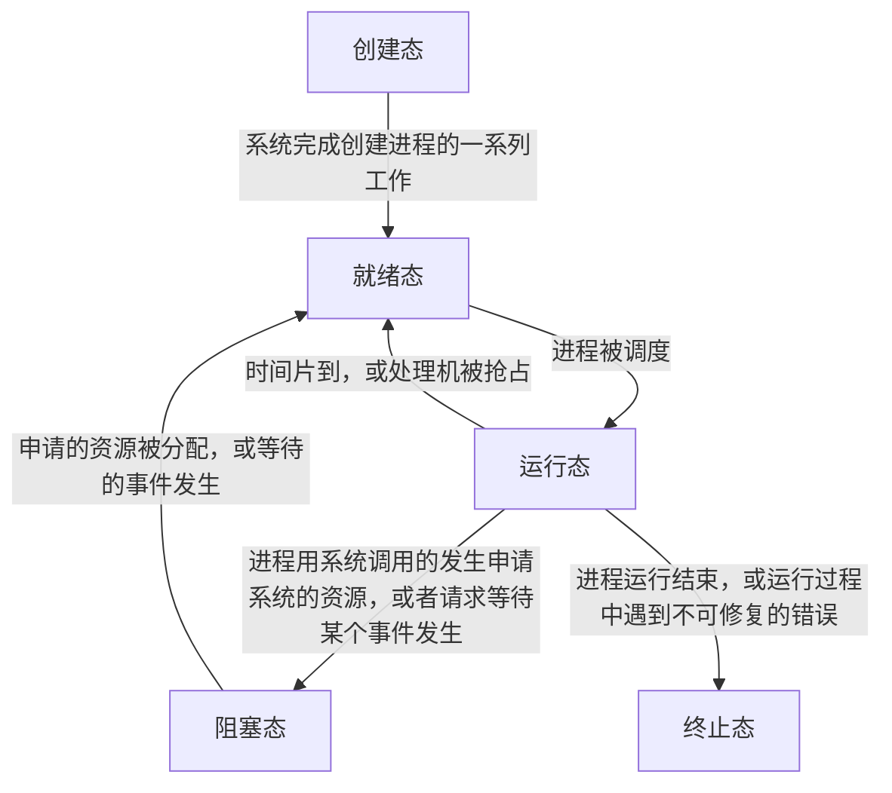
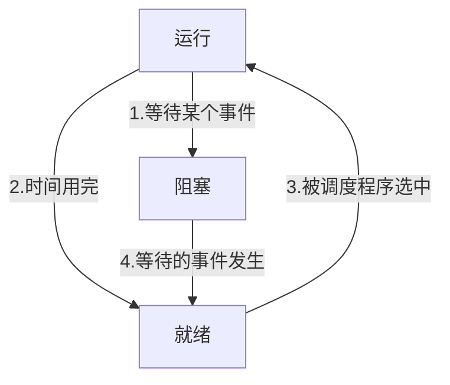
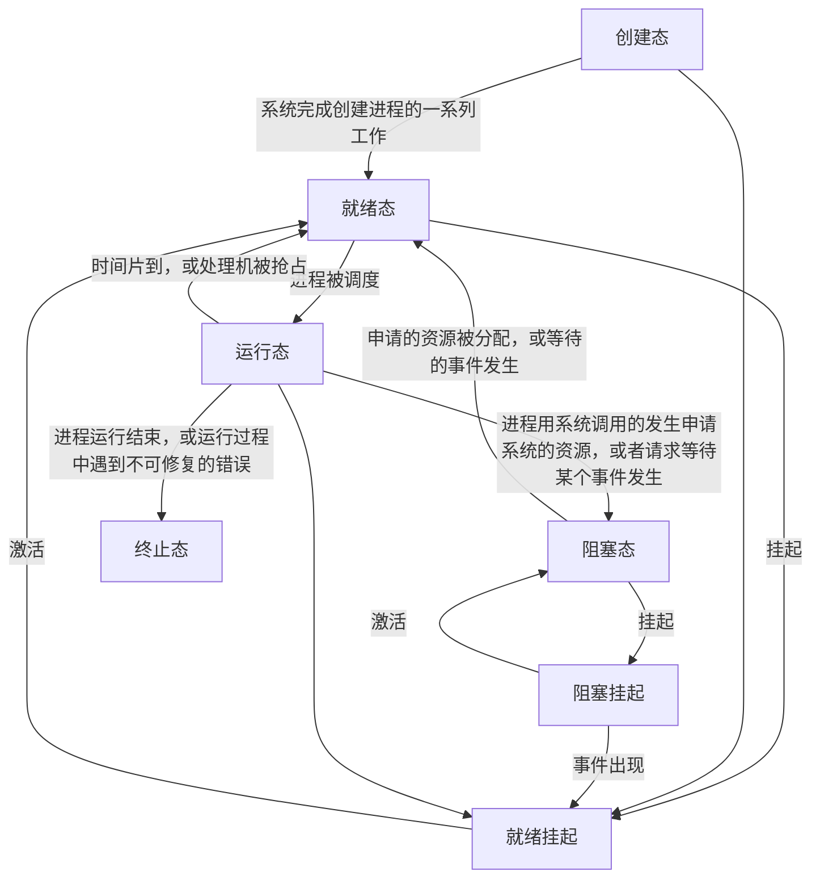
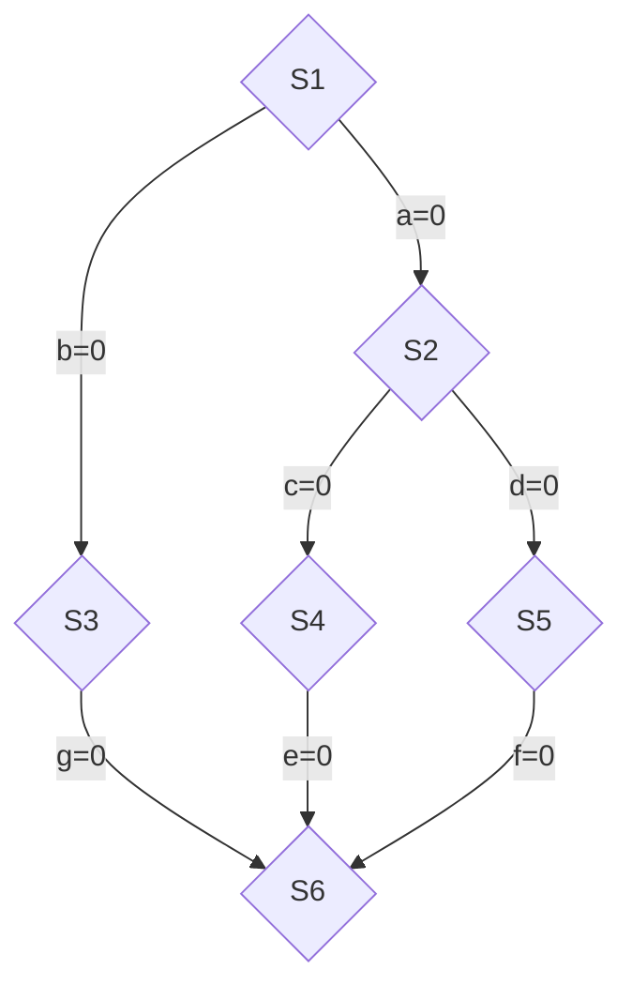

# 进程管理

## 进程
##### 4.14

### 进程的概念

**程序**：是**静态**的，就是个存放在磁盘的可执行文件，也就是一系列的指令集合
**进程**（Process）：是**动态**的，是程序的一次执行过程（ *同一个程序多次执行会对应多个进程* ）

当进程被创建时，操作系统会为该进程分配一个**唯一的、不重复**的”身份证号“--**PID**

操作系统要记录PID、进程所属用户ID（UID）
 - 基本的进程描述信息，可以让操作系统区分各个进程

还要记录给进程分配那些资源
 - 可用于实现操作系统对资源的管理

还要记录进程的运行情况
 - 可用于实现操作系统对进程的控制、调度

这些信息都被保存在一个数据结构**PCB**（Process Control Block）中，即**进程控制块**
操作系统需要对各个并发运行的进程进行管理，但凡管理时需要的信息，都会被放在**PCB**中

#### 进程的组成 

**定义**：进程是进程实体的==运行过程==，是系统进行**资源分配**和**调度**的一个独立单位

一个**进程实体(进程映像)** 由**PCB，程序段和数据段**组成。
==进程==是==动态==的，==进程实体==是==静态==的

**PCB**
 - 给操作系统用的
**PCB是进程存在的唯一标志**，当进程被创建时，操作系统会为其创建PCB，当进程结束时，会回收其PCB

**程序段**、数据段
 - 给进程自己用的

#### 进程的特征
1. **动态性**：进程是程序的一次执行过程，是动态的产生、变化和消亡的
    - 是基础最基本的特征
2. **并发性**：内存中有多个进程实体，各进程可并发执行
3. **独立性**：进程是能==独立运行、独立获得资源、独立接收调度==的基本单位
4. **异步性**：各进程按各自独立的、不可预知的速度向前推进，需要操作系统提供进程同步机制来解决异步问题
    - 异步性会导致程序执行结果的不确定性
5. **结构性**：每个进程都配置一个PCB。结构上看，进程由程序段、数据段、PCB组成

#### 进程的状态
 - 创建态
 - 就绪态

**创建态**：进程正在被创建时，它的状态就是**创建态**，在整个阶段操作系统会为其分配资源、初始化PCB

**就绪态**：进程创建完成后，便进入**就绪态**，处于就绪态的进程已经具备运行条件，但由于没有空闲CPU，就暂时不能运行

**运行态**：如果一个进程此时在CPU上运行，那么整个进程就处于”**运行态**

**阻塞态**：进程运行过程中，可能会==请求等待某个事件的发生==，在这个事件发生之前，进程无法继续往下执行，此时操作系统会让这个进程下CPU，并让它进入**阻塞态**
 - 当CPU空闲时，又会选择另外一个就绪态进程上CPU运行

**终止态**：一个进程可以执行exit系统调用，请求操作系统终止该进程，此时该进程会进入**终止态**，操作系统会让该进程下CPU，并回收内存空间等资源，最后还要回收该进程的**PCB**

#### 进程状态的转换


阻塞态 -> 就绪态 不是进程自身能控制的，是一种**被动行为**
运行态 -> 阻塞态 是一种进程自身做出的**主动行为**

==注意==：**不能由阻塞态直接转化为运行态，也不能由就绪态直接转换为阻塞态**（阻塞态是进程主动请求的，必然需要进程在运行时才能发出这种请求）
*单CPU情况下，同一时刻只会有一个进程处于运行态，进程的整个生命周期中，大部分时间都处于三种基本状态*

**进程的PCB中，会有一个变量state来表示进程的当前状态**

### 进程的组织

#### 链接方式
 - 执行指针
 - 就绪队列指针
 - 阻塞队列指针
 - 等待磁盘的阻塞队列
#### 索引方式
根据进程状态的不同为进程建立索引表

##### 4.15
### 进程控制
进程控制就是要实现进程状态的转换

可以使用**原语**实现进程控制
 - 原语的执行具有**原子性**（使用**关中断**和**开中断**两个==特权指令==实现原子性）

#### 进程的创建

**创建原语**：创建态 -> 就绪态
 1. 申请空白PCB
 2. 为新进程分配所需资源
 3. 初始化PCB
 4. 将PCB插入就绪队列

**引起进程创建的事件**：
 - 用户登录
 - 作业调度
 - 提供服务
 - 应用请求

#### 进程的终止 

**撤销原语**：就绪态/阻塞态/运行态 -> 终止态 -> 无
  1. 从PCB集合中找到终止进程的PCB
  2. 若进程正在运行，立即剥夺CPU，将CPU分配给其他进程
  3. 终止其所有子进程
  4. 将该进程拥有的所有资源归还给父进程或操作系统
  5. 删除PCB

**引起进程终止的事件**
 - 正常结束
 - 异常结束
 - 外界干预

#### 进程的阻塞

**阻塞原语**：运行态 -> 阻塞态
 1. 找到要阻塞的进程对应的PCB
 2. ==保护进程运行现场==，将PCB状态信息设置为阻塞态，暂时停止进程运行
 3. 将PCB插入相应事件的等待队列

**引起进程阻塞的事件**：
 - 需要等待系统分配某种资源
 - 需要等待相互合作的其他进程完成工作

#### 进程的唤醒

**唤醒原语**：阻塞态 -> 就绪态
 1. 在事件等待队列中找到PCB
 2. 将PCB从等待队列移除，设置进程为就绪态
 3. 将PCB插入就绪队列，等待被调度

**引起进程唤醒的事件**：
 - 等待的事件发生（因为什么事情被阻塞就应该被什么事情所唤醒）

#### 进程的切换

**切换原语**： 运行态 -> 就绪态  /  就绪态 -> 运行态
 1. 将==运行环境信息==存入PCB（运行过程中产生的中间结果）
 2. PCB移入相应队列
 3. 选择另一个进程执行，并更新其PCB
 4. 根据PCB==恢复新进程所需的运行环境==

**引起进程切换的事件**
 - 当前进程时间片到
 - 有更高优先级的进程到达
 - 当前进程主动阻塞
 - 当前进程终止

### 进程通信

**进程间通信**（IPC，Inter-Process Communication）: 指两个进程之间产生数据交互

进程是分配系统资源的单位，因此**各进程**拥有的**内存地址空间相互独立**
为了保证安全，==一个进程不能直接访问另外一个进程的地址空间==

#### 共享存储

**基于存储区**的共享：操作系统在内存中划出一块共享存储区，数据的形式、存放位置都由通信进程控制，而不是操作系统。这种共享方式速度很快，是一种**高级通信**方式

**基于数据结构**的共享：比如共享空间只能放一个长度为10的数组。这种共享方式**速度慢、限制多**，是一种**低级通信**的方式

为了避免出错，各个进程对共享空间的**访问**是**互斥**的

#### 消息传递

进程间的数据交换以**格式化的消息**（Message）为单位。进程通过操作系统提供的“发送消息/接收消息”两个**原语**进行数据交换
 - 直接通信方式：消息发送进程指明接收进程的ID
 - 间接通信方式：通过“信箱”间接的通信。因此又叫做信箱通信方式

#### 管道通信

"管道"是一个特殊的共享文件，又叫pipe文件。其实就是在内存中开辟一个大小固定的**内存缓冲区**
 - 管道只能采用**半双工通信**，某一时间段内只能单向的传输。如果要实现**双向同时通信**，则需要**设置两个管道**
 - 各进程要**互斥**的访问管道
 - 当**管道写满**时，**写进程**将被**阻塞**，直到读进程将管道中的数据取走，即可唤醒写进程
 - 当**管道读空**时，**读进程**将被**阻塞**，直到写进程往管道中写入数据，即可唤醒读进程
 - 管道中的数据一旦被读出，就彻底消失。因此，当多个进程读同一个管道时，可能会错乱。对此，通常有两种解决方案：
    1. ==一个管道允许多个写进程，一个读进程==（考研的默认）
    2. 允许有==多个写进程，多个读进程==，但系统会让各个读进程轮流从管道中读数据（Linux的方案）

### 信号

**信号与信号量的区别**：
 - **信号量**（Semaphore） ：实现进程间的同步、互斥
 - **信号**（Signal）实现进程间的通信（IPC）

#### 信号的作用

用于==通知进程某个特定事件已经发送==。进程收到一个信号后，对该信号进行处理

#### 实现原理

##### 信号发送与保存

进程的PCB有**待处理信号**（pending）和**被阻塞信号**（blocked）
- 不少于N bit的位向量，对应N种信号
- blocked位向量也叫==信号掩码==（signal mask）
用户进程之间可以发送信号，内核进程可以给用户进程发送信号

*注：进程之间允许发送的信号类型是有限制的*

##### 信号的处理

**什么时候处理（when）**
当==进程从内核态转为用户态时==，例行检查是否有待处理信号，如果有，就**处理信号**
 - 先将blocked全部**按位取反**，再与pending进行逐位**按位与**运算
1. 进程收到信号
2. 从内核态回到用户态时，检测到待处理信号，转移信号处理程序
3. 运行信号处理程序
4. 返回到下一条指令

**怎么处理（how）**
 1. 执行操作系统为此类信号设置的==缺省（默认）信号处理程序==（某些信号默认忽略不做处理）
 2. 执行进程为此类信号设置==用户自定义信号处理程序（自定义信号处理程序将覆盖1）==
 - 信号处理程序运行结束后，通常会返回进程的下一条指令进行执行（除非信号处理程序将进程阻塞或终止）
 - 一旦处理了某个信号，将pending位置为0
 - 重复收到的同类信号，将被简单的丢弃（因为仅有1bit记录一类待处理信号）
 - 当同时收到多个不同类信号时，通常先处理序号更小的信号

#### 信号和异常

==信号可以作为异常的配套机制，让进程对操作系统的异常处理进行补充==

在进程运行过程中，某些特殊事件可能引发异常，操作系统内核负责捕获并处理异常
 - 一些异常可以由操作系统内核完成全部处理（缺页异常），此时不必使用信号机制
 - ==有些异常无法由内核完成处理，可能需要用户进程配合==，此时就可以使用信号机制与异常机制配合

### 线程

有的进程可能需要“同时”做很多事情，而传统的进程只能串行执行一系列程序。为此引入线程，==来增加并发度==

引入线程后，**线程**是一个**基本的CPU执行源**，**线程**成为了**程序执行流的最小单位**

引入线程后，不仅进程之间可以并发，进程内的**各线程之间**也可以**并发**，从而进一步提升了**系统的并发度**，使得一个进程内也可以处理各种任务
 - 系统开销进一步减小

引入线程后，**进程**只能作为**除CPU之外的系统资源的分配单元**

#### 线程的属性
- **线程是处理机调度的单位**
- 多CPU计算机中，各个线程可占用不同的CPU
- 每个线程都有一个线程ID、线程控制块（TCB）
- **线程**也有==就绪、阻塞、运行==三种基本状态
- **线程**几乎==不拥有系统资源==
- **同一**==进程==的**不同**==线程==之间共享进程的资源
- 由于共享内存地址空间，同一进程内的线程间通信甚至**无需系统干预**
- **同一**进程中的线程切换，**不会**引起进程切换
- **不同**进程的线程切换，**会**引起进程切换
- 切换**同进程**内的线程，==系统开销很小==
- 切换**进程**==系统开销大==

#### 线程的实现方式

##### **用户级线程**（User-Level Thread，ULT）
早期的操作系统（比如早期Unix）只支持进程，不支持线程。当时的“线程”是由线程库实现的
``` cpp
int main(){
	int i = 0;
	while(true){
		if(i = 0){...}//处理视频的代码
		if(i = 1){...}//处理文字的代码
		if(i = 2){...}//处理传输的代码
		i = (i + 1) % 3;
	}
}
```
*从代码的角度看，线程其实就是一端代码逻辑。上述三段代码逻辑上可以看作三个“线程”，while循环就是一个最弱智的“线程库”，线程库完成了对线程的管理工作（比如调度）*
 - 此时的**线程切换**在**用户态**下完成的，无需系统干预
 - 线程由应用程序通过线程库实现，所有的**线程管理工作**都由**应用程序负责**
 - 操作系统不能意识到用户级线程的存在
 - **优点**：该线程的切换在用户空间即可完成，不需要切换到**核心态**，线程管理的系统开销小，效率高
 - **缺点**：当一个用户级线程被阻塞时，整个进程都会被阻塞，并发度不高。多个线程不可以在多核处理机上并行运行

##### **内核级线程**（Kernel-Level Thread，KLT）：
内核支持的线程
 - 内核级线程的管理工作由**操作系统内核**完成
 - 线程调度、切换等工作由内核负责，因此**内核级线程的切换**必然需要在**核心态**下才能完成
 - 操作系统会为每个内核级线程建立相应的TCB（Thread Control Block），通过线程控制块对线程进行管理。“内核级线程”就是“从操作系统视角看能看到的线程”
 - **优点**：当一个线程被阻塞后，别的线程还可以继续执行，**并发能力强**。多线程可在多核处理机上**并行执行**
 - **缺点**：一个用户进程会占用多个内核级线程，线程切换由操作系统完成，需要切换到核心态，因此线程管理的**成本高、开销大**

##### **多线程模型**
在支持内核级线程的系统中，根据用户级线程和内核级线程的映射关系，可以划分为几种多线程模型

**一对一模型**：一个用户级线程映射到一个内核级线程。每个用户进程有与用户级线程同数量的内核级线程
 - **优点**：当一个线程被阻塞后，别的线程还可以继续执行，并发能力强。多线程可在多核处理机上**并行执行**
 - **缺点**：一个用户进程会占用多个内核级线程，线程切换由操作系统完成，需要切换到核心态，因此线程管理的**成本高、开销大**

**多对一模型**：多个用户级线程映射到一个内核级线程。且一个进程只被分配一个内核级线程
 - 该线程的切换在用户空间即可完成，不需要切换到**核心态**，线程管理的系统开销小，效率高
 - 当一个用户级线程被阻塞时，整个进程都会被阻塞，**并发度不高**。多个线程不可以在多核处理机上并行运行
==**重点**：操作系统只看得见内核级线程，因此**只有内核级线程才是处理机分配的单位**==

**多对多模型**：n个用户级线程映射到m个内核级线程（n ≥ m）。每个用户进程对应m个内核级线程
克服了**多对一**模型**并发度不高**的缺点，同时克服了**一对一**模型中一个**用户进程占用太多内核级线程，开销太大**的缺点

#### 线程的状态与转换


**线程的组织与控制**：使用一个数据结构TCB（线程控制块）控制
 - 线程标识符 -- TID，与PID类似
 - 程序计数器 -- 线程目前执行到哪里
 - 其他寄存器 -- 线程运行的中间结果
 - 堆栈指针  -- 堆栈保存函数调用信息、局部变量等
 - 线程运行状态 -- 运行/就绪/阻塞
 - 优先级 -- 线程调度、资源分配的参考

将多个PCB组织成一个表 -- 线程表（Thread Table)

### 调度

#### 调度的概念

当有很多任务需要处理，但由于资源有限，这些事情没法同时处理，这就需要确定**某种规则**来**决定**处理这些任务的**顺序**，则就是调度研究的问题

##### 调度的三个层次

###### **高级调度**：
作业：一个具体的任务
用户向系统提交一个作业 ≈ 用户让操作系统启动一个程序

**高级调度**（作业调度），按一定的原则从外存的作业后备队列中挑选一个作业调入内存，并创建进程。**每个作业只调入一次，调出一次**。作业调入时会建立PCB，调出时才撤销PCB

---
###### 低级调度 
低级调度（进程调度/处理机调度） -- 按照某种策略从就绪队列中选取一个进程，将处理机分配给它

进程调度是操作系统中**最基本的一种调度**，在一般的操作系统中都必须配置进程调度
进程调度的**频率很高**，一般几十毫秒一次

---
###### 中级调度
内存不够时，可将某些进程的数据调出外存。等内存空闲或者进程需要运行时在重新调入内存
暂时调到外存等待的进程状态叫做**挂起状态**，被挂起的进程PCB会被组织成**挂起队列**

**中级调度（内存调度）** -- 按照某种策略决定将哪个处于挂起状态的进程重新调入内存。一个进程可能会被多次调出、调入内存，因此**中级调度**发生的**频率**要比高级调度**更高**

##### 进程的七状态模型

除了：创建态、就绪态、运行态、阻塞态、终止态
暂时调到外存等待的进程状态为**挂起状态（挂起态，suspend）**
挂起态又可以进一步细分为**就绪挂起、阻塞挂起**两种状态

*挂起和阻塞 : 两种状态都是暂时不能获得CPU的服务，但挂起态是将进程映像调到**外存**去了，而阻塞态进程映像还在**内存***

##### 三层调度的联系、对比

|                | 要做什么                               | 调度发生在..            | 发生频率 | 对进程状态的影响                    |
| -------------- | ---------------------------------- | ------------------ | ---- | --------------------------- |
| 高级调度<br>（作业调度） | 按照某种规则，从后备队列中选择合适的作业将其调入内存，并为其创建进程 | 外存 -> 内存<br>（面向作业） | 最低   | 无 -> 创建态 -> 就绪态             |
| 中级调度<br>（内存调度） | 按照某种规则，从挂起队列中选择合适的进程将其数据调回内存       | 外存 -> 内存<br>（面向进程） | 中等   | 挂起态 -> 就绪态<br>（阻塞挂起 -> 阻塞态） |
| 低级调度<br>（进程调度） | 按照某种规则，从就绪队列中选择一个进程为其分配处理机         | 内存 -> CPU          | 最高   | 就绪态 -> 运行态                  |
##### 4.16

#### 进程调度的时机

进程调度（低级调度）：按照某种规则，从就绪队列中选择一个进程为其分配处理机

**需要进行**进程调度与切换的情况
 - 当前运行的进程**主动放弃**处理机
   - 进程正常终止
   - 运行过程中发生异常而终止
   - 进程主动请求阻塞
 - 当前运行的进程**被动放弃**处理机
   - 分给进程的时间片用完
   - 有更紧急的事需要处理
   - 有更高优先级的进程进入就绪队列

**不能进行**进程调度与切换的情况
 1. 在**处理中断的过程中**。中断处理过程复杂，与硬件密切相关，很难做到在中断处理过程中进行进程切换
 2. 进程在**操作系统内核程序临界区**中
 3. 在**原子操作过程中**（原语）。原子操作不可中断，要一气呵成

进程在**操作系统内核程序临界区**中**不能**进行调度与切换
 - 临界资源：一个时间段内只允许一个进程使用的资源。各进程需要**互斥的**访问临界资源
 - 临界区：访问临界资源的那段代码
内核程序临界区：一般是用来访问**某种内核数据结构**的，比如进程的就绪队列
 - **内核程序临界区**访问的临界资源如果不尽快释放的话，==极有可能影响到操作系统内核的其他管理工作==。因此在访问==内核程序临界区期间==**不能**进行调度与切换
 - **普通临界区**访问的临界资源==不会直接影响操作系统内核的管理工作==。因此在访问普通临界区时可以进行调度与切换

#### 进程调度的方式

##### 非剥夺调度方式

又称为**非抢占方式**，即，只允许进程主动放弃处理机。在运行过程中即便有更紧迫的任务到达，当前进程依然会继续使用处理机，直到该进程==终止或主动要求进入**阻塞态**==
 - **实现简单，系统开销小**
 - 无法及时处理紧急任务，适合早期的==批处理系统==
##### 剥夺调度方式

又叫做**抢占方式**，当一个进程正在处理机上执行时，如果有一个**更重要或更紧迫**的进程需要使用处理机，则==立即暂停==正在执行的进程，将处理机分配给更重要紧迫的那个进程
- 可以==优先处理更紧急的进程==，也可以==实现让各进程按时间片轮流执行的功能==（时钟中断）适合==分时操作系统、实时操作系统==

#### 进程的切换与过程

“狭义的进程调度”与“进程切换”的区别：
- **狭义的进程调度**：指的是从就绪队列中**选中一个要运行的进程**（可以是刚刚被暂停执行的进程，也可以是**另一个进程**，后者就需要==进程切换==）
- **进程切换**：指一个进程让出处理机，由另外一个进程占用处理机的过程
“**广义的进程调度**”：包含了选择一个进程和进程切换两个步骤

**进程切换**完成了：
 1. 对用来运行进程各种数据的保存
 2. 对新的进程各种数据的恢复（程序计数器、程序状态字、各种数据寄存器等处理机现场信息，这些信息一般保存在PCB中）
*注：**进程切换是有代价的**，因此如果==过于频繁的==进行进程==调度、切换==，必然使得整个==系统的效率降低==，使系统大部分时间都花在了进程切换上，而真正用于执行进程的时间减少*

#### 调度器/调度程序（scheduler）

调度时机--什么事件会触发**调度程序**
 - **创建新进程**
 - **进程退出**
 - 运行**进程阻塞**
 - **IO中断**发生
 非抢占式调度策略，只有运行进程阻塞或退出才触发调度程序工作
 抢占式调度策略，每个**时钟中断**或k个时钟中断会触发调度程序工作

*不支持内核级线程的操作系统，调度程序处理的是进程；而支持内核级线程的操作系统，调度程序处理对象是==内核线程==*

**闲逛进程**：调度程序永远的备胎，没有其他就绪进程时，运行闲逛进程（idle）
- 优先级最低
- 可能是0地址指令，占一个完整的指令周期（指令周期末尾例行检查中断）
- 能耗低

#### 调度算法的评价指标

##### CPU利用率
早期CPU造假昂贵，人们希望其尽可能多的工作

CPU利用率：指CPU忙碌的时间占总时间的比例
$$
利用率=\frac{忙碌的时间}{总时间}
$$
##### 系统吞吐量
对于计算机而言，希望尽可能少的时间完成尽可能多的作业

系统吞吐量：单位时间内完成作业的数量
$$
系统吞吐量 = \frac{总共完成了多少作业}{总共花费多少时间}
$$
##### 周转时间
对于用户而言，他很关心自己的作业从提交到完成花费多少时间

周转时间：从作业==被提交给系统开始==，到==作业完成为止==的这段时间间隔
它包含四个部分
 1. 作业在外存后备队列上等待作业调度（高级调度）的时间
 2. 进程在就绪队列上等待进程调度（低级调度）的时间
 3. 进程在CPU上执行的时间
 4. 进程等待IO操作完成的时间
*后三项在一个作业的整个处理过程中，可能发生多次*

$$周转时间：作业完成时间 - 作业提交时间 $$
*对于用户而言，更关心单个作业*
$$平均周转时间 = \frac{各作业周转时间之和}{作业数}$$
*对于操作系统而言，更关心系统的整体表现*

$$带权周转时间 = \frac{作业周转时间}{作业实际运行的时间}=\frac{作业完成时间-作业提交时间}{作业实际运行的时间}$$
$$平均带权周转时间=\frac{各作业带权周转时间之和}{作业数}$$
##### 等待时间
计算机的用户希望自己的作业尽可能少的等待处理机

**等待时间**：指进程/作业==处于等待处理机状态时间之和==，等待时间越长，用户满意度越低

对于**进程**而言，等待时间就是指进程建立后**等待被服务的时间之和**，在等待IO完成的期间其实进程也是在被服务的，所以不计入等待时间
对于**作业**而言，不仅要考虑**建立进程后的等待时间，还要加上作业在外存后备队列中等待的时间**

##### 响应时间
对于用户而言，希望自己提交的请求尽早的开始被系统服务、回应

响应时间，指用户**提交请求**到**首次产生响应**所用的时间

#### 调度算法
**饥饿**：某进程/作业长期得不到服务

##### 先来先服务FCFS

**First Come First Serve**：他是一种**非抢占式的算法**，

**规则**：主要从公平的角度考虑，按照作业/进程到达的先后顺序进行服务

用于**作业**调度时，考虑的是哪个作业**先到达后备队列**；用于进程调度时，考虑的时哪个进程**先到达就绪队列**

**优点**：公平、算法实现简单
**缺点**：排在长作业（进程）后的短作业（进程）需要等待很长时间，带权周转时间很大，对短作业而言用户体验不好。即，FCFS算法对**长作业有利，短作业不利**

**不会导致饥饿**

##### 短作业优先SJF

**Shortest Job First**：追求最少的平均等待时间，最少的平均周转时间、最少的平均带权周转时间

**规则**：最短的作业/进程优先得到服务

其可用于**进程调度和作业调度**。用于进程调度时称为**短进程优先算法**（SPF，Shortest Process First）

SJF和SPF均为**非抢占式**算法。但是有**抢占式的版本--最短剩余时间优先算法**（SRTN，Shortest Remaining Time Next）
 - 如果题目未特别说明，默认为非抢占式
**优点**：“最短的”平均等待时间、平均周转时间
**缺点**：不公平，**对短作业有利，对长作业不利**。可能产生**饥饿现象**。另外，进程/作业的运行时间是用户提供的，并不一定真实，不一定能做到真正的短作业优先

**会导致饥饿**：如果源源不断的短进程/作业到来，可能使得长作业/进程长时间得不到服务，产生**饥饿**现象。如果一直得不到服务，则称为**饿死**

##### 高响应比优先HRRN

**Highest Response Ratio Next**：综合考虑作业/进程的等待时间和要求服务时间

规则：每次调度时先计算各个作业/进程的**响应比**，选择**响应比最高**的作业/进程为其服务
$$响应比=\frac{等待时间+要求服务时间}{要求服务时间}$$
其可用于**进程调度和作业调度**

其为**非抢占式**算法。因此只有当前运行的作业/进程主动放弃处理机时，才需要调度，才需要计算响应比

**优点**：综合考虑了等待时间和运行时间
 - 等待时间相同时，要求服务时间短的优先（SJF的优点）
 - 要求服务时间相同时，等待时间长的优先（FCFS）
 - 对于长作业而言，随着等待时间越来越久，其响应比也会越来越大，从而避免了长作业饥饿的问题

**不会导致饥饿**

*上述三种算法不关心响应时间，也不区分紧急程度，因此对于用户而言交互性很差。所以这三种算法适用于**早期的批处理系统***

##### 时间片轮转调度算法RR

Round-Robin：公平的、轮流的为各个进程服务，让每个进程在一段时间间隔内都可以得到响应

**规则**：按照各进程到达就绪队列的顺序，轮流让各个进程执行一个**时间片**。若进程未在一个时间片内执行完，则剥夺处理机，将进程重新放入就绪队列队尾重新排队

**适用于进程调度**（只有作业放入内存建立了相应的进程后，才能被分配处理机时间片）

**属于抢占式算法**，若进程未能在时间片内运行完，将被强行剥夺处理机使用权。由时钟装置发出**时钟中断**来通知CPU时间片已到

*如果==时间片太大==，使得每个进程都可以在一个时间片内完成，则时间片轮转调度算法==退化为先来先服务==调度算法，并且==会增大进程响应时间==，因此**时间片不能太大***

*然而，进程调度、切换是有代价的，因此如果==时间片太小==，会导致==进程切换过于频繁==，系统会花费大量时间来处理进程切换，从而导致实际用于进程执行的时间比例减少，**所以时间片也不能太小***

**优点**：公平；响应快，适用于**分时操作系统**
**缺点**：由于高频的进程切换，因此有一定开销；不区分任务的紧急程度

**不会导致饥饿**

##### 优先级调度算法

随着计算机的发展，特别是实时操作系统的出现，越来越多的应用场景需要根据任务的紧急程度来决定处理顺序

**规则**：每个作业/进程有各自的优先级，调度时选择优先级最高的作业/进程

**既可用于作业调度，也可用于进程调度**，甚至可用于后续的IO调度中

**抢占式、非抢占式都有**。做题的区别：非抢占式只需在==进程主动放弃处理机时==进行调度即可，而抢占式还需在==就绪队列变化时==，检查是否发生抢占

*就绪队列不一定只有一个，可以按照不同优先级来组织。另外也可以把优先级高的进程排在更靠近队头的位置。根据优先级是否可变可以将其分为==静态优先级==和==动态优先级==*
 - 静态优先级：创建进程时确定，之后一直不变
 - 动态优先级：创建进程时有一个初始值，之后根据情况动态调整

**优点**：用优先级区分紧急程度、重要程度，适用于实时操作系统。可灵活的调整各种作业/进程的偏好程度
**缺点**：若源源不断的有高优先级进程到来，则可能导致饥饿

**会导致饥饿**

##### 多级反馈队列调度算法

对其他调度算法的折中

**规则**：
 1. 设置多级就绪队列，各级队列**优先级**从==高到低==，**时间片**==从小到大==
 2. **新进程**到达时==先进入第1级==队列，按**FCFS原则**排队等待被分配时间片，若用完时间片进程还**未结束**，则进程==进入下一级队列==队尾。如果此时**已经是在最下级**的队列，则==重新放回==该队列队尾
 3. 只有第k级队列为空时，才会为k+1级队头的进程分配时间片

**适用于进程调度**

**属于抢占式算法**
 - 在k级队列的进程运行过程中，若更上级的队列（1~k-1级）中进入了一个新进程，则由于新进程处于优先级更高的队列中，因此新进程会抢占处理机，原来运行的进程放回k级队列队尾

**优点**：
 - 对各类型进程相对公平（FCFS优点）
 - 每个新到达的进程都可以很快得到响应（RR的优点）
 - 短进程只用较少的时间就可以完成（SPF优点）
 - 不必实现估计进程的运行时间（避免用户作假）
 - 可灵活的调整对各类进程的偏好程度，比如CPU密集型进程、IO密集型进程（可以将因IO而阻塞的进程重新放回原队列，这样IO型进程就可以保持较高优先级）

**有可能会导致饥饿**：源源不断的短进程进入的话，可能会导致低优先级队列得不到时间片

*上述三种算法**适用于交互式系统**，由于计算机造价大幅降低，之后出现的交互式系统更注重系统的响应时间、公平性、平衡性等指标*

##### 多级队列调度算法

系统按进程类型设置多个队列，进程创建成功后加入某个队列（比如系统进程队列、交互式进程队列、批处理进程队列）

队列之间可采用固定优先级，或时间片划分
 - 固定优先级：高优先级空时低优先级进程才能被调度
 - 时间片划分：如三个队列分配时间50%、40%、10%

*各队列可采用不同的调度策略*
 - 系统进程队列采用优先级调度
 - 交互式队列采用RR
 - 批处理队列采用FCFS

#### 多处理机调度

##### 单处理机调度 vs 多处理机调度

单处理机调度：只需决定让哪个就绪进程优先上处理机即可

多处理机调度：
 - 用调度算法决定让哪个就绪进程优先上处理机
 - ==还需要决定被调度的进程到底上哪个处理机==

##### 多处理机调度性能指标

多处理机调度追求的目标--负载均衡和处理机亲和性

==负载均衡== -- 尽可能让每个CPU同等忙碌

==处理机亲和性== -- 尽可能让一个进程调度到同一个CPU上运行，以发挥CPU中缓存的作用（Cache）

##### 公共就绪队列
 - 所有CPU共享同一个就绪进程队列（位于内核区）
 - 每个CPU运行调度程序，从公共就绪队列中选择一个进程运行
 - 每个CPU访问公共就绪队列时需要上锁（确保互斥）

**优点**：==可以天然的实现负载均衡==
**缺点**：各个进程频繁的切换CPU运行，==亲和性不好==
 - 软亲和：由进程调度程序尽量保证“亲和性”
 - 硬亲和：由用户进程通过系统调用，主动要求操作系统分配固定的CPU，==确保亲和性==

##### 私有就绪队列
 - 每个CPU都有一个私有就绪队列
 - CPU空闲时运行调度程序，从私有就绪队列中选择一个进程运行


**推迁移（Push）策略**
==一个特定的系统程序周期性检查每个处理器的负载==，如果负载不平衡，就从忙碌CPU的就绪队列中“推”一些就绪进程到空闲CPU的就绪队列

**拉迁移（Pull）策略**
每个CPU运行调度程序时，==周期性检查自身负载与其他CPU负载==。如果一个CPU**负载低**，就从其他**高负载**CPU的就绪队列中==拉==一些就绪进程到自己的就绪队列

**优点**：私有就绪队列天然的实现了处理机亲和性

##### 4.20

### 同步与互斥

进程具有**异步性**的特征

#### 进程同步

解决的是**异步问题**（比如管道通信中按照“写数据->读数据”的顺序执行，而异步性导致二者的先后顺序是不确定的）

同步：又叫做**直接制约关系**，它是为完成某种任务而建立的两个或多个进程，这些进程因为需要在某些位置上**协调**他们的**工作次序**而产生的制约关系。进程间的直接制约关系就是源于他们之间的相互合作

#### 进程互斥

进程的并发需要共享的支持，各个并发执行的进程不可避免的需要共享一些资源
 - 互斥共享：一个时间段内只允许一个进程访问
 - 同时共享：允许一个时间段内多个进程“同时”对它们进行访问

把**一个时间段内只允许一个进程使用**的资源叫做**临界资源**。很多物理设备，以及许多变量、数据、内存缓冲区都属于临界资源，对临界资源的访问必须**互斥**的进行

互斥又叫做**间接制约关系**，**进程互斥**指当一个进程访问某个临界资源时，另一个想要访问该临界资源的进程必须等待。当前访问临界资源的进程访问结束，释放该资源后，另一个进程才能去访问临界资源

##### 什么是进程互斥

对临界资源的互斥访问，可以在逻辑上分为如下四个部分
```cpp
do{
	entry section;//进入区
	critical section;//临界区
	exit section;//推出区
	remainder section;//剩余区
}while(true)
```
- 进入区：
  - 负责检查是否可以进入临界区，若可以进入，则应该设置*正在访问临界资源的标志（可以理解为上锁）*，以阻止其他进程同时进入临界区
- 临界区：
  - 访问临界资源的那段代码
- 退出区：
  - 负责解除*正在访问临界资源的标志（可理解为解锁）*
- 剩余区：
  - 做其他处理

*注：**临界区**是进程中**访问临界资源**的代码段
**进入区**和**退出区**是负责**实现互斥**的代码段
临界区也就这**临界段**
*

为了实现对临界资源的互斥访问，同时保证系统整体性能，需要遵循以下原则：
 1. **空闲让进**
    - 临界区空闲时，可以允许一个请求进入临界区的进程立即进入临界区
 2. **忙则等待**
     - 当已有进程进入临界区时，其他试图进入临界区的进程必须等待
 3. **有限等待**
     - 对请求访问的进程，应保证能在有限时间内进入临界区（防止饥饿）
 4. **让权等待**
     - 当进程不能进入临界区时，应立即释放处理机，防止进程忙等待

##### 进程互斥的软件实现

###### 单标志法

**思想**：两个进程在==*访问完临界区*==后会把使用临界区的权限转交给另一个进程。也就是说==每个进程进入临界区的权限只能被另一个进程赋予==

```cpp
//P0
while(turn != 0);//1
critical section;//2
turn = 1;//3
remainder  section;//4
//P1
while(turn != 1);//5
critical section;//6
turn = 0;//7
remainder  section;//8
```

turn的初值为0，即刚开始只允许0号进程进入临界区
若P1先上处理机运行就会卡在5，直到P1的时间片用完，发生调度，切换P0上处理机。
代码1不会卡住P0，P0可以正常访问临界区，在P0访问临界区期间即时切换回P1，P1依然会卡在5。
只有在P0退出区将turn改为1后，P1才能进入临界区

**缺点**：**单标志法**存在的**主要问题**是：==**违背空闲让进原则**==

###### 双标志先检查法

**思想**：设置一个bool型数组flag[]，数组中各个元素用来**标记各进程想进入临界区的意愿**，比如“flag[0] = ture"意味着0号进程P0现在想进入临界区。
每个进程在进入临界区之前先检查当前有没有别的进程想进入临界区，如果没有，则把自身对应的标志flag[i]设置为true，之后开始访问临界区

```cpp
bool flag[2];
flag[0] = false;
flag[1] = false;

//P0进程
while(flag[1]);//1
flag[0] = true;//2
critical section;//3
flag[0] = false;//4
remainder section;

//P1进程
while(flag[0]);//5  如果此时P0想进入临界区，P1就一直等待
flag[1] = true;//6  标记P1进程想进入临界区
critical section;//7 访问临界区
flag[1] = false;//8 访问完临界区，修改标记为P1不想使用临界区
remainder section;
```

1，2，5，6为进入区，背后的含义为”表达意愿“（上锁）

如果按照1、5、2、6的顺序执行，P0和P1会同时访问临界区。
因此，双标志先检查法的**主要问题**是：==**违反忙则等待原则**==

**原因**：**进入区**的检查和上锁**两个处理不是一气呵成的**，检查后，上锁前可能发生进程切换

###### 双标志后检查法

**思想**：双标志先检查法的改版。前一个算法的问题是先检查后上锁，但是两个操作又无法一气呵成，因此导致了两个进程同时进入临界区的问题。因此，人们又想到先上锁后检查的方法。来避免上述问题

```cpp
bool flag[2];
flag[0] = false;
flag[1] = false;

//P0进程
flag[0] = true;//1
while(flag[1]);//2
critical section;//3
flag[0] = false;//4
remainder section;

//P1进程
flag[1] = true;//5  标记P1进程想进入临界区
while(flag[0]);//6  如果此时P0想进入临界区，P1就一直等待
critical section;//7 访问临界区
flag[1] = false;//8 访问完临界区，修改标记为P1不想使用临界区
remainder section;
```

若按照1、5、2、6的顺序执行，P1和P0都无法进入临界区
因此，双标志后检查法虽然**解决了忙则等待**的问题，但是==又违背了**空闲让进**和**有限等待**原则==，会因各进程都长期无法访问临界资源而产生**饥饿**的现象

###### Peterson算法

**思想**：结合双标志法和单标志法的思想。如果双方都争着想进入临界区，那可以让进程尝试“谦让”。

```cpp
bool flag[2];
int turn = 0;

//P0
flag[0] = turn;//1
turn = 1;//2
while(flag[1] && turn == 1);//3
critical section;//4
flag[0] = false;//5
remainder section;

//P0
flag[1] = turn;//6  表示自己想进入临界区
turn = 0;//7   表示优先让对方进入临界区
while(flag[0] && turn == 0);//8  对方详尽且最后一次是自己“谦让”，则自己等待
critical section;//9
flag[0] = false;//10  访问完临界区，表示自己已经不想访问临界区了
remainder section;
```

进入区（1，2，3 & 6，7，8）
 1. 主动争取
 2. 主动谦让
 3. 检查对方是否想使用且最后一次不是自己表示谦让
 4. 谁在最后说了客气话，谁就失去了行动的优先权

**结论**：Peterson算法用软件方法解决了进程互斥问题，**遵循了空闲让进、忙则等待、有限等待三个原则**，但是依然==未遵循让权等待==的原则


##### 进程互斥的硬件实现

###### 中断屏蔽法

**思想**：利用开/关中断指令实现（即某个进程开始访问临界区到结束访问为止都不允许被中断，也就不能发生进程切换，因此也就不可能发生两个同时访问临界区的情况）

**优点**：简单、高效
**缺点**：不适用于多处理机；只适用于操作系统内核进程，不适用于用户进程（开/关中断指令只能运行在内核态）

###### TestAndSet指令

简称TS指令，TestAndSetLock指令，TSL指令
**TSL指令**：是使用**硬件实现的**，执行的过程中不允许被中断，只能一气呵成。

其逻辑展示为：
```cpp
//布尔型共享变量lock表示当前临界区是否被加锁
//true表示已加锁，false表示未加锁
bool TestAndSet(bool *lock){
	bool old;
	old = *lock;//old存放lock用来的值
	*lock = true;//无论是否已经加锁，都将lock设置为true
	return old;//返回lock原来的值
}

//以下是TSL指令实现互斥的算法逻辑
while(TestAndSet(&lock));//上锁并检查
...//临界区代码
lock = false;//解锁
...//剩余代码
```

如果刚开始lock为false，则TSL返回的old值为false，while循环条件不满足，直接跳过循环，进入临界区。
若刚开始lock为true，则执行TSL后old返回的值为true，while循环条件满足，会一直循环，直到当前访问临界区的进程在退出区进行解锁

相比软件实现方法，TSL指令把上锁和检查操作用硬件的方式变成了**一气呵成的原子操作**
**优点**：实现简单，无需像软件实现方法那样严格检查是否会有逻辑漏洞；适用于多处理机环境
**缺点**：依然不满足**让权等待原则**，暂时无法进入临界区的进程会占用CPU并循环执行TSL指令，==从而导致忙等==

###### swap指令

也叫Exchange指令，简称XCHG指令
Swap指令是用**硬件实现**的，执行的过程不允许被中断，只能一气呵成

```cpp
//swap指令作用是交换两个变量的值
Swap(bool *a,bool *b){
	bool temp;
	temp = *a;
	*a = *b;
	*b = temp;
}
//以下是用Swap指令实现互斥的算法逻辑
//lock表示当前临界区是否被加锁
bool old = true;
while(old == true)
	Swap(&lock,&old);
...//临界区
lock = false;
...//剩余代码
```

逻辑上看Swap和TSL并无太大区别，都是先记录下此时临界区是否已经上锁，再将上锁标记lock设置为true，最后检查old，如果old为false则说明之前没有别的进程对临界区上锁，则可跳出循环，进入临界区

**优点**：实现简单，无需像软件实现方法那样严格检查是否会有逻辑漏洞；适用于多处理机环境
**缺点**：依然不满足**让权等待原则**，暂时无法进入临界区的进程会占用CPU并循环执行Swap指令，==从而导致忙等==

##### 锁
解决临界区最简单的工具就是**互斥锁**，一个进程在进入临界区时应获得锁，退出临界区时释放锁。函数acquire()获得锁，release()释放锁

互斥锁的主要**缺点**就是**忙等待**

需要连续循环忙等待的互斥锁，都可叫做**自旋锁**（TSL，Swap，单标志法）
**特点**：
 1. 需忙等，进程时间片用完才下处理机，违反让权等待
 2. **优点**：等待期间不用切换进程上下文，多处理器系统中，若上锁时间短，则等待代价低
 3. 常用于多处理器
 4. 不太适用于单处理器系统，忙等的过程中不可能解锁

##### 4.22
#### 信号量机制

进程互斥的四种软件、三种硬件实现方式都==无法实现“让权等待”==

用户进程可以通过使用操作系统提供的**一对原语**来对**信号量**进行操作，从而很方便的实现了进程互斥、进程同步
 - **wait(S)** 原语和**signal(S)** 原语
 - 可以将原语理解为函数，**信号量S**其实就是函数调用时传入的参数
 - 也可以简称P(S)、V(S)操作

**信号量**其实就是一个变量（可以是一个整数，也可以是更复杂的记录型变量），可以用一个信号量来==表示系统中某种资源的数量==

##### 整型信号量

用一个**整数型的变量**作为信号量，用来表示**系统中某种资源的数量**
 - 与普通整数变量的区别：对信号量的操作只有三种，即初始化、P操作、V操作
 
```cpp
int S = 1; //初始化整型信号量s，表示当前系统中可用的打印机资源数
void wait(int S){ //wait原语，相当于进入区
	while(S<=0); //如果资源数不够，则一直循环等待
	S = S - 1;   //如果资源够，则占用一个资源
}
void signal(int S){ //signal原语，相当于退出区
	S = S + 1;      //使用完资源后，在退出区释放资源
}

//P0
...
wait(S);     //进入区，申请资源
...//使用资源 //临界区，访问资源
signal(S);   //退出区，释放资源
...

//P1
...
wait(S);
...//使用资源
signal(S);
...

//...Pn
...
wait(S);
...//使用资源
signal(S);
...
```

P（wait）操作：检查和上锁一气呵成，避免了并发、异步导致的问题

**问题**：==不满足“让权等待”原则==，会发生忙等

##### 记录型信号量

整型信号量的缺陷是存在忙等的问题，因此提出了记录型信号量，即用==记录型数据结构==表示的信号量

```cpp
struct semaphore{
	int value;        //剩余资源数
	struct process *L;//等待队列
};

//wait
void wait(semaphore S){
	S.value--;
	if(S.value < 0){
		block(S.L);
	}
}

//signal
void signal(semaphore S){
	S.value++;
	if(S.value <= 0){
		wakeup(S.L);
	}
}

```
wait：如果剩余资源数不够，使用block原语使进程从运行态进入阻塞态，并挂到信号量S的等待队列中

signal：释放资源后，若还有别的进程在等待这种资源，则使用wakeup原语唤醒等待队列中的一个进程，该进程从阻塞态变为就绪态

对信号量S的**一次P操作**意味着进程**请求一个单位的该类资源**，因此需要执行value--，表示资源数**减1**，当其<0时表示该类资源已分配完毕，因此进程应该==调用block原语进行自我阻塞==，主动放弃处理机，并插入该类资源的等待队列L中。可见，该机==遵循了**让权等待原则**==，不会出现忙等的现象

对信号量S的**一次V操作**意味着进程**释放一个单位的该类资源**，因此需要执行value++，表示资源数**加1**，若加1后仍然是value<=0，表示依然有进程在等待该类资源，因此==调用wakeup原语唤醒等待队列中的第一个进程==

#### 用信号量机制实现进程互斥、同步、前驱关系

##### 实现进程互斥
 1. 分析并发进程的关键活动，划定临界区
 2. 设置**互斥信号量==mutex==**，**初值为1**
 3. 在进入区P(mutex) -- **申请资源**
 4. 在退出区V(mutex) -- **释放资源**

```cpp
semphore mutex = 1;//初始化信号量

P1(){
...
P(mutex);//使用临界资源前加锁
临界区代码..
V(mutex);//释放临界资源后解锁
...
}

P2(){
...
P(mutex);
临界区代码..
V(mutex);
...
}
```
*注意：对于==不同的临界资源==需要设置==不同的互斥信号量==*
**P、V操作必须成对出现**

##### 实现进程同步

进程同步：要让各并发进程按照要求有序的推进

```cpp
P1(){
 代码1;
 代码2;
 代码3;
}
P2(){
 代码4;
 代码5;
 代码6;
}
```
比如，P1、P2并发执行，由于存在异步性，因此二者交替推进的次序是不确定的
若P2的==代码4==要基于P1的==代码1==和==代码2==的运行结果才能执行，那么就必须保证==代码4==一定在==代码2==之后才会执行
 - 让本来异步并发的进程互相配合，有序推进

**如何实现**
 1. 分析什么地方需要实现同步关系，即必须保证**一前一后**执行的两个操作
 2. 设置**同步信号量S**，初值为==0==
 3. **在前操作之后执行V(S)**
 4. **在后操作之前执行P(S)**
```cpp
semaphore S = 0;
P1(){
 代码1;
 代码2;
 V(S);
 代码3;
}
P2(){
 P(S);
 代码4;
 代码5;
 代码6;
}
```
**理解**：信号量S代表某种资源，刚开始没有这种资源，P2需要使用这种资源，而又只能由P1产生这种资源

若先执行到了V(S)操作，则S++后S=1。之后当执行到P(S)操作时，由于S=1，表示有资源可用，会执行S--，S的值变回0，P2进程不会执行block原语，而是继续往下执行代码4

若先执行到P(S)操作，由于S=0，S--后S=-1，表示表示此时没有可用资源，因此P操作中会执行block原语，主动请求阻塞。之后当执行完代码2，继而执行V(S)操作，S++，使S变回0，由于此时有进程在该信号量对应的阻塞队列中，因此会在V操作中执行wakeup原语，唤醒P2进程。这样P2就可以继续执行代码4了

##### 实现前驱关系

假设进程P1有句代码S1，P2有句代码S2....P6有句代码S6.这些代码关系如下：

其实每一对前驱关系都是一个==进程同步==问题（保证一前一后操作）
 1. ==要为每一对前驱关系各设置一个同步信号量
 2. 在**前操作**之后对相应的同步信号量执行**V操作**
 3. 在**后操作**之前对相应的同步信号量执行**P操作**
```cpp
P1(){
...
S1;
V(a);
V(b);
...
}

P2(){
...
P(a);
S2;
V(c);
V(d);
...
}

P3(){
...
P(b);
S3;
V(g);
...
}
...

P6(){
...
P(e);
P(f);
P(g);
S6;
...
}
```

#### 生产者-消费者问题

系统中有一组生产者进程和一组消费者进程，生产者进程每次生产一个产品放入缓冲区，消费者进程每次从缓冲区取出一个产品并使用（这里的产品理解为某种数据）

**问题分析**：
  - 生产者、消费者共享一个**初始为空、大小为n的缓冲区**
  - 只有**缓冲区每满**时，生产者才能把产品放入缓冲区，否则必须等待（缓冲区没满->生产者生产）
  - 只有**缓冲区不空**时，消费者才能从中取出产品，否则必须等待（缓冲区没空->消费者消费）
  - 缓冲区是临界资源，各进程必须**互斥的访问**（互斥关系）

PV操作题目分析步骤：
 1. 关系分析
    找出题目描述的各个进程，分析它们之间的同步、互斥关系
 2. 整理思路
    根据各进程的操作流程确定P、V操作的大致顺序
 3. 设置信号量
    根据题目条件确定信号量初值（互斥信号量初值一般为1，同步信号量的初值要看对应资源的初值是多少）

```cpp
semaphore mutex = 1;//互斥信号量，实现对缓冲区的互斥访问
semaphore empty = n;//同步信号量，表示空闲缓冲区的数量
semaphore full = 0;//同步信号量，表示产品的数量，即非空缓冲区的数量

//生产者
producter(){
生产一个产品
P(empty);//从空闲缓冲区申请一个资源
P(mutex);
把产品放入缓冲区
V(mutex);
V(full);//增加一个产品
}
//消费者
consumer(){
P(full);//消耗一个产品，如果是空的则进入阻塞态
P(mutex);
从缓冲区取出一个产品
V(mutex);
V(empty);//增加一个空闲缓冲区
使用产品
}
```
不难发现：**实现两个进程的同步关系，是在其中一个进程执行P，另外一个进程执行V**，==而实现互斥是在同一个进程中进行一对PV操作==

**重点**：`P(mutex)//1`和`P(empty)//2`不可以互换
 - 如果互换，此时缓冲区内已经放满产品，则empty=0，full=n。
   则生产者进程执行1使得mutex变为0，再执行2，由于已经没有空闲缓冲区，因此生产者被阻塞
 - 由于生产者被阻塞，因此切换到消费者进程，消费者执行`P(mutex)`，由于mutex为0，即生产者还没释放对临界资源的**锁**，因此消费者也被阻塞
 - 这就造成了生产者等待消费者释放空闲缓冲区，而消费者由等待生产者释放临界区的情况，生产者和消费者循环等待被对方唤醒，出现 **“死锁”**
 所以**实现互斥的P操作一定要在实现同步的P操作之后**

*V操作不会导致进程阻塞，因此**两个V操作顺序可以互换***

#### 多生产者-多消费者问题

假设桌子上有一个盘子（缓冲区），每次只能向其内部放一个水果，爸爸专门放苹果，妈妈专门放橘子（生产者），儿子专门吃橘子，女儿专门吃苹果（消费者）。只有盘子空时，父母才可以向盘子中放水果。仅当盘子有需要的水果时，儿女才可以从中取水果

**问题分析：**
 1. 关系分析。找出题目中的各个进程，分析之间的同步、互斥关系
     - 互斥关系：对缓冲区（盘子）的访问要互斥的进行
     - 同步关系（一前一后）：
        1. 父亲将苹果放入盘子后，女儿才能取苹果
        2. 母亲将橘子放入盘子后，儿子才能取橘子
        3. 只有==盘子为空==时，父亲或母亲才能放入水果
 2. 整理思路。根据各进程的操作流程确定P、V的大致顺序
 3. 设置信号量

**实现：**
```cpp
semaphore mutex = 1;//实现互斥访问盘子（缓冲区）
semaphore apple = 0;//盘子中有几个苹果
semaphore orange = 0;//盘子中有几个橘子
semaphore plate = 1;//盘子中还可以放几个水果

//dad
dad(){
	while(1){
		准备一个苹果;
		P(plate);
		P(mutex);
		把苹果放入盘子;
		V(mutex);
		V(apple);	
	}
}
//mom
mom(){
	while(1){
		准备一个橘子;
		P(plate);
		P(mutex);
		把橘子放入盘子;
		V(mutex);
		V(apple);
	}
}
//daughter
daughter(){
	while(1){
		P(apple);
		P(mutex);
		从盘子中取出苹果;
		V(mutex);
		V(plate);
		吃掉苹果;
	}
}
//son
son(){
	while(1){
		P(apple);
		P(mutex);
		从盘子中取出橘子;
		V(mutex);
		V(plate);
		吃掉橘子;
	}
}
```
**分析**：如果不使用互斥信号量mutex
刚开始，儿子、女儿即时上处理机运行也会被阻塞。如果刚开始是父进程先上处理机运行，则：父亲`P(plate)`，可以访问盘子 -> 母亲`P(plate)`，阻塞等待盘子 -> 父亲放入苹果V(apple)，女儿进程被唤醒，其他进程即时运行也会被阻塞，暂时不可能访问临界资源（盘子） -> 女儿P(apple)，访问盘子，V(plate)，等待盘子的母亲进程被唤醒 -> 母亲进程访问盘子（其他进程暂时都无法进入临界区） -> ...

**结论**：即使不设置专门的互斥变量mutex，也不会出现多个进程同时访问盘子的现象
**原因**：此时==缓冲区大小为1==，在任何时刻，apple、orange、plate三个同步信号量中最多只有一个是1。因此在任何时刻，最多只有一个进程的P操作不会被阻塞，并顺利进入临界区

**分析**：如果盘子（缓冲区）容量为2
父亲P(plate),可以访问盘子 -> 母亲P(plate)，可以访问盘子 -> 父亲在往盘子里放苹果，同时母亲也可以往盘子里放橘子。于是出现了两个进程同时访问缓冲区的情况，可能导致两个进程写入缓冲区的数据互相覆盖的情况。因此，如果==缓冲区大小大于1==，**就必须专门设置一个互斥信号量mutex来保证互斥访问缓冲区**

###### 信号量设置

正确的分析方法应该==从事件的角度思考问题==，而不是从==单个进程行为的角度来考虑==，可以将==*进程行为的前后关系*==抽象为一对==*事件的前后关系*==

##### 4.23

#### 读者-写者问题

**核心思想**：设置了**计数器count**用于记录当前正在访问共享文件的读进程数
 - 另外对count变量的检查和赋值不能一气呵成导致了一些错误，如果需要**实现==一气呵成==，自然就会想到==互斥信号量==**

现有读者和写者两组并发进程，共享一个文件，当两个或两个以上的读进程同时访问共享数据时不会产生副作用，但若某个写进程和其他进程同时访问共享数据时则可能导致数据不一致的错误。因此要求：
 1. 允许多个读者可以同时对文件执行读操作
 2. 只允许一个写者往文件中写信息
 3. 任一写者在完成写操作之前不允许其他读者或写者工作
 4. 写者执行写操作前，应让已有的读者和写者全部退出

**问题分析**：
 1. 关系分析。找出题目中的各个进程，分析同步、互斥关系
     - 两类进程：写进程、读进程
     - 互斥关系：写-写，写-读。读进程与读进程不存在互斥
 2. 整理思路。根据各个进程操作流程确定P、V操作的大致顺序
 3. 设置信号量。设置需要的信号量，并根据题目条件确定信号量初值

##### 解决算法（问题：读进程优先）
```cpp
semaphore rw = 1;//实现对共享文件互斥的访问
int count = 0;//记录当前有几个读进程
semaphore mutex = 1;//对count进行互斥的访问

//writer
writer(){
	while(1){
		P(rw);//写前加锁
		写文件...
		V(rw);//写后解锁
	}
}

//reader
reader(){
	while(1){
		P(mutex);//读进程互斥的访问count
		if(count == 0)//由第一个读进程负责加锁
			P(rw);
		count++;//读进程+1
		V(mutex);
		读文件...
		P(mutex);
		count--;//读进程-1
		if(count == 0)//由最后一个读进程负责解锁
			V(rw);
		V(mutex);
	}
}
```
**思考**：如果没有mutex让读进程对count进行互斥访问会发生什么
 - 若两个读进程并发进行，则count=0时两个进程均满足if条件，都会执行P(rw)，从而使得第二个读进程阻塞的情况
 - **解决方法**：上述问题的出现原因是**对count变量的检查和赋值无法一气呵成**，因此可以设置另外一个互斥信号量来保证各读进程对count的访问是互斥的

**潜在问题**：只要有读进程在读，写进程就要一直阻塞等待，可能饿死。因此该算法读进程优先

##### 优化算法（再引入一个信号量）

```cpp
semaphore rw = 1;//实现对共享文件互斥的访问
int count = 0;//记录当前有几个读进程
semaphore mutex = 1;//对count进行互斥的访问
semapjore w = 1;//用于实现写优先

//writer
writer(){
	while(1){
		P(w);
		P(rw);//写前加锁
		写文件...
		V(rw);//写后解锁
		V(w);
	}
}

//reader
reader(){
	while(1){
		P(w);
		P(mutex);//读进程互斥的访问count
		if(count == 0)//由第一个读进程负责加锁
			P(rw);
		count++;//读进程+1
		V(mutex);
		V(w);
		读文件...
		P(mutex);
		count--;//读进程-1
		if(count == 0)//由最后一个读进程负责解锁
			V(rw);
		V(mutex);
	}
}
```
**结论**：
 - 在这种算法中，连续进入多个读进程可以同时读文件
 - 写者和其他进程不能同时访问文件
 - **问题**：写者不会饥饿，但也并不是真正的**写优先**，而是==相对公平的先来先服务FCFS原则==

#### 哲学家进餐问题

一张圆桌上坐着**5名**哲学家，每两个哲学家之间的桌上有一根筷子，桌子中间是一碗米饭。哲学家用于思考和进餐，并不影响他人。
 - 只有当哲学家饥饿时，才试图拿起左右两根筷子（一根一根拿）。
 - 如果筷子已经在他人手上，则需等待。
 - 饥饿的哲学家只有同时拿起两根筷子才可以开始进餐，当进餐完毕后，放下筷子继续思考

**问题分析**：
 1. 关系分析。系统中有5个哲学家进程，5位哲学家与左右邻居对其中间筷子的访问是互斥关系
 2. 整理思路。
     - 该问题只有**互斥关系**，但与之前1遇到的不同的是，每个哲学家进程需要同时持有**两个临界资源**才能开始吃饭
     - 如何**避免**临界资源分配不当造成的**死锁现象**，是哲学家问题的精髓
 3. 信号量设置
     - 定义互斥信号量数组chopstick[5] = {1,1,1,1,1}用于实现对5个筷子的**互斥访问**。并对哲学家按0~4编号，哲学家左边的筷子**编号为i**，右边的筷子**编号为(i+1)%5**

##### 算法1
```cpp
semaphore chopstick[5] = {1,1,1,1,1};
Pi(){
	while(1){
		P(chopstick[i]);//拿左
		P(chopstick[(i+1)%5]);//拿右
		吃饭...
		V(chopstick[i]);//放左
		V(chopstick[(i+1)%5]);//放右
		思考...
	}
}
```
**思考**：
 -  当简单粗暴的使用上述算法时，如果所有哲学家并发拿起左边的筷子时，每位哲学家循环等待右边的人放下筷子（阻塞），**发生死锁**
 - **解决办法**：
    1. 可以对哲学家进程施加一些限制条件，比如==最多允许四个哲学家同时进餐==。这样可以保证最少有一个哲学家是可以拿到左右两个筷子的（设置一个count=4的信号量）
    2. 要求**奇数号**哲学家==先拿左边的筷子，然后再拿右边的筷子==，而**偶数号**哲学家刚好相反。用这种方法可以保证如果**相邻的两个奇偶号哲学家**都想吃饭，那么只会有其中==一个拿起第一个筷子，另一个会直接阻塞==。这就避免了占用一个筷子后再等待另外一个
    3. 仅当一个哲学家左右两只筷子都可用时才允许他抓起筷子（这种方法并不能保证只有两边的筷子都可用时，才允许哲学家拿起筷子，但是不会发生死锁）

**方法三**
```cpp
// 正确的方案3：AND型信号量
semaphore chopstick[5] = {1,1,1,1,1};
semaphore mutex = 1;

Pi() {
    while(1) {
        P(mutex);
        // 检查两根筷子是否都可用
        if(chopstick[i] && chopstick[(i+1)%5]) {
            P(chopstick[i]);
            P(chopstick[(i+1)%5]);
            V(mutex);
            吃饭...
            V(chopstick[i]);
            V(chopstick[(i+1)%5]);
        } else {
            V(mutex);
            // 等待后重试
        }
        思考...
    }
}
```
更准确的说法是：各哲学家拿筷子这件事必须互斥的执行。这就保证了即使一个哲学家在拿筷子拿到一半时被阻塞，也不会有别的哲学家会继续尝试拿筷子。这样的话，当前正在吃饭的哲学家放下筷子后，被阻塞的哲学家就可以获得等待的筷子了

#### 管程
信号量机制存在的问题：编写程序困难、易出错
1973年，首次在程序设计语言中引入了管程成分 -- 一种高级同步机制

##### 管程的定义和基本特征

管程是一种特殊的软件模块，有这些部分组成：
 1. 局部于管程的**共享数据结构**说明
 2. 对该数据结构进行操作的**一组过程**（函数）
 3. 对局部于管程的共享数据设置初始值的语句
 4. 管程有一个名字

**基本特征**：
 1. 局部于管程的数据只能被局部于管程的过程所访问
 2. 一个进程只有通过调用管程内的过程才能进入管程访问共享数据
 3. **每次仅允许一个进程在管程内执行某个内部过程**（同一时间只有一个进程才能调用某个函数）

##### 利用管程解决生产者-消费者问题

```cpp
monitor ProducerConsumer //由编译器负责实现各进程互斥的进入管程中的过程
	condition full,empty;//条件变量，用于实现同步（排队）
	int count = 0;//缓冲区中的产品数
	void insert (Item item){ // 把产品item放入缓冲区
		if(count == N)
			wait(full);
		count++;
		insert_item(item);
		if(count == 1)
			signal(empty);
	}
	Item remove(){//从缓冲区拿出一个产品
		if(count == 0)
			wait(empty);
		count --;
		if(count == N - 1)
			signal(full);
		return remove_item();
	}
end monitor;

//生产者
producer(){
	while(1){
		item = 生产一个产品;
		ProducerConsumer.insert(item);
	}
}

//消费者
consumer() {
	while(1){
		item = ProducerConsumer.remove();
		消费产品item;
	}
}
```
*注：管程中设置条件变量和等待/唤醒操作，可以解决==同步问题==*

##### 管程的特点

引入管程的目的无非就是要更方便的实现进程互斥和同步
 1. 需要在管程中定义共享数据（如生产者消费者问题的缓冲区）
 2. 需要在管程中定义用于访问这些共享数据的==入口==，其实就是一些函数
 3. 只有**通过这些特定的入口才能访问共享数据**
 4. 管程中有很多入口，但**每次只能开放一个入口**，并且**只能让一个进程/线程进入**（管程的这种特性即可保证一个时间段内最多只会有一个进程在访问缓冲区）
     - *注意：这种==**互斥特性是由编译器负责实现**==的，程序员不用关心*
 5. 可在管程中设置**条件变量**及**等待/唤醒操作**以解决同步问题。
     - 可以让一个进程或者线程在条件变量上等待（**此时，该进程应该先释放管程的使用权，也就是让出入口**）
     - 可以通过唤醒操作将等待在条件变量上的进程或线程唤醒

### 死锁

#### 死锁的概念

其实早在哲学家进餐的例子中已经遇到

**概念**：在并发环境下，各进程因竞争资源而造成的一种*互相等待对方手里的资源，导致各进程都阻塞，都无法向前推进*的现象，这就是死锁。发生死锁后若无外力干涉，这些进程都将无法向前推进

#### 死锁、饥饿和死循环的区别

**死锁**：**各进程互相等待对方手里的资源**，导致各进程都阻塞，无法向前推进的现象
 - 如果发生死锁的话，==至少有两个或者两个以上的进程同时发生死锁==，另外发生死锁的进程一定处在阻塞态

**饥饿**：由于**长期得不到想要的资源**，某进程无法向前推进的现象
 - ==可能只有一个进程发生饥饿==，发生饥饿的进程既可能是阻塞态，也可能是就绪态

**死循环**：某进程执行过程中**一直跳不出某个循环**的现象。有时是逻辑bug导致，有时是程序员故意设计
 - ==可能只有一个进程发生死循环==。死循环的进程可以上处理机运行（可以是运行态），只不过无法像期待的那样推进。死锁和饥饿的问题是由于操作系统分配资源策略不合理导致的，而死循环是代码逻辑错误导致的。即==**死锁和饥饿是管理者（操作系统）的问题，死循环是被管理者的问题**==

#### 死锁产生的必要条件

产生死锁必须同时满足以下四个条件，只要任一条件不成立，死锁就不会发生。
 1. **互斥条件**：只有对必须互斥使用的资源的争抢才会导致死锁。像内存、扬声器这样的可以同时让多个进程使用的资源是不会导致死锁的（因为进程不用阻塞等待这种资源）
 2. **不剥夺条件**：进程所获得的资源在未使用完之前，**不能由其他进程强行夺走**，只能主动等待释放
 3. **请求和保持条件**：进程**已经保持了至少一个资源**，但又提出了新的资源**请求**，而该资源又被其他进程占有，此时请求进程被阻塞，但又对自己已有的资源**保持**不放
 4. **循环等待条件**：存在一种**进程资源的循环等待链**，链中的每一个进程以获得的资源同时被下一个进程所请求
==**注意：发生死锁时一定有循环等待，但是发生循环等待时未必死锁**==（循环等待是死锁的必要不充分条件）

#### 死锁产生的时机

对**不可剥夺资源**的**不合理分配**，可能导致死锁
1. **对系统资源的竞争**：各进程对不可剥夺的资源的竞争可能引起死锁，对可剥夺资源（CPU）的竞争是不会引起死锁的
2. **进程推进顺序非法**：请求和释放资源的顺序不当，同样会导致死锁。*例如，并发执行的进程P1、P2分别申请并占用了R1和R2，之后进程P1又紧接着申请R2，而进程P2又申请R1，二者会因为申请的资源被对方占用而阻塞，从而发生死锁*
3. **信号量的使用不当**：如生产者-消费者问题中，如果互斥的P操作在实现同步的P操作之前，就有可能导致死锁

##### 4.27
#### 死锁的处理策略

1. **预防死锁**：破坏死锁的四个产生条件中的一个或几个
2. **避免死锁**：用某种方法防止系统进入不安全状态
3. **死锁的检测和解除**：允许死锁发生，但操作系统会负责检测出死锁的发生，然后采取某种措施解除死锁

##### 预防死锁

###### 破坏互斥条件

**互斥条件**：只有对必须互斥使用的资源的争抢才会导致死锁

如果把只能互斥使用的资源改造为允许共享使用，则系统不会进入死锁状态。比如：**SPOOLing技术**。操作系统可以采用SPOOLing技术把独占设备在逻辑上改造成共享设备

**缺点**：并不是所有资源都可以改造成可共享使用的资源。并且为了系统安全，很多地方还必须保护这种互斥性。因此，**很多时候都无法破坏互斥条件**

---
###### 破坏不剥夺条件

**不剥夺条件**：进程所得的资源在未使用完之前，不能由其他进程强行夺走，只能主动释放

==破坏不剥夺条件==：
 1. **方法一**：
     - 当某个进程请求新的资源得不到满足时，它必须立即释放保持的所有资源，待以后需要再重新申请。也就是说，即使某些资源尚未使用完，也必须主动释放，从而破坏了不可剥夺条件
 2. **方法二**：
     - 当某个进程需要的资源被其他进程所占用时，可以由操作系统协助，将想要的资源强行剥夺。这种方式一般需要考虑各进程的优先级

**缺点**：
 1. 实现起来复杂
 2. 释放以获得的资源可能导致前一阶段工作的失效。因此这种方法一般只适用于易于保存和恢复状态的资源（CPU）
 3. 反复申请释放资源会增加系统开销，降低系统吞吐量
 4. 若采用方法一，意味着只要暂时得不到资源，之前获得的那些资源就都需要放弃，以后再重新申请。如果一直发生这样的情况，就会导致饥饿

---
###### 破坏请求和保存条件

==请求和保持条件==：进程**已经保持了至少一个资源**，但又有新的资源提出**请求**，而该资源又被其他进程占有，此时请求进程被阻塞，但又对自己已有的资源**保持不放**

==**解决方法**==:
 - 采用**静态分配的方法**：即进程在运行前，一次申请完它所需的全部资源，在它资源未满足之前，不然其投入运行。一旦投入运行后，这些资源就一直归它所有，该进程就不会再请求别的任何资源了

该方法虽然**实现简单**但有明显的**缺点**：
 - 有些资源可能使用很短的时间，因此如果进程的整个运行期间都一直保持着所有的资源，就会造成严重的==资源浪费==，==资源利用率极低==。另外该策略也有可能导致**某些进程饥饿**

---
###### 破坏循环等待条件

==循环等待条件==： 存在一种**资源的循环等待链**，链中的每一个进程已获得的资源同时被下一个进程所请求

==**解决方法**==：
 - 采用==顺序资源分配法==：首先给系统中的资源编号，规定每个进程==必须按编号递增的顺序请求资源==，同类资源（即编号相同的资源）一次申请完

**原理**：一个进程只有已占用小编号资源时，采有资格申请更大编号的资源。按此规则，已持有大编号资源的进程不可能逆向的来回申请小编号的资源，从而就不会产生循环等待的现象
 - 在任何时候，总有一个进程拥有的资源编号是最大的，那这个进程申请之后的资源必然畅通无阻。因此，不可能出现所有进程都阻塞的死锁现象

**缺点**：
1. 不方便增加新的设备，因为可能需要重新分配所有的编号
2. 进程实际使用资源的顺序可能和编号递增的顺序不一致，==会导致资源的浪费==
3. 必须按规定次序申请资源，用户编程麻烦
##### 避免死锁

###### 安全序列

假设有一位银行家，有100亿现金，此时有三个企业B、A、T分别借钱70、40、50亿，**如果借给企业的总数达不到企业提出的最大要求，那么不管之前借了多少，钱都拿不回来了**，刚开始三个企业分别借了20、10、30亿

|     | 最大需求 | 已借走 | 最多还借 |
| --- | ---- | --- | ---- |
| B   | 70   | 20  | 50   |
| A   | 40   | 10  | 30   |
| T   | 50   | 30  | 20   |
如果此时企业B还想借30亿，若借给它，则此时只剩10亿，无法后续满足企业的请求

如果此时A想借20亿，若借给它，此时还剩20亿，那么将所有钱再借给T，等其还钱再借给B，等其还钱后再借A，就全部完成了（不止一种解法）

**安全序列**：指如果系统按照这种序列分配资源，则每个进程都能顺利完成。只要能找出一个安全序列，系统就是**安全状态**。当然，安全序列可以==有多个==

如果分配资源之后，系统中找不到任何一个安全序列，系统就进入了**不安全状态**。意味着以后**可能**所有进程都无法顺利的执行。当然，如果有进程提前归还了一些资源，那**系统也有可能重新回到安全状态**，不过在分配资源之前总是要考虑到最坏情况

如果系统处于**安全状态**，就**一定不会**发生**死锁**。如果系统进入**不安全状态**，就**可能**发生**死锁**（处于不安全状态未必就是死锁，但死锁了一定是不安全状态）

==**银行家算法核心思想**==：因此可以**在资源分配之前预先判断这次分配是否会导致系统进入不安全状态**，以此决定是否答应资源分配请求。

###### 银行家算法

有迪杰斯特拉提出，以确保银行发放贷款时，不会发生不能满足客户需求的情况，后来该算法被用于操作系统，用于**避免死锁**

**核心思想**：在资源分配之前预先判断这次分配是否会导致系统进入不安全状态。如果会进入不安全状态，就暂时不答应该请求，让进程先阻塞等待

在操作系统中，资源不是单一的钱，此时应该==将单维的数字拓展为多维的向量==，比如5个进程P0~P4，3种资源R0~R2，初始数量为(10,5,7)，则某时刻可如下表示：

| 进程  | 最大需求    | 已分配     | 最大还需要   |
| --- | ------- | ------- | ------- |
| P0  | (7,5,3) | (0,1,0) | (7,4,3) |
| P1  | (3,2,2) | (2,0,0) | (1,2,2) |
| P2  | (9,0,2) | (3,0,2) | (6,0,0) |
| P3  | (2,2,2) | (2,1,1) | (0,1,1) |
| P4  | (4,3,3) | (0,0,2) | (4,3,1) |
此时系统剩余资源为(3,3,2)，如果分析是否还处于安全状态则：
**思路**：尝试找出一个安全序列
 - 即依次检查可用资源是否能满足各进程的需求
 - 加上归还的资源再次检查剩余的资源是否可以满足各进程的要求
 - 以此类推
 共五次循环检查就可以将5个进程都加入安全序列中，最终可得一个安全序列。该算法称为**安全性算法**。

*若手算的话，第一轮不难发现剩余资源可以同时P1，3进程，所以直接加上P1，3的资源，进行剩余进程的对比，此时剩余资源又可以同时满足P0，2，4，所以直接得到安全序列*

###### 代码实现

假设==系统中有n个进程，m种资源==
每个进程在运行前先声明对各种资源的最大需求数，则可用一个$n*m$的矩阵(可用二维数组实现)表示所有进程对各种资源的最大需求数。不妨称为**最大需求矩阵Max**，$Max[i,j] = K$表示==进程Pi最多需要K个资源Rj==。同理，系统可以用一个$n*m$的**分配矩阵Allocation**表示对所有进程的资源分配情况。$$Max - Allocation = Need矩阵$$，==表示各进程最多还需多少各类资源==。另外还要用一个**长度为m的一维数组Available**表示==当前系统中还有多少可用资源==。

某进程Pi向系统申请资源，可用一个长度为m的一维数组$Request_i$表示==本次申请的各种资源量==

其实就是这个

| 进程  | 最大需求（MAX） | 已分配（Allocation） | 最大还需要（Need） |
| --- | --------- | --------------- | ----------- |
| P0  | (7,5,3)   | (0,1,0)         | (7,4,3)     |
| P1  | (3,2,2)   | (2,0,0)         | (1,2,2)     |
| P2  | (9,0,2)   | (3,0,2)         | (6,0,0)     |
| P3  | (2,2,2)   | (2,1,1)         | (0,1,1)     |
| P4  | (4,3,3)   | (0,0,2)         | (4,3,1)     |
此时$Available = (3,3,2)$，假设$Rquest_0 = (2,1,1)$(表示此时进程0申请的资源)

**流程**：
此时可以使用**银行家算法**预判本次分配是否会导致系统进入不安全状态
 1. 如果$Request_i[j] \leq Need[i,j](0\leq j\leq m)$ 便转向2；否则认为出错
 2. 如果$Request_i[j]\leq Available[j](0 \leq j \leq m)$,便转向3；否则表示尚且无足够资源，Pi必须等待
 3. 系统**试探着**把资源分配给进程Pi，并修改相应的数据（==并非真的分配，修改数值只是为了做预判==）
    $Available = Available - Request_i$
    $Allocation[i,j] = Allocation[i,j]+Request_i[j]$
    $Need[i,j] = Need[i,j] - Request_i[j]$
 4. 操作系统执行**安全性算法**，检查此次分配后，系统**是否处于安全状态**。若安全，才正式分配；否则让进程阻塞等待
###### 总结

**数据结构**：
 - 长度为m的一维数组Available表示==当前系统中还有多少可用资源==
 - $n*m$的**最大需求矩阵Max**，$Max[i,j] = K$表示==进程Pi最多需要K个资源Rj==
 - $n*m$的**分配矩阵Allocation**表示对所有进程的资源分配情况
 - $Max - Allocation = Need$==表示各进程最多还需多少各类资源==
 - 长度为m的一维数组$Request_i$表示==本次申请的各种资源量==

**银行家算法步骤**：
 1. 检查此次申请是否超过了之前声明的最大需求数
 2. 检查此时系统剩余的可用资源是否还能满足这次请求
 3. 试探着分配，更改各数据结构
 4. 用安全性算法检查此次分配是否会导致系统进入不安全状态

**安全性算法步骤**：
 - 检查当前的剩余可用资源是否能满足某个进程的最大需求，如果可以，就把该进程加入安全序列，并把该进程持有的资源全部回收
 - 不断重复上述过程，看最终是否能让所有进程都加入安全序列
##### 死锁的检测和解除

如果系统中既不采取预防死锁的措施，也不采取避免死锁的措施，系统就很可能**发生死锁**。在这种情况下，系统应当提供两个算法
 - 死锁检测算法：用于检测系统状态，以确定系统中是否发生了死锁
 - 死锁解除算法：当认定系统中已经发生了死锁，利用该算法可将系统从死锁状态中解脱出来

###### 死锁的检测
为了能对系统是否已经发生了死锁进行检测，必须：
 1. 用**某种数据结构**来保存资源的请求和分配信息
 2. 提供**一种算法**，利用上述信息检测系统是否死锁

**数据结构资源分配图**：
 - 两种结点：
    - 进程结点 ： 对应一个进程
    - 资源结点 ： 对应一类资源，一类资源可能有多个
 - 两种边
    - 进程结点 --> 资源结点（请求边）  ：表示进程想申请几个资源（每个边代表一个）
    - 资源结点 --> 进程结点（分配边） ： 表示已经为进程分配了几个资源（每个边代表一个）

此时如果系统中剩余的可用资源数足够==满足进程的需求==，那么这个进程暂时是不会阻塞的，可以顺利的执行下去
如果这个进程执行结束把资源归还了系统，就可能使得某些等待资源的进程激活，并顺利执行下去
以此类推，如果按照上述过程分析，最终能**消除所有边**，就称这个图是**可完全简化的**。此时**一定没有发生死锁**（相当于找到一个安全序列）

如果最终**不能消除所有边**，那么此时**就是发生了死锁**
==所以最终还连着边的进程就是**处于死锁状态的进程**==

**死锁检测算法**：
 1. 在资源分配图中，找出既不阻塞又不孤点的进程Pi（即，找出一条有向边与他相连，且该有向边对应资源的申请数小于等于系统中已有空闲资源数。若所有的连接该进程的边均满足上述条件，则这个进程能继续运行直至完成，然后释放它所占用的所有资源）。==消去它所有的请求边和分配边==，是指成为==孤立的结点==
 2. 进程Pi所释放的资源，可以唤醒某些因为等待资源而阻塞的进程，原来的阻塞进程可能变为非阻塞进程。若能消除途中所有的边，则该图是**可完全简化的**
**死锁定理**：如果某时刻系统的资源分配图是**不可完全简化的**，那么此时系统**死锁**

###### 死锁的解除
一旦检测出死锁的发生，就应该立即解除死锁

*并不是系统中所有的进程都是死锁状态，用死锁检测算法**化简资源分配图后，还连着边的那些进程**就是==死锁进程==*

**解除死锁的方法**：
 1. **资源剥夺法**：挂起某些死锁进程，并抢占它的资源，将这些资源分配给其他的死锁进程。但是应该防止被挂起的进程长时间得不到资源而饥饿
 2. **撤销进程法**（终止进程法）：强制撤销部分、甚至全部死锁进程，并剥夺这些进程的资源。这种方式的优点是实现简单，但所付出的代价可能会很大。因为有些进程可能已经运行很长时间甚至接近结束了，一旦终止可能功亏一篑
 3. **进程回退法**：让一个或多个进程回退置足以避免死锁的地步。这要求操作系统要记录进程的历史信息，设置还原点

决定对哪个进程动手：
 1. 进程优先级
 2. 执行时间
 3. 剩余时间
 4. 使用资源数量
 5. 进程是交互式还是批处理式的
