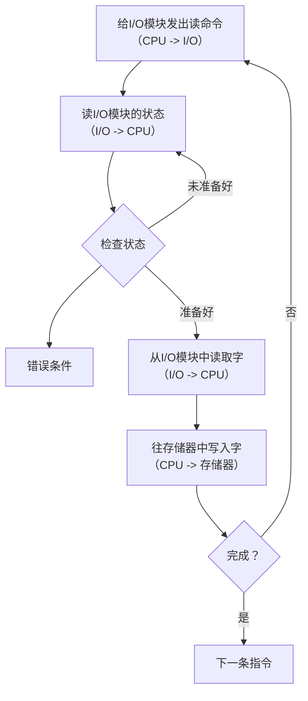
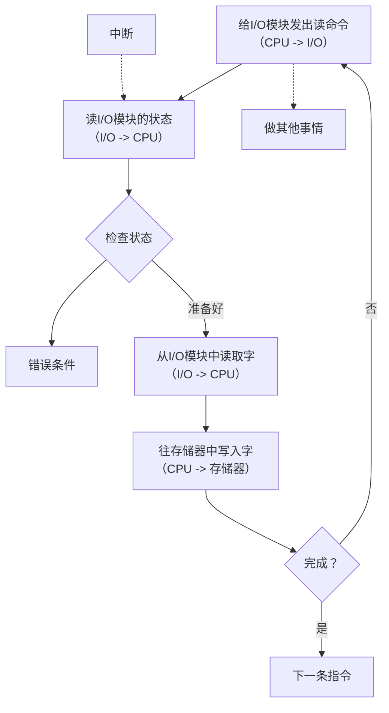
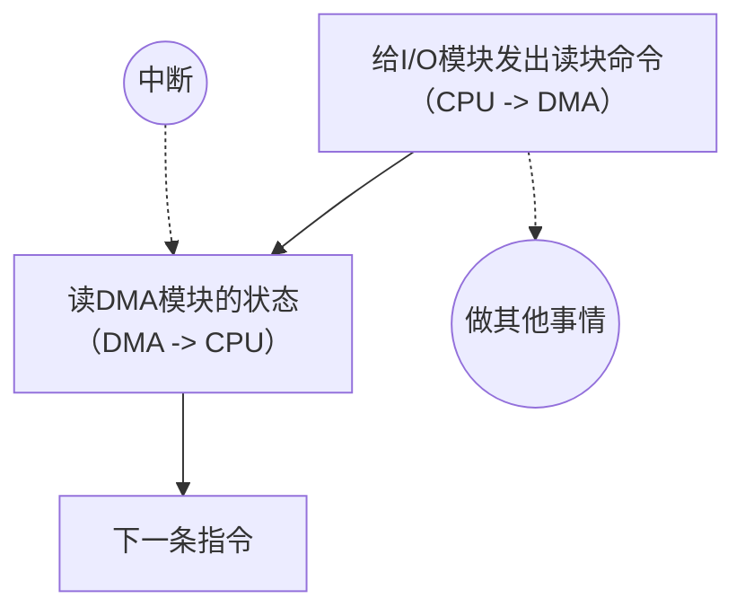
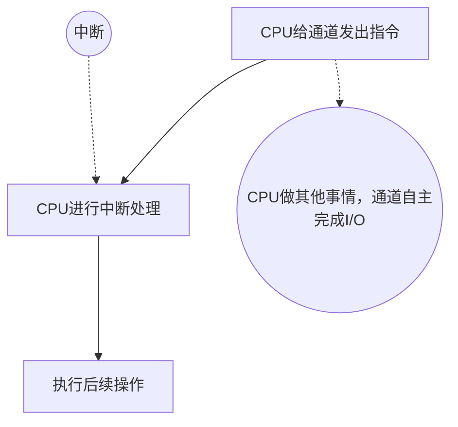
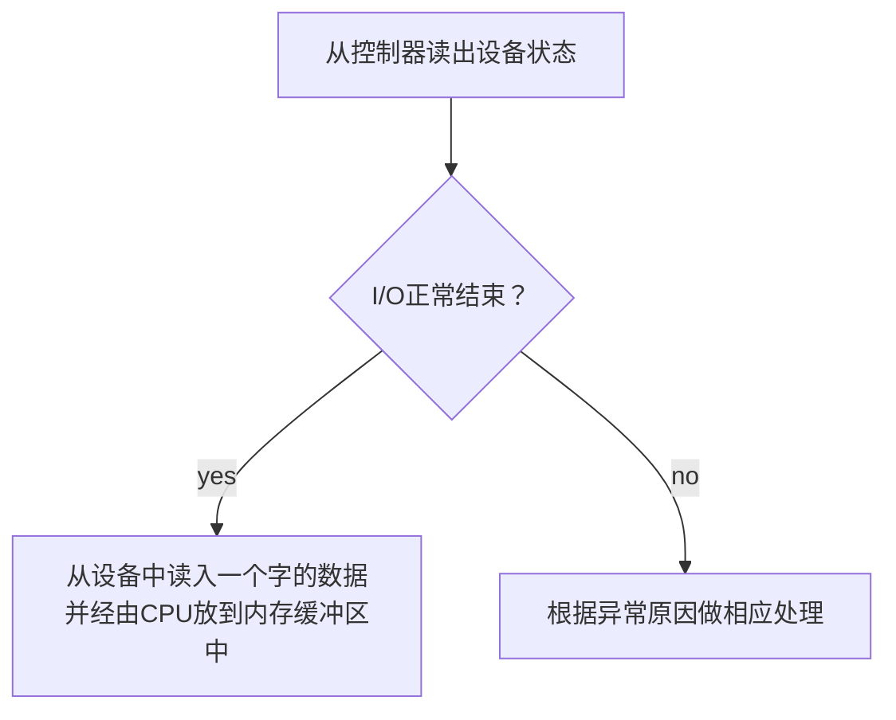

##### 5.13

# I/O管理概述

## I/O设备的概念

I/O：即输入/输出（Input/Output），就是可以将数据输入到计算机，或者可以接收计算机输出数据的外部设备，属于计算机中的硬件部件
 - UNIX系统将外部设备抽象为一种特殊的文件，用户可以使用与文件操作相同的方式对外部设备进行操作

## I/O设备的分类

### 按使用特性分类

共有三类
 1. 人机交互外部设备
     - 键盘、鼠标、打印机等 -- 用于人机交互
     - 数据传输慢
 2. 存储设备
     - 移动硬盘、光盘等 -- 用于数据存储
     - 数据传输快
 3. 网络通讯设备
     - 调制解调器等 -- 用于网络通信
     - 数据传输速度介于二者之间

### 按传输速率分类

主要三类
 - 低速设备
 - 中速设备
 - 高速设备

### 按信息交换的单位分类

主要分为
 - 块设备
    - 磁盘等 -- 数据传输的基本单位是“块”
    - **传输速率高，可寻址，即对它可进行随机读写任一块**
 - 字符设备
    - 鼠标/键盘等 -- 数据传输的基本单位是字符
    - **传输速率慢**，不可寻址，在输入输出时常采用中断驱动方式

## I/O控制器

I/O设备主要由**机械部件**和**电子部件**组成
 - **机械部件**：主要用来执行具体I/O操作
 - **电子部件**：通常是插入主板扩充槽的印刷电路板

### I/O设备的电子部件

CPU无法直接控制I/O设备的机械部件，因此I/O设备还要有一个电子部件**作为CPU与I/O设备机械部件之间的中介**，用于实现CPU对设备的控制

这个电子部件就是**I/O控制器**，又叫**设备控制器**。CPU可控制设备控制器，又由设备控制器来控制设备的机械部件

**设备控制器的功能**：
 - 接受和识别CPU发出的命令
    - I/O控制器中会有相应的**控制寄存器**来存放命令和参数
 - 向CPU报告设备的状态
    - I/O控制器中会有相应的**状态寄存器**，用于记录I/O设备当前状态，比如1表示空闲，0表示在忙碌
 - 数据交换
    - I/O控制器中会设置相应的**数据寄存器**。输出时，数据寄存器用于暂存CPU发来的数据，之后再由控制器传送设备。输入时，数据寄存器用于暂存设备发来的数据，之后CPU从数据寄存器中取走数据
 - 地址识别
    - 类似于内存的地址，为了区分设备控制器中的各个寄存器，也需要给各个寄存器设置一个特定的地址。I/O控制器通过CPU提供的地址来判断CPU要读/写的是哪个寄存器

### I/O控制器的组成

**CPU与控制器的接口**
 - 用于实现CPU与控制器之间的通信
 - CPU通过**控制线**发出命令
 - CPU通过**地址线**指明要操作的设备
 - CPU通过**数据线**来取出（输入）数据，或放入（输出）设备

**I/O逻辑**
 - 负责接收和识别CPU的各种命令（如，地址译码），并负责对设备发出命令

**控制器与设备的接口**
 - 用于实现控制器与设备之间的通信
 - 控制器向设备发出控制信息

*注意*
 1. 一个I/O控制器可能对应多个设备
 2. 数据寄存器、控制寄存器、状态寄存器可能有多个，且这些寄存器都要有相应的地址才能方便CPU操作。
     - 有的计算机会让这些寄存器占用内存地址的一部分，称为**内存映像I/O**
     - 另外一些计算机则采用I/O专用地址，即**寄存器独立编址**

#### 内存映像I/O v.s. 寄存器独立编址

**内存映射I/O**：控制器中的寄存器与内存地址统一编址
 - **优点**：简化了指令。可以采用对内存进行操作的指令来对控制器进行操作

**寄存器独立编址**：控制器中的寄存器使用单独的地址
 - **缺点**：需要设置专门的指令来实现对控制器的操作，不仅要指明寄存器的地址，还要指明控制器的编号

## I/O控制方式

即用什么样的方式来控制I/O设备的数据读/写

**重点注意的内容**：
 1. 完成一次读/写操作的流程
 2. CPU干预的频率
 3. 数据传送的单位
 4. 数据的流向
 5. 主要缺点和主要优点
### 程序直接控制方式

**Key word轮询**
完成一次读写操作流程（读操作为例）
 1. CPU向控制器**发出读指令**，于是设备启动，并且状态寄存器设为1（未就绪）
 2. **轮询**检查控制器的状态（其实就是再不断执行程序的循环，如果状态为一直是1，则说明设备一直在准备中，于是CPU会不断的轮询）
 3. 输入设备准备好数据后，将数据传给控制器，并报告自身的状态
 4. 控制器将输入的数据放到数据寄存器中，并将状态改为0（已就绪）
 5. CPU发现设备已就绪，即可将数据寄存器中的内容读入CPU的寄存器中，再把CPU寄存器中的内容放入内存
 6. 若之后还要继续读入数据，则CPU继续发出读指令

#### 总结

**CPU干预的频率**:
 - 非常频繁，I/O操作开始之前、完成之后需要CPU介入，并且**在等待I/O完成的过程中CPU需要不断的轮询检查**

**数据传送的单位**：
 - 每次读写一个**字**

**数据的流向**：
 - 读操作（数据输入） **I/O设备 -> CPU -> 内存**
 - 写操作（数据输出）**内存 -> CPU -> I/O设备**
每个字的读写都需要CPU的帮助

**主要优缺点**：
 - **优点**：实现简单，在读写指令之后，加上实现循环检查的一系列指令即可
 - **缺点**：==CPU和I/O设备只能串行工作，CPU需要一直轮询检查，长期处于忙等状态==，**CPU利用率低**

### 中断驱动方式

引入**中断机制**，由于I/O设备速度很慢，因此在CPU发出读/写命令后，可**将等待I/O的进程阻塞**，先切换到别的进程执行

当I/O完成后，控制器会向CPU发送一个中断信号，CPU**检测到中断信号后**，会保存当前进程的运行环境信息，转去执行中断处理程序处理该中断

处理中断的过程中，CPU从I/O控制器读一个字的数据传送到CPU寄存器，再写入主存

接着，**CPU恢复等待I/O的进程（或其他进程）的运行环境，然后继续执行**

**注意**：
 1. CPU会在每个指令周期的末尾检查中断
 2. 中断处理过程中需要保存、恢复进程的运行环境，这个过程需要一定的时间开销。可见中断发生的频率太高，会降低系统性能

#### 总结

**CPU的干预频率**：
 - 每次I/O操作开始前、完成之后需要CPU介入
 - **等待I/O完成的过程中CPU可以切换到别的进程执行**

**数据传送的单位**：
 - 每次读/写**一个字**

**数据的流向**：
 - 读操作（数据输入） **I/O设备 -> CPU -> 内存**
 - 写操作（数据输出）**内存 -> CPU -> I/O设备**

**主要优缺点**：
 - **优点**：与程序直接控制方式相比，中断驱动方式中，I/O控制器会通过中断信号主动报告I/O已经完成，CPU**不再需要不停轮询**。**CPU和I/O设备可以并行工作**，CPU利用率明显提升
 - **缺点**：每个字在I/O设备与内存之间的传输，都需要经过CPU。而**频繁的中断处理会消耗较多的CPU时间**

### DMA方式

与中断驱动方式相比，**DMA方式**（Direct Memory Access，**直接存储器存取**，主要用于块设备的I/O控制）存在以下几个改进：
 1. **数据传输单位是块**。不再是一个字、一个字的传送
 2. 数据的流向是从设备直接放入内存，或者从内存直接到设备。不再需要CPU作为中转
 3. 仅在传送一个或多个数据块的开始和结束时，才需要CPU干预

**给I/O模块发出都块命令**：
 - CPU指明此次要进行的操作，并说明要读入多少数据、数据要存放在内存的什么位置、数据在外部设备上的地址
**读DMA模块的状态**：
 - 控制器会根据CPU提出的要求完成数据的读/写工作，整块数据的传输完成后，才向CPU发出中断信号

#### DMA控制器

计算机组成原理中已经详细学习过
**DMA控制器**主要由DR、MAR、DC、CR、I/O控制逻辑等组成，通过系统总线与CPU进行数据交换，同样包含主机-控制器接口、块设备-控制器接口等
 - **数据寄存器DR**（Data Register）：暂存从设备到内存，或从内存到设备的数据
 - **内存地址寄存器MAR**（Memory Address Register）：在输入时，MAR表示数据应该存放到内存中的什么位置；输出时MAR表示要输出的数据放在内存中的什么位置
 - **数据计数器DC**（Date Counter）：表示剩余要读/写的字节数
 - **命令/状态寄存器CR**（Command Register）：用于存放CPU发来的I/O命令，或设备的状态信息

#### 总结

**CPU干预的频率**：
 - 仅在传送一个或多个数据块的开始和结束时，才需要CPU干预

**数据的传送单位**：
 - 每次读/写**一个或多个块（注意：每次读写的只能是连续的多个块，且这些块读入内存后在内存中也必须是连续的）**

**数据的流向**：
 - 读操作（数据输入） **I/O设备  -> 内存**
 - 写操作（数据输出）**内存  -> I/O设备**

**主要的优缺点**
 - **优点**：数据传输以块为单位，CPU介入频率进一步降低。数据的传输不再需要先经过CPU再写入内存，数据传输效率进一步增加。CPU和I/O设备的**并行性得到提升**
 - **缺点**：CPU每发出一条I/O指令，只能读/写一个或多个连续的数据块。如果要读/写多个离散存储的数据块，或者要将数据分别写到不同的内存区域时，CPU要分别发出多条I/O指令，进行多次中断处理才行
### 通道控制方式

**通道**：一种**硬件**，可以理解为**弱化版CPU**。通道可以识别并执行一系列**通道指令**（在操作系统中貌似也有介绍）
- 与CPU相比，通道可以执行的指令很单一，并且通道程序是放在主机内存中的，也就是说**通道与CPU共享内存**

CPU通过总线与内存以及通道直接相连
 1. **CPU向通道发出I/O指令**。指明通道程序在内存中的位置，并指明要操作的是哪个I/O设备。之后CPU就切换到其他进程执行了
 2. **通道执行内存中的通道程序**（其中指明了要读入/写出多少数据，读/写的数据应该放在内存的什么位置等信息）
 3. 通道执行完规定的任务后，**向CPU发出中断信号**，之后CPU对中断进行处理

#### 总结

**CPU的干预频率**
 - 极低，通道会根据CPU的指示执行相应的通道程序，只有完成一组数据块的读/写后才需要发出中断信号，请求CPU干预

**数据的传送单位**
- 每次读/写**一组数据块**

**数据的流向**（==在通道的控制下进行==）
 - 读操作（数据输入） **I/O设备  -> 内存**
 - 写操作（数据输出）**内存  -> I/O设备**

**主要优缺点**
 - **缺点**：实现复杂，需要专门的通道硬件支持
 - **优点**：**CPU、通道、I/O设备可并行工作，资源利用率很高**

### 总结

|          | 完成一次读/写的过程                                        | CPU干预频率 | 每次I/O数据传输单位 | 数据流向                           | 优缺点                                                                                                                                                                                               |
| -------- | ------------------------------------------------- | ------- | ----------- | ------------------------------ | ------------------------------------------------------------------------------------------------------------------------------------------------------------------------------------------------- |
| 程序直接控制方式 | CPU发出I/O命令后需要不断轮询                                 | 极高      | 字           | 读：设备->CPU->内存 写：内存->CPU->设备 | **优点**：实现简单，在读写指令之后，加上实现循环检查的一系列指令即可   **缺点**：==CPU和I/O设备只能串行工作，CPU需要一直轮询检查，长期处于忙等状态==，**CPU利用率低**                                                                                          |
| 中断驱动方式   | CPU发出I/O命令后**可以做其他事情**，本次I/O完成后设备管理器发出中断信号        | 高       | 字           | 读：设备->CPU->内存 写：内存->CPU->设备 | **优点**：CPU**不再需要不停轮询**。**CPU和I/O设备可以并行工作**，CPU利用率明显提升  **缺点**：每个字在I/O设备与内存之间的传输，都需要经过CPU。而**频繁的中断处理会消耗较多的CPU时间**                                                                            |
| DMA方式    | CPU发出I/O命令后**可以做其他事**，本次I/O完成后DMA控制器发出中断信号        | 中       | 块           | 读：设备->内存 写：内存->设备           | **优点**：数据传输以块为单位，CPU介入频率进一步降低。数据的传输不再需要先经过CPU再写入内存，数据传输效率进一步增加。CPU和I/O设备的**并行性得到提升**   **缺点**：CPU每发出一条I/O指令，只能读/写一个或多个连续的数据块。如果要读/写多个离散存储的数据块，或者要将数据分别写到不同的内存区域时，CPU要分别发出多条I/O指令，进行多次中断处理才行 |
| 通道控制方式   | CPU发出I/O命令后可以做其他事。通道会执行通道程序以完成I/O，完成后通道向CPU发出中断信号 | 低       | 一组块         | 读：设备->内存 写：内存->设备           | **缺点**：实现复杂，需要专门的通道硬件支持   **优点**：**CPU、通道、I/O设备可并行工作，资源利用率很高**                                                                                                                              |
事实上，每个阶段的优点都是**解决上个阶段最大的缺点**

总体而言，整个发展过程就是要尽量减少CPU对I/O过程的干预，把CPU从繁杂的I/O控制事务中解脱出来，以便更多的去完成数据处理任务

##### 5.14

## I/O软件层次结构

### 用户层软件

**用户层软件**：**实现了与用户交互的接口**，用户可直接使用该层提供的、与I/O操作相关的库函数对设备进行操作

用户层软件将用户请求翻译成格式化的I/O请求，并通过“系统调用”请求操作系统内核的服务

### 设备独立性软件

又叫做**设备无关性软件**，与设备的硬件特性无关的功能几乎都在这一层实现

主要实现的**功能**：
 1. 向上层提供统一的调用接口
 2. 实现设备的保护
     - 原理类似于文件保护。设备被看作是一个特殊的文件，不同用户对各个文件的访问权限是不一样的，同理，对设备的访问权限也不一样
 3. 差错处理
 4. 设备的分配与回收
 5. 数据缓冲区管理
     - 可以通过缓冲技术屏蔽设备之间数据交换单位大小和传输速度的差异
 6. 建立逻辑设备名到物理设备名的映射关系；根据设备类型选择调用相应的驱动程序
     - 用户或用户层软件发出I/O操作相关系统调用的系统调用时，需要指明此次要操作的I/O设备的逻辑设备名
     - **设备独立性软件**需要通过**逻辑设备表（LUT，Logical Unit Table）** 来确定逻辑设备对应的物理设备，并找到该设备对应的**设备驱动程序**
        1. **整个系统只设置一张LUT**，这就意味着所有用户不能使用相同的逻辑设备名，因此这种方式只适用于**单用户操作系统**
        2. **为每个用户设置一张LUT**，各个用户使用的逻辑设备名可以重复，适用于多用户操作系统。系统会在用户登录时为其建立一个用户管理进程，而LUT就存放在用户管理进程的PCB中

### 设备驱动程序

其主要负责对硬件设备的具体控制，将上层发出的一系列命令转化成特定设备“能听得懂”的一系列操作。包括设置设备寄存器；检查设备状态等

不同的I/O设备有不同的硬件特性，具体细节只有设备的厂家才知道，因此厂家需要根据设备的硬件特性设计并提供相应的驱动程序

### 中断处理程序

当I/O任务完成时，I/O控制器会发送一个**中断信号**，系统会**根据中断信号类型**找到相应的**中断处理程序**并执行。中断处理程序流程如下：

由此可见，**中断处理程序也会和硬件直接打交道**

**总结**：
 - 理解并记住I/O软件**各个层次之间的顺序**，要能推理判断某个处理应该是在哪个层次完成的（最常考的是==设备独立性软件、设备驱动程序两层==）
 - 只需理解：**直接涉及到硬件的具体细节、且与中断无关的操作肯定是在设备驱动程序层完成的**，**没有涉及硬件的、对各种设备都需要进行的管理工作都是在设备独立性软件层完成的**

## 输入/输出应用程序接口

在上一小节中，显然，用户层的应用程序无法用一个统一的系统调用接口来完成所有类型设备的I/O（比如字符设备、块设备、网络设备）

**字符设备接口**：
 - get/put 系统调用：向字符设备读/写一个字符

**块设备接口**：
 - read/write系统调用：向块设备的**读写指针位置**读/写多个字符
 - seek系统调用：**修改读写指针的位置**

**网络设备接口**：又叫**网络套接字（socket）接口**
 - socket系统调用：**创建一个网络套接字**，需指明网络协议
 - bind：将套接字绑定到某个本地“端口”
 - connect：将套接字连接到远程地址
 - read/write：从套接字读/写数据

**以两台主机通信为例（使用 TCP 协议）**
 1. **创建并绑定套接字**  
    - 主机1和主机2分别调用 `socket` 系统调用创建自己的套接字，并各自调用 `bind` 将套接字绑定到一个本地端口（例如主机1绑定到端口 211，主机2绑定到端口 6666）。 
 2. **建立连接**  
    - 主机1上的进程 P1 调用 `connect` 系统调用，通过文件描述符 `fd` 指定本机的套接字，并传入主机2的 IP 地址和端口号 6666。  
    - （此时，双方操作系统内核中的 TCP 协议栈会完成三次握手，在传输层建立一条逻辑连接。从应用层角度看，连接已可用。）
 3. **发送数据**  
    - P1 在用户空间准备好数据，调用 `write` 系统调用，将数据复制到该套接字对应的内核发送缓冲区中。
 4. **协议栈与驱动处理**  
    - 设备独立性软件（即网络协议栈）根据 TCP/UDP 等协议封装数据，然后调用网络控制器驱动程序，将数据从发送缓冲区输出到网络设备（网卡）。
 5. **数据传输与中断**  
    - 网卡通过物理网络将数据发送到主机2的网卡。主机2的网卡接收到数据后，向 CPU 发送中断信号。
 6. **接收数据到内核缓冲区**  
    - 主机2的中断处理程序识别到该中断，调用相应的网络控制器驱动程序，将网卡中的数据拷贝到协议栈中，并根据端口号（6666）将数据放入对应套接字的接收缓冲区（内核空间）。
 7. **进程读取数据**  
    - 主机2上的进程 P3 调用 `read` 系统调用，指定要读取的套接字文件描述符 `fd`。设备独立性软件（协议栈）将数据从内核接收缓冲区复制到用户空间的缓冲区中，P3 即可处理收到的数据。

### 阻塞/非阻塞 I/O

阻塞I/O：应用程序发出I/O系统调用，**进程需转为阻塞态等待**
 - 举例：字符设备接口 -- 从键盘读入一个字符get

非阻塞I/O：应用程序发出I/O系统调用，系统调用可迅速返回，**进程无需阻塞等待**
 - 块设备接口 -- 往磁盘写数据write

### 设备驱动程序接口

若各个公司开发的设备驱动程序接口不统一，则操作系统很难调用设备驱动程序

所以操作系统会给出接口要求，厂商根据接口要求，开发相应的设备驱动程序，设备才能被使用

# I/O核心子系统

**重点**：
 - 用户层软件：假脱机技术（SPOOLing技术）
 - 设备独立性软件：**I/O调度、设备保护**、设备分配与回收、缓冲区管理（即缓冲与高速缓存管理）

**I/O调度**：用某种算法确定一个好的顺序来处理各个I/O请求
 - FCFS先来先服务、优先级算法、短作业优先等算法来确定I/O调度顺序

**设备保护**：UNIX中设备会被看作一种特殊的文件，操作系统需要实现**文件保护功能**，不同的用户对各个文件有不同的访问权限

## 假脱机技术(SPOOLing)

操作系统在早期手工操作阶段，主机直接从I/O设备获取数据，由于设备速度很慢，主机速度很快。人机速度矛盾明显，主机浪费很多时间等待设备

批处理阶段引入了**脱机技术**（磁带完成）：
 - 在外围控制机的控制下，慢速输入设备的数据先被输入到更快速的磁带上。之后主机可以从快速的磁带上读入数据，从而缓解了速度矛盾
 - 输出时类似
 - **优点**：引入脱机技术后，缓解了CPU与慢速I/O设备的速度矛盾。另一个方面，即使CPU在忙碌，也可以提前将数据输入到磁带；即使慢速的输出设备正在忙碌，也可以提前将数据输出到磁带
**脱机**：即脱离主机的控制进行输入输出

### 输入和输出井

*假脱机技术*，又叫**SPOOLing技术**是用软件的方法模拟脱机技术，其组成如下：
 - 系统会在磁盘上开出两个存储区 -- **输入井**和**输出井**
 - **输入井**：模拟脱机输入时的磁带，用于收容I/O设备输入的数据
 - **输出井**：模拟脱机输出时的磁带，用于收容用户进程输出的数据
 - **输入进程**：模拟脱机输入时的外围控制机
 - **输出进程**：模拟脱机输出时的外围控制机
 - **输入缓冲区**：在输入进程的控制下，输入缓冲区用于暂存从输入设备输入的数据，之后再转存到输入井中
 - **输出缓冲区**：在输出进程的控制下，输出缓冲区用于暂存从输出井送来的数据，之后再传送到输出设备上
 - *注意，输入缓冲区和输出缓冲区是在内存中的缓冲区*
所以要实现SPOOLing技术，**必须要有多道程序技术的支持**。系统会建立输入进程和输出进程

### 共享打印机原理分析

**独占式设备** --- **只允许各个进程串行使用的设备**，一段时间内只能满足一个进程的请求
 - 若进程1正在使用设备，则进程2请求使用设备时必然阻塞

**共享设备** --- **允许多个进程“同时”使用的设备**（宏观上同时使用，微观上可能是交替使用）。可以同时满足多个进程的使用请求

打印机就是一种独占式设备，但是可以使用SPOOLing技术改造成共享设备
当多个用户进程提出输出打印的请求时，系统会答应它们的请求，但是并不是真的把打印机分给它们，而是由假脱机管理进程为每个进程做两件事：
 1. 在磁盘输出井中为进程申请一个空闲缓冲区（也就是说缓冲区是在磁盘上的），并将要打印的数据送入其中
 2. 为用户进程申请一张**空白的打印请求表**，并将用户的打印请求填入表中（其实就是说明用户的打印数据存放位置等信息的），再将该表挂到假脱机文件队列上
当打印机空闲时，输出进程会从文件队列的队头取出一张打印请求表，并根据表中的要求将要打印的数据从输出井传送到输出缓冲区，再输出到打印机进行打印。用这种方式可依次处理完全部的打印任务

所以虽然系统中只有一台打印机，但每个进程提出打印请求时，系统都会在输出井中为其分配一个存储区，使每个用户进程都觉得自己在独占一台打印机，从而实现对打印机的共享

SPOOLing技术可以把一台物理设备**虚拟**成逻辑上的多台设备，**可将独占式设备改造成共享设备**

## 设备的分配与回收

**设备的分配与回收**包含：
 - 设备分配时考虑的因素
 - 静态分配与动态分配
 - 设备分配管理中的数据结构
 - 设备分配的步骤
 - 设备分配步骤的改进方法

### 设备分配时应该考虑的因素

设备的**固有属性**可分为三种
 - 独占设备：一个时段只能分配给一个进程
 - 共享设备：可同时分配给多个进程使用（磁盘），各进程往往是宏观上同时共享使用设备，而微观上交替使用
 - 虚拟设备：采用SPOOLing技术将独占设备改造成虚拟的共享设备，可同时分配给多个进程使用

**设备的分配算法**：先来先服务算法，优先级高者优先，短任务优先...

从**安全性**角度而言，设备分配有两种方式：
 - **安全分配方式**：为进程分配一个设备后就将进程阻塞，本次I/O完成后才将进程唤醒（一个时段内每个进程只能使用一个设备）
    - **优点**：破坏了“请求和保持”条件，不会死锁
    - **缺点**：对于一个进程而言，CPU和I/O设备只能串行工作
 - **不安全分配方式**：进程发出I/O请求后，系统为其分配I/O设备，进程可继续执行，之后还可以发出新的I/O请求。只有某个I/O请求得不到满足时才将进程阻塞（一个进程可以同时使用多个设备）
    - **优点**：进程的计算任务和I/O任务可以并行处理，使进程迅速推进
    - **缺点**：有可能发送死锁（死锁避免，死锁的检测和解除）

### 静态分配和动态分配

**静态分配**：进程运行前就为其分配全部的所需资源，运行结束后归还资源
 - 破坏了“请求和保持”条件，不会发生死锁
**动态分配**：进程运行过程中动态申请设备资源
 - 可能会发生死锁

### 设备分配管理中的数据结构

**设备、控制器、通道的关系**：
 - *一个通道可以控制多个控制器，一个控制器又可以控制多个设备*

设备分配管理中的数据结构包含：
 1. 设备控制表DCT
 2. 控制器控制表COCT
 3. 通道控制表CHCT
 4. 系统设备表SDT
#### 设备控制表DCT

**设备控制表**（DCT，Device Control Table）：系统为每个设备配置一张DCT，用于记录设备情况，包含：
 - 设备类型
 - 设备标识符：
    - 即物理设备名。系统中每个设备的物理设备名唯一
 - 设备状态：
    - 忙碌/空闲/故障
 - 指向控制器表的指针：
    - 每个设备由一个控制器控制，该指针可找到相应控制器的信息
 - 重复执行次数或时间：
    - 当重复执行多次I/O操作后不成功，才会判定I/O失败
 - 设备队列的队首指针
    - 指向此时等待该设备的进程队列（由进程PCB组成队列）

#### 控制器控制表COCT

**COCT**，COntroller Control Table：每个设备控制器都会对应一张COCT。操作系统根据COCT的信息对控制器进行操作和管理，包含：
 - 控制器标识符
    - 各个控制器的唯一ID
 - 控制器状态
 - 指向通道表的指针
    - 每个控制器由一个通道控制，该指针可找到相应通道的信息
 - 控制器队列的队首指针
 - 控制器队列的队尾指针
    - 指向正在等待该控制器的进程队列（由进程PCB组成队列）

#### 通道控制表CHCT

**CHCT**，CHannel Control Table：每个通道都会对应一张CHCT。操作系统根据CHCT的信息对通道进行操作和管理，包含：
 - 通道标识符
    - 各个通道的唯一ID
 - 通道状态
 - 与通道连接的控制器表首址
    - 可通过该指针找到该通道管理的所有控制器相关信息（COCT）
 - 通道队列的队首指针
 - 通道队列的队尾指针
    - 指向正在等待该通道的进程队列（由进程PCB组成队列）

#### 系统设备表SDT

**SDT**，System Device Table：记录了**系统中全部设备**的情况，每个设备对应一个表目：
表目包含：
 - 设备类型
 - 设备标识符
    - 即物理设备名
 - DCT
 - 驱动程序入口

### 设备分配的具体步骤

具体步骤如下：
 1. 根据进程请求的**物理设备名**查找SDT（物理设备名是进程请求分配设备时提供的参数）
 2. 根据SDT找到DCT，若**设备忙碌**则将进程PCB挂到**设备等待队列中**，不忙碌则将**设备分配**给进程
 3. 根据DCT找到COCT，若**控制器忙碌**则将进程PCB挂到**控制器等待队列**中，不忙碌则将**控制器分配**给进程
 4. 根据COCT找到CHCT，若**通道忙碌**则将进程PCB挂到**通道等待队列**中，不忙碌则将**通道分配**给进程

**注意**：==只有设备、控制器、通道三者都分配成功时，这次设备分配才算成功，之后编可以启动I/O设备进行数据传送==

**缺点**：
1. 用户编程时必须使用“物理设备名”，底层细节对用户不透明，不方便编程
2. 若换了一个物理设备，则程序无法运行
3. 若进程请求的物理设备正在忙碌，则即使系统中还有同类型的设备，进程也必须阻塞等待

#### 设备分配步骤的改进

由于上述的缺点，具体改进方法为：**建立逻辑设备名与物理设备名**的映射机制，用户编程时只需提供**逻辑设备名**

此时具体步骤如下：
 1. 根据进程请求的**逻辑设备名**查找SDT（**用户编程时提供的逻辑设备名就是设备类型**）
 2. 查找SDT，找到用户进程**指定类型的、空闲**的设备，将其分配给该进程。操作系统**在逻辑设备表LUT中新增一个表项**
 3. 根据DCT找到COCT，若**控制器忙碌**则将进程PCB挂到**控制器等待队列**中，不忙碌则将**控制器分配**给进程
 4. 根据COCT找到CHCT，若**通道忙碌**则将进程PCB挂到**通道等待队列**中，不忙碌则将**通道分配**给进程

==逻辑设备表（LUT）建立了逻辑设备名与物理设备名之间的映射关系==
某用户进程第一次使用设备时使用逻辑设备名向操作系统发出请求，操作系统根据用户进程指定的设备类型（逻辑设备名）查找系统设备表，找到一个空闲设备分配给进程，并在LUT中增加相应表项

==如果之后用户进程再次通过**相同的逻辑设备名**请求使用设备，则操作系统通过LUT表即可知道用户进程实际要使用的是哪个物理设备了，并且也能知道该设备的**驱动程序入口地址**==

**逻辑设备表的设置问题**：
 - 整个系统只有一张LUT：各个用户所用的**逻辑设备名不允许重复**，适用于单用户操作系统
 - 每个用户一张LUT：**不同用户的逻辑设备名可重复**，适用于多用户操作系统