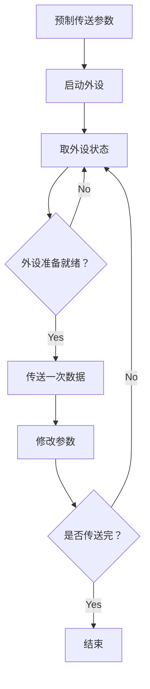
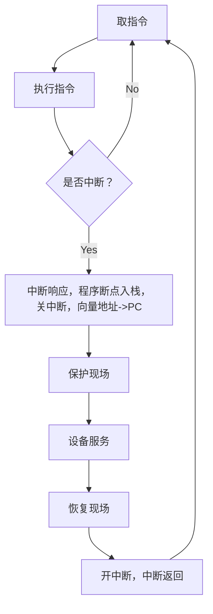
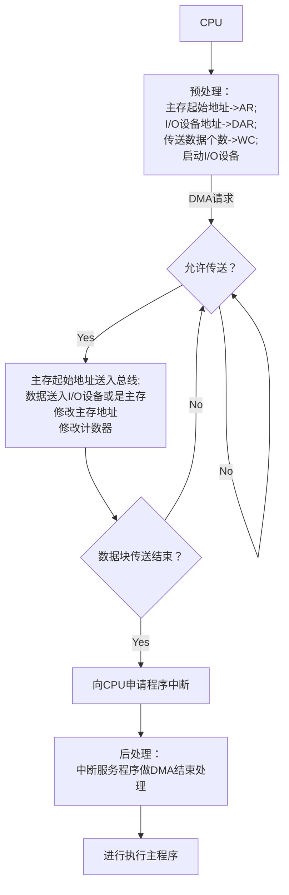

# 3.4

##### 冯诺依曼计算机的特点

1.计算机由五大部件组成（控制器，运算器，存储器，I/O设备）

2.<mark>指令和数据以同等地位存于存储器，可按地址寻访</mark>

    后果：a.程序可以自修改

                b.指令也要经过缓存

                c.指令与数据会发生带宽竞争（von Neumann bottleneck）

3.<mark>指令和数据用二进制表示</mark>

4.指令由**操作码**和**地址码**组成

5.存储程序

6.以**运算器**为中心（现在一般以存储器为中心，而且MDR及MAR一般集成到CPU里）

#### 主存储器的基本组成

**存储体+MAR+MDR**

**MAR** : Memory Address Register存储地址寄存器

   MAR 位数决定“可寻址单元数量”

**MDR** : Memory Data Register存储数据寄存器

    MDR 位数决定“单次数据通路宽度”

顺序：CPU->MAR->存储体->MDR->CPU

**存储体**：

    存储单元：每个存储单元存放一串二进制代码

    存储字（word）：存储单元中二进制代码的组合

    存储字长：存储单元中二进制代码的位数 8/16/32/64

**MAR** ：位数反映存储单元的个数

    MAR=4位 -> 总共有2^4个存储单元

**MDR** ：位数=存储字长

    MDR=16位 -> 每个存储单元可存放16bit，一个字(word) = 16bit

**注** ：一个字节（Byte） = 8bit

        1B = 一个字节，1b = 1个bit

##### 运算器的基本组成

**ACC+MQ+ALU+X**

**ACC(Accumulator)**：累加器，用于存放操作数或运算结果

**MQ** ：乘商寄存器，在乘除运算时，存放操作数或运算结果

**X** ：通用的操作数寄存器，存放操作数

**<mark>ALU(Arithmetic and Logic Unit)</mark>** : 算术逻辑单元,通过内部复杂的电路实现算数运算、逻辑运算

|     | 加     | 减     | 乘       | 除      |
| --- | ----- | ----- | ------- | ------ |
| ACC | 被加数、和 | 被减数、差 | 乘积高位    | 被除数、余数 |
| MQ  |       |       | 乘数，乘积低位 | 商      |
| X   | 加数    | 减数    | 被乘数     | 除数     |

##### 控制器的基本组成

**CU+IR+PC**

**<mark>CU(Control Unit)</mark>** ：控制单元，分析指令，给出控制信号

**IR(Instruction Register)** ：指令寄存器，存放当前执行的指令

**PC(Program Counter)** ：程序计数器，存放下一条指令地址，有自动加一的功能

完成一条指令：PC（取指令）-> IR（分析指令）-> CU（执行指令）

##### 计算机的工作过程

```cpp
int a=2,b=3,c=1,y=0;
void main(){
    y=a*b+c;
}
```

CPU:运算器+控制器

主存：存储体+MAR+MDR

| 主存地址 | 指令                | 注释            |
| ---- | ----------------- | ------------- |
| 0    | 000001 0000000101 | 取数a至ACC       |
| 1    | 000100 0000000110 | 乘b得ab，存于ACC   |
| 2    | 000011 0000000111 | 加c得ab+c，存于ACC |
| 3    | 000010 0000001000 | 将ab+c，存于主存单元  |
| 4    | 000110 0000000000 | 停机            |
| 5    | 0000000000000010  | 原始数据a=2       |
| 6    | 0000000000000011  | 原始数据b=3       |
| 7    | 0000000000000001  | 原始数据c=1       |
| 8    | 0000000000000000  | 原始数据y=0       |

I/O

初始：(PC)（程序计数器）=0，指向第一条指令的存储地址

#1: (PC) -> MAR,导致(MAR)（存储地址寄存器） = 0  //打一个()表示寄存器里边的内容

#3: M(MAR) -> MDR（存储数据寄存器）,导致(MDR) = 000001（**操作码**） 0000000101（**地址码**）

#4: (MDR) -> IR（指令寄存器）,导致(IR) = 000001 0000000101

#5: OP(IR) -> CU（控制单元）,指令的**操作码**送到CU，CU分析后得知，这是“取数”指令

#6: Ad(IR) -> MAR,指令的地址码送到MAR,导致(MAR) = 5

#8: M(MAR) -> MDR ,导致(MDR) = 0000000000000010 = 2

#9: (MDR) -> ACC（累加计数器）,导致(ACC) = 0000000000000010 = 2 //此时a变量值已经放入ACC中了

 总结：#1-4 取指令（完成后PC值自动+1） #5 分析指令 #6-9 执行取数指令

上一条指令取指后PC自动+1，(PC)  = 1;执行后 (ACC) = 2 

#1: (PC) -> MAR,导致(MAR)（存储地址寄存器） = 1 

#3: M(MAR) -> MDR（存储数据寄存器）,导致(MDR) = 000100（**操作码**） 0000000110（**地址码**）

#4: (MDR) -> IR（指令寄存器）,导致(IR) = 000100 0000000110

#5: OP(IR) -> CU,指令操作码送到CU，CU分析后得知，这是”乘法“指令

#6: Ad(IR) -> MAR,指令的**地址码**送到MAR，导致(MAR)=6

#8: M(MAR) -> MDR ,导致(MDR) = 0000000000000011 = 3

#9: (MDR) -> MQ,导致(MQ) = 0000000000000011 = 3

#10: (ACC) -> X,导致(X) = 2

#11: (MQ)*(X) -> ACC,由ALU（算术逻辑单元）实现乘法运算，导致(ACC) = 6,如果乘积过大需要MQ辅助存储

总结：#1-4 取指令（完成后PC值自动+1） #5 分析指令 #6-11 执行乘法指令

上一条指令取指后(PC) = 2,执行后，(ACC) = 6

#1: (PC) -> MAR,导致(MAR)（存储地址寄存器） = 2

#3: M(MAR) -> MDR（存储数据寄存器）,导致(MDR) = 000011（**操作码**） 0000000111（**地址码**）

#4: (MDR) -> IR（指令寄存器）,导致(IR) = 000011 0000000111

#5: OP(IR) -> CU,指令操作码送到CU，CU分析后得知，这是”加法“指令

#6: Ad(IR) -> MAR,指令的**地址码**送到MDR，导致(MAR) = 7

#8: M(MAR) -> MDR,导致(MDR) = 0000000000000001 = 1

#9: (MDR) -> X ,导致 (X) = 0000000000000001 = 1

#10: (ACC) + (X) -> ACC,导致(ACC) = 7,由ALU实现加法运算

总结：#1-4 取指令（完成后PC值自动+1） #5 分析指令 #6-10 执行加法指令

上一条指令取指后(PC) = 3,执行后，(ACC) = 7

#1: (PC) -> MAR,导致(MAR)（存储地址寄存器） = 3

#3: M(MAR) -> MDR（存储数据寄存器）,导致(MDR) = 000010（**操作码**） 0000001000（**地址码**）

#4: (MDR) -> IR（指令寄存器）,导致(IR) = 000010 0000001000

#5: OP(IR) -> CU,指令操作码送到CU，CU分析后得知，这是”存数“指令

#6: Ad(IR) -> MAR,指令的**地址码**送到MAR，导致(MAR) = 8

#7: (ACC) -> MDR,导致(MDR) = 7

#9: (MDR) -> 地址为8的存储单元（由MAR指明），导致y = 7

总结：#1-4 取指令（完成后PC值自动+1） #5 分析指令 #6-9 执行存数指令

上一条指令取指后(PC) = 4

#1: (PC) -> MAR,导致(MAR)（存储地址寄存器） = 4

#3: M(MAR) -> MDR（存储数据寄存器）,导致(MDR) = 000110（**操作码**） 0000000000（**地址码**）

#4: (MDR) -> IR（指令寄存器）,导致(IR) = 000110 0000000000

#5: OP(IR) -> CU,指令操作码送到CU，CU分析后得知，这是”停机“指令

利用中断机制通知操作系统终止该进程（在操作系统部分学习）

总结：#1-4 取指令（完成后PC值自动+1） #5 分析指令 执行停机指令

**总结** ： 必经步骤：

1.(PC) -> MAR M(MAR) -> MDR (MDR) -> IR 取指结束(PC) + 1 -> PC

2.OP(IR) -> CU 分析指令结束

# 3.9

##### 计算机软件

应用软件：为解决某个应用领域而开发

系统软件：负责管理硬件资源，并向上层应用程序提供基础服务

**三种级别的语言**：1.机器语言2.汇编语言3.高级语言

**软件和硬件的逻辑功能是等价性**：同一个功能既可以用硬件实现（高成本）又可以用软件实现（低成本）

指令集体系结构（ISA）：清晰定义软件硬件的界限

##### 计算机系统的层次结构（硬件设计人员视角）

<mark>虚拟机器</mark>(高级语言机器) M4 -> <mark>虚拟机器</mark>(汇编语言机器) M3 -> <mark>虚拟机器</mark>(操作系统机器) M2 -><mark>传统机器</mark>(机器语言的机器) M1-> <mark>微程序机器</mark>(微指令系统) M0

高级语言机器：用编译程序翻译成汇编语言程序

软件：M4，3，2

硬件：M1，0

**计算机组成原理**：实现计算机体系结构所体现的属性，对程序员“透明（看不见）”（具体指令的实现）（用硬件实现定义的接口）

**计算机体系结构**：机器语言程序员所见到的计算机系统的属性概念性的结构与功能特性（指令系统、数据类型、寻址技术、I/O机理）（设计软硬件之间的接口）

##### 计算机系统的工作原理（C举例）

程序员 -> 源程序（hello.c） -<mark>预处理器</mark>-> 预处理（hello.i） -<mark>编译器</mark>-> 汇编语言程序（hello.s） -<mark>汇编器</mark>-> 机器语言程序（hello.o 目标模块）+ 其他被引用的目标模块printf.o -<mark>链接器</mark>-> 可执行文件

# 3.11

##### 计算机的性能指标

**存储器的性能指标**：

总容量 = 存储单元个数 × 存储字长 bit   1Byte = 8bit

             = 存储单元个数 × 存储字长/8 Byte

例子：

    MAR为32位，MDR为8位，

$$
总容量 = 2^{32} * 8 bit = 4GB
$$

MAR的位数反映存储单元的个数

MDR位数 = 存储字长 = 每个存储单元的大小

**CPU的性能指标**

CPU主频：CPU内数字脉冲信号振荡的频率

每个脉冲信号的时间：CPU的**时钟周期**

$$
CPU主频（时钟频率） = \frac{1}{CPU时钟周期}
$$

CPI（Clock cycle Per Instruction）：执行一条指令的时钟周期数

不同的指令，CPI不一样，甚至相同的指令，CPI也可能有变化

$$
执行一条指令的耗时 = CPI × CPU时钟周期
$$

$$
CPU执行时间 = \frac{CPU时钟周期数}{主频} = \frac{指令条数×CPI}{主频}
$$

IPS(Instructions Per Second) : 每秒执行多少条指令

$$
IPS = \frac{主频}{平均CPI}
$$

FLOPS（Floating-point Operations Per Second）：每秒执行多少次浮点运算

**系统整体性能指标**

数据通路带宽：数据总线一次能并行传送信息的位数（各硬件部件通过总线传输数据）

吞吐量：系统在单位时间内处理请求的数量

响应时间：用户给系统发送请求到系统对该请求做出回应的时间

**系统整体的性能指标（动态测试）**

基准程序：用于测量计算机处理速度的实用程序，方便比较

# 3.16

##### 十进制

符号反映权重：1 2 3 4 5 6 7 8 9 0

符号所在位置也反映权重

$$
K_{n}K_{n-1}...K_{2}K_{1}K_{0}K_{-1}K_{-2}...K_{-m}\\
=K_{n}×10^{n}+K_{n-1}×10^{n-1}...K_{2}×10^{2}+K_{1}×10^{1}+K_{0}×10^{0}\\
+K_{-1}×10^{-1}+K_{-2}×10^{-2}...K_{-m}×10^{-m}

$$

##### 推广：R进制

r进制：（任意进制->十进制）

$$
K_{n}K_{n-1}...K_{2}K_{1}K_{0}K_{-1}K_{-2}...K_{-m}\\
=K_{n}×r^{n}+K_{n-1}×r^{n-1}...K_{2}×r^{2}+K_{1}×r^{1}+K_{0}×r^{0}\\
+K_{-1}×r^{-1}+K_{-2}×r^{-2}...K_{-m}×r^{-m}
$$

<mark>基数</mark>：每个数码位所用到的不同符号的个数，r进制的基数为r

例：常见的进制

    二进制：0 1 

    八进制：0 1 2 3 4 5 6 7 

    十六进制： 0 1 2 3 4 5 6 7 8 9 A B C D E F

**二进制的优点**

1. 可以使用两个稳定状态的物理器件表示

2. 0，1正好对应逻辑真假，方便实现逻辑运算

3. 可以方便的使用逻辑门电路实现算数运算

**二进制<-->八进制、十六进制**

二->八：

每<mark>三个为一组</mark>转为八进制符号即可

二->十六：

每<mark>四个为一组</mark>转为十六进制符号即可

八->二

每位八进制对应3位二进制

十六->二

每位十六对应4位二进制

##### 进制的书写方式

二进制：$(10000001010)_{2}$ 或者 10000001010B

八进制：$(1652)_{8}$ 

十六进制：$(1652)_{16}$ 或者 1652H 或者 0x1652

十进制：$(1652)_{10}$ 或者 1652D  

###### 十进制->其他进制

**整数部分**：$K_{0} = n / r .... 余数$ 以此类推

例：75.3整数部分 75

75 ÷ 2 = 37 ···1 $K_{0}$

37 ÷ 2 = 18 ···1 $K_{1}$

18 ÷ 2 = 9 ··· 0 $K_{2}$

9 ÷ 2 = 4 ··· 1 $K_{3}$

4 ÷ 2 = 2 ··· 0 $K_{4}$

2 ÷ 2 = 1 ··· 0 $K_{5}$

1 ÷ 2 = 0 ··· 1 $K_{6}$

<mark>先得到的余数是低位的，后得到的是高位的</mark>

所以 75D = 1001011B

**小数部分** 小数部分 × 基数 所得的整数部分就是$K_{-1}$ 以此类推

例：75.3小数部分 0.3

0.3 × 2 = 0.6 = 0 + 0.6 $K_{-1}$

0.6 × 2 = 1.2 = 1 + 0.2 $K_{-2}$

0.2 × 2 = 0.4 = 0 + 0.4 $K_{-3}$

0.4 × 2 = 0.8 = 0 + 0.8 $K_{-4}$

0.8 × 2 = 1.6 = 1 + 0.6 $K_{-5}$

0.3二进制无法精确表示，所以一般后5位

即0.3D = 0.01001...B

综上所述：75.3D = 1001011.01001...B

##### 真值和机器数

增加一个标志位去表示正负

真值：符合人类习惯的数字

机器数：数字实际存到机器中的形式，正负号需要被“数字化”

# 3.17

##### 定点数 vs 浮点数

定点数：小数点的位置固定 Eg：996.007 --**常规计数**

浮点数：小数点的位置不固定 Eg：9.96007*$10^{2}$  --**科学计数法**

二进制的定点数，浮点数也类似

##### 无符号数的表示

无符号数：整个机器字长的全部二进制位均为数值位，没有符号位，相当于数的绝对值

通常只讨论无符号整数，而没有无符号小数

##### 有符号数的定点表示

定点整数：第一位为符号位

定点小数：小数点的位置隐含

**注**：可以使用**原码，反码，补码**三种方式来表示定点整数和定点小数

**原码（机器字长为8位）**：用尾数表示真值的绝对值，符号位0/1表示正负

Eg：+19D：00010011 

         -19D：10010011 若未指明机器字长可写为$[x]_{原} = 1,10011$

         +0.75D：01100000

          -0.75D：11100000

表示范围：若机器字长n+1，则原码整数表示范围：$-(2^n-1)≤x≤2^n-1$

                    原码小数表示范围：$-(1-2^{-n})≤x≤1-2^{-n}$

真值0有+0和-0

**反码**：若符号位为0，则原码和反码相同

            若符号位为1，则数值位全部取反

Eg：+19D：00010011

         -19D：11101100

反码的表示范围：与原码一致

反码的作用几乎只是原码转补码的中间码

**补码**：正数的补码 = 原码

            负数的补码 = 反码末尾+1（考虑进位）

Eg：+19D：00010011

         -19D：11101101

补码的真值0只有一种表示形式

定点整数补码$[x]_补 = 10000000$ 表示 $x = -2^7$

若机器字长n+1位，则补码整数的表示范围：$-2^n≤x≤2^n-1$

**移码** ：补码的基础上将符号位取反 <mark>注意：移码只能表示整数</mark>

移码表示的整数很方便比较大小

**技巧** 由$[x]_补$ 快速求得$[-x]_补$

    符号位、数值位全部取反，末位+1

##### 加减运算

硬件加法器和减法器的设计中减法器的成本高，所以使用加法运算代替减法运算

模运算mod n 把所有整数分为n类（0~n-1）

mod n相同的数，都是同一类，都是等价的

使用加法代替减法，互为补数，二者绝对值之和=模

**8位字长的机器**：相当于天然的完成了$mod  2^8$的操作，任何运算在模运算之后只保留最低八位

所以 <mark>模-a的绝对值 = a的补数</mark>

**补码**：让减法操作转变为加法操作，节省硬件成本

##### C语言中的强制类型转换

```c
short x = -4321;//short占两个字节
unsigned short y = (unsigned short)x;//强转之后相当于直接把x的补码赋值给y
//导致y真值 = 61215，
```

无符号数到有符号数：不改变数据的二进制内容但改变解释方式

长整数变短整数：高位截断，保留低位

短整数转长整数：符号拓展

##### 零拓展&符号拓展

原因：

1. ALU的长度是固定的，所以运算前需要把短数据扩展为长数据

2. 通用寄存器的位数固定，把数据存入寄存器时，可能需要长度扩展

**零拓展**：8bit -> 16bit <mark>属于无符号整数</mark>

无符号整数90 01011010 -> 0000000001011010

**符号拓展**：<mark>适用于带符号整数</mark>

带符号整数（补码）-90 1,0100110 -> 1,111111110100110(负数符号位和数值位之间加1)

                                  +90 0,1011010 -> 0,000000001011010(正数符号位和数值位之间加0)

##### 基本逻辑运算：与、或、非

算数运算----加、减、乘、除（基本算术运算）、幂次方（复合算术运算）

逻辑运算----对逻辑真/假（二进制1/0）进行运算 与、或、非（基本逻辑运算）、异或（复合逻辑运算）...

**与 AND**：

表达式： Y = A·B

| A   | B   | Y   |
| --- | --- | --- |
| 0   | 0   | 0   |
| 0   | 1   | 0   |
| 1   | 0   | 0   |
| 1   | 1   | 1   |

**或 OR**

表达式 Y = A + B

| A   | B   | Y   |
| --- | --- | --- |
| 0   | 0   | 0   |
| 0   | 1   | 1   |
| 1   | 0   | 1   |
| 1   | 1   | 1   |

**非 NOT**

表达式 $Y = \overline A$

| A   | Y   |
| --- | --- |
| 0   | 1   |
| 1   | 0   |

##### 复合逻辑运算：与非、或非、异或、同或

**与非 NAND**

表达式 $Y = \overline{A·B}$

| A   | B   | Y   |
| --- | --- | --- |
| 0   | 0   | 1   |
| 0   | 1   | 1   |
| 1   | 0   | 1   |
| 1   | 1   | 0   |

**或非 NOR**

表达式 $Y = \overline{A + B}$

| A   | B   | Y   |
| --- | --- | --- |
| 0   | 0   | 1   |
| 0   | 1   | 0   |
| 1   | 0   | 0   |
| 1   | 1   | 0   |

**异或 XOR**

表达式 $ Y = A \oplus B = \overline AB + A\overline B$

| A   | B   | Y   |
| --- | --- | --- |
| 0   | 0   | 0   |
| 0   | 1   | 1   |
| 1   | 0   | 1   |
| 1   | 1   | 0   |

<mark>当两个输入值相异的时候，输出为1</mark>

**同或 XNOR**

表达式 ： $Y = A ⊙ B = \overline {A \oplus B} = \overline{\overline AB + A\overline B}$

| A   | B   | Y   |
| --- | --- | --- |
| 0   | 0   | 1   |
| 0   | 1   | 0   |
| 1   | 0   | 0   |
| 1   | 1   | 1   |

两个输入相“同”时，输出1

**异或的妙用（实现奇偶校验）**

对n bit进行异或，若有奇数个1，结果为1；若有偶数个1，则异或结果为0

#### 优先级问题

基本逻辑运算：非>与>或

先算括号内的，括号会提升优先级

##### 逻辑运算常见公式（详情在离散数学）

分配律 $A(C+D) = AC + AD$

与运算结合律 $ABC = A(BC)$

或运算结合律 $A+B+C = A + (B + C)$

反演律：$\overline{A+B} = \overline A · \overline B$

反演律：$\overline{A·B} = \overline A + \overline B$

**本质上逻辑表达式是对电路的数学化描述**

##### 多路选择器（MUX）

k个输入+单个输出+控制信号

作用：在多个输入数据中，只允许其中之一通过MUX

控制信号的位数$m\geq [\log_2{k}]bit$

##### 三态门

作用：根据控制信号决定是否让输入的数据通过

图形：小三角，一个输入、一个输出、一个控制信号

**非门和三态门的核心区别**：<mark>非门没有控制信号，只有输入输出</mark>

##### 加法器的基本功能

$A_i$：被加数的本位

$B_i$：加数的本位

$C_{i-1}$：来自低位的进位

$S_i$：本位和

输出：$S_i$：输入中有奇数个1时输出1

$$
S_i = A_i \oplus B_i \oplus C_{i-1}
$$

$C_i$:输入中至少2个1时输出1

$$
C_i = A_i·B_i + (A_i\oplus B_i)·C_{i-1}
$$

##### 一位全加器

封装上述电路，仅对外暴露输入输出

一位全加器：支持1bit加法

##### n bit 加法器

把n个一位全加器串联起来就可以进行n bit数相加

将上述一堆全加器封装并屏蔽内部细节，只暴露输入输出，即为加法器

不足之处：进位信息串行产生，计算速度取决于进位产生和传递的速度

*注：电信号达到稳定有一定延迟，因此进位产生速度会有延迟*

*注：串行进位又叫行波进位，每一级进位直接依赖于前一级的进位，即进位信号是逐级形成的*

由于两个输入端允许并行输入n bit，因此这种加法器属于：并行加法器

由于进位是串行产生的，因此从“进位方式看”，这种加法器属于：**串行进位加法器**

综上，这种加法器很多地方称为：**<mark>串行进位的并行加法器</mark>**

##### 并行进位的并行加法器

增加一个n位CLA部件

**并行进位的并行加法器**：所有进位信息都是同时产生的，几乎没有延迟

特点：运算速度比“串行进位的并行加法器”更快

##### 带标志位的加法器

有时候需要关心加法运算是否溢出、是否为0、结果是否为0/1

所以增加一些标志位：

**OF（Overflow Flag）**：溢出标志，用于判断**带符号数**加减运算是否溢出。 1：是 0：否

    $OF = C_n \oplus C_{n-1}$:即最高位的进位$\oplus$次高位的进位

**SF（Sign Flag）**：符号标志，判断**带符号数**加减运算结果的正负性 。1：负 0：正

    $SF = S_n$ 取运算结果的最高位（符号位）

**ZF（Zero Flag）** 零标志，判断结果是否为0。 1：表示为0  0：表示不为0

    $ZF = \overline{S_n+....+S_2+S_1}$ : 仅当运算结果所有bit全0时，ZF才为1，此时运算结果为0

**CF（Carry Flag）** 进位/借位标志，判断无符号数加减运算是否溢出。 1：溢出 0：没有溢出

    $CF = C_{out}\oplus C_{in} = C_n \oplus C_0$ 反映无符号数加减运算是否溢出

# 3.19

##### 算术逻辑单元的作用

CPU由控制器、运算器组成

控制器负责解析指令，并根据指令功能发出相应控制信号

运算器负责对数据进行处理

**ALU**是一种组合逻辑电路，<mark>是运算器的核心</mark>

**加法器是ALU的核心**

其本质是：**在同一套数据通路上，通过控制信号选择不同运算功能**

##### ALU的功能

算数运算：加减乘除

逻辑运算：与或非...

其他：求补码、直送等

如果ALU支持k种功能，则控制信号位数 $m >= [\log_2k]$ 

##### 定点数的移位运算

移位运算：通过改变数码位和小数点的相对位置，从而改变各数码位的位权

**逻辑移位**：（常用于处理无符号整数）

    **逻辑左移**：高位移出丢弃，低位补0

对于无符号整数，每逻辑左移一位，相当于×2

<mark>若逻辑左移丢弃的位=1</mark>，则发生溢出

    **逻辑右移**：低位移出丢弃，高位补0

对于无符号整数，每逻辑右移一位，相当于÷2

若逻辑右移丢弃的位=1，则会<mark>丢失精度</mark>

**算数移位**（通常处理带符号整数）

    **算数左移**：高位移出丢弃，低位补0

对于带符号整数，每算数左移一位，相当于×2

<mark>计算机硬件会检查符号位是否发生改变</mark>，改变则溢出

   **算数右移**：低位移出丢弃，<mark>高位补符号位</mark>

对于带符号整数，每算数右移一位，相当于÷2

若逻辑右移丢弃的位=1，则会<mark>丢失精度</mark>

##### 原码的加减运算

**加法运算**

正+正 ->绝对值做加法，结果为正

负+负 ->绝对值做加法，结果为负

正+负 ->绝对值大的减绝对值小的，符号同绝对值大的数

负+正 ->绝对值大的减绝对值小的，符号同绝对值大的数

**减法运算**，减数符号取反，转为加法

正-负 ->正+正

负-正 ->负+负

正-正 ->正+负

负-负 ->负+正

原码复杂的逻辑使用电路设计过于困难，所以一般使用补码进行加减运算

##### 补码的加减运算

对于补码而言，无论加法还是减法，**最后都会转变为加法**，由加法器实现运算，符号位也参与

**溢出判断**：

只有 正数+正数 才会<mark>上溢</mark> --正+正 = 负

只有 负数+负数 才会<mark>下溢</mark> -- 负+负 = 正

*方法一*：采用一位符号位

    假设A的符号为$A_s$，B的符号为$B_s$，运算结果的符号为$S_s$,则溢出逻辑表达式为

$$
V = A_sB_s\overline{S_s} + \overline{A_s}\overline{B_s}S_s
$$

<mark>V=0</mark>,表示无溢出

<mark>V=1</mark>,表示有溢出

*方法二*：采用一位符号位，根据数据进位情况判断

|     | 符号位的进位$C_s$ | 最高数值位的进位$C_1$ |
| --- | ----------- | ------------- |
| 上溢  | 0           | 1             |
| 下溢  | 1           | 0             |

即$C_s$ 与$C_1$不同时有溢出

处理不同的逻辑符号：异或$\oplus$

溢出判断的逻辑表达式为：

$$
V = C_s \oplus C_1
$$

<mark>若V=0</mark>，表示无溢出

<mark>若V=1</mark>，表示有溢出

*方法三*：采用双符号位

<mark>正数符号00</mark>，<mark>负数符号11</mark>

相加之后两个符号位的第一个表示的是**本应得到的符号**，第二个表示的是**实际得到的符号**

所以两数相加得到：

    01：本应为正却得到负，发生<mark>上溢</mark>

    10：本应为负却得到正，发生<mark>下溢</mark>

**双符号位的补码：模4补码**（实际存储时只存储1个符号位，运算时会复制一个）

**单符号位的补码：模2补码**

##### 

##### 无符号数的加减运算

无符号整数的加法：从最低位开始，按位相加，并往更高位进位

**减法**：

    1.被减数不变，<mark>减数**全部位**按位取反</mark>、末尾+1，减法变加法

    2.从最低位开始，按位相加，并往更高位进位

其实就是得到减数的<mark>补数</mark>

**溢出判断**

手算：n bit位的无符号整数表示范围0 ~ $2^n-1$，超出即为溢出

计算机判断方法：

    无符号整数<mark>加法</mark>溢出判断：**最高位产生进位=1时**，发生溢出，否则未溢出

    无符号整数<mark>减法</mark>溢出判断：减法变加法，**最高位产生的进位=0时**，发生溢出，否则未发生溢出

带标志位的加法器的CF进行溢出判断

# 3.20

##### 补码的加减运算电路

在加法器上再连接一个**MUX（多路选择器）**：Sub加/减法控制信号，加法0，减法1

n bit<mark>补码 X + Y</mark>，按位相加即可

n bit<mark>补码 X - Y</mark>:将减数**Y全部按位取反**，末尾+1，得到$[-Y]_补$减法变加法

减数Y经过MUX的非门进行全部位按位取反，在加法器中与被减数和Sub相加

整个电路也可以用于无符号数的运算

##### 手算无符号整数二进制乘法

**十进制**：逐位相乘，错位相加

$985×211=(985×2×10^2)+(985×1×10^1)+(985×1×10^0)$

**二进制：** 和十进制一样

$1101×1011 = (1101×1×2^3)+(1101×0×2^3)+(1101×1×2^1)+(1101×1×2^0)$

$1101×1×2^1$ 其实相当于逻辑左移一位

由于计算机的加法器只能处理两个数的相加

**引入部分积P**

刚开始$P_0$ = 0000

1.用乘数最低位×被乘数，得到1101，然后与$P_0$相加得到$P_1 = 1101$

2.用乘数第二位（从右向左）× 被乘数 ，得到1101，然后与$P_1$进行错位相加得到$P_2 = 100111$

3.用乘数第三位 × 被乘数，得到0000，与$P_2$错位相加得到$P_3=100111$

4.用乘数第四位 × 被乘数，得到1101，与$P_3$错位相加得到$P_4 = 10001111$也就是最终乘积

**总结**：

1. 两个n bit无符号整数的乘法运算，可以拆解为n轮加法运算

2. 根据乘数的各个bit，决定每一轮加法运算“+被乘数”或者“+全0”

3. 注意每一轮加法运算需要与上一轮的运算结果**错位相加**

##### 无符号整数的二进制乘法的逻辑实现

**原理电路包含**：被乘数寄存器X，4位ALU，进位C，乘积寄存器P，乘数寄存器Y，控制逻辑，计数器Cn（X，P，Y均为4位）

**开始**：

1. 将被乘数，乘数分别放入寄存器X，Y

2. 乘积寄存器P置为0

3. 计数器Cn初始置为n（n位乘数的位数）

*特殊情况：乘数或者被乘数有一个全为0时，结果直接得0*

**过程**：重复n轮加法、移位运算，直到计数器Cn = 0

1. 将**乘数寄存器Y的最低位**，送入“控制逻辑”进行判断

2. 若Y的<mark>**最低位为1**</mark>，则<mark>执行加法</mark>，运算结果写回P（注意加法产生的进位需保存至进位触发器C）；若Y的**最低为为0**，则什么都不做

3. 将【C、P、Y】视为一个整体，<mark>**逻辑右移一位**</mark>

4. **计数器Cn减一**

**结束**：计数器Cn = 0

1. 乘法运算的结果用2n位暂存（P、Y）

2. 很多计算机架构中，通常仅保留低n位作为结果，因此运算结果可能会<mark>溢出</mark>

无符号整数乘法的**溢出判断**

- 两个n bit**无符号整数相乘**，运算**结果用2n bit暂存**。通常仅保留低n位作为乘法运算的结果。若<mark>高n位不全为0</mark>，说明发生溢出，此时**可将OF标志位（溢出标志位）置为1**

***溢出的处理***：

- 程序员可以选择忽略“溢出”，这样导致错误的运算结果

- 如果想要处理“溢出”这种"异常"，可以在<mark>乘法指令之后</mark>执行一条<mark>**溢出自陷指令**</mark>（x86的INTO指令）。**该指令会检查OF标志位，若OF==1，就执行操作系统的“异常处理程序”**

# 3.24

##### 带符号整数的二进制乘法运算的逻辑实现

在低位增加一个“辅助位”，并且并保存进位信息

控制逻辑根据2bit（Y的最低位、辅助位）决定本轮该如何处理

*注1：由于带符号整数使用补码表示，因此二进制运算的数学原理要比无符号整数更复杂。目前仅聚焦于运算过程，不探讨数学原理*

*注2：带符号数（补码）乘法，<mark>符号位参与运算</mark>*

**开始**：

1. 将被乘数、乘数分别置入寄存器X、Y

2. 乘积寄存器P置为0，”辅助位“置为0

3. 计数器$C_n$的初始值置为n（n为乘数的位数）

只要被乘数、乘数中有一个全0，结果直接得0，不需要再进行运算

**过程**：

1. 将乘数寄存器Y的最低位、辅助位，2bit送入“控制逻辑”进行判断

2. 根据寄存器Y的最低位、辅助位，决定是$+[x]_补$、$-[x]_补$、+0

3. 将[P、Y、辅助位]视为整体，算数右移一位（用符号位补）

4. 计数器$C_n$减一

| 寄存器Y最低位 | 辅助位 | 本轮操作     |
| ------- | --- | -------- |
| 0       | 0   | +0       |
| 0       | 1   | $+[x]_补$ |
| 1       | 0   | $-[x]_补$ |
| 1       | 1   | +0       |

**结束（$C_n=0$）**：

1. 乘法运算的结果用2n位暂存（寄存器P、Y）

2. 很多计算机架构中，通常仅保留低n位作为结果，因此运算结果可能会<mark>溢出</mark>

**溢出判断**：

- 两个n bit*带符号整数*相乘，运算结果用2n bit暂存，通常仅保留低n位作为乘法运算结果。若<mark>高n+1位不完全相同</mark>，则<u>**发生溢出**</u>，此时将**OF位（溢出标志位）** 置为1

*溢出的处理与无符号整数几乎相同*

这种乘法也被称为<mark>“布思乘法”</mark>（booth）

##### 计算机实现乘法的三种方式

**由ALU、移位器、寄存器、控制逻辑组成的乘法电路**（之前介绍过）

该电路实现n bit无符号数相乘，至少需要<mark>n个时钟</mark>

*改进方法*：实现“两位乘法”

**阵列乘法器**

特点：<mark>可以再1个时钟内完成乘法运算</mark>

*注*：阵列乘法器是快速乘法器中的一种

**用逻辑运算、加/减运算等效实现乘法**

优点：没有乘法运算电路、不支持乘法指令的计算机中，也可以等效实现乘法

缺点：很慢，每条指令至少需要1个时钟

##### 手算无符号整数的二进制除法

对于除法电路，建议重点关注：除法电路的<mark>开始状态、结束状态、除法异常判断</mark>

**十进制上商规则**：商×除数的值，要尽可能接近“中间余数”，但又不能大于中间余数

**二进制手算方法**：“逐位上商，错位相减”

*余数的数学定义：被除数 = 商×除数 + 余数*

<mark>**二进制上商规则**</mark>：商×除数 的值，要尽可能接近”中间余数“，但又不能大于中间余数

换言之，如果<mark>中间余数>=除数，则上商1，否则上商0</mark>

##### 无符号整数二进制除法原理：4bit无符号整数为例

该除法器支持$2n bit ÷ n bit$最终得到n bit商和n bit余数（若被除数不足2n bit，则扩展为2n bit）

包含：**余数寄存器R、余数/商寄存器Q、除数寄存器Y、ALU**

**开始**

将数据放入寄存器：

1. **除数**放入**寄存器Y**

2. **被除数**放入寄存器[R、Q]并完成**零拓展**

3. 计数器$C_n$的初始值置为n

特殊情况检查：

- 若除数为0，则发生“除数异常”，停止除法运算，调出操作系统的异常处理

- 如果<mark>[被除数]<[除数]</mark>，则商=0，**除数=被除数**，除法器不必再执行

**过程**

进行1+n轮处理（计算1+n轮的商）

***上商的规则***：如果[R] - [Y] >= 0，则上商1；否则上商0

***第一轮特殊处理（商溢出判断）***：

- 直接上商，若**第一位商=1**，则发生<mark>“商溢出”异常</mark>，停止除法运算

- 直接上商，若**第一位商=0**，则说明不会发生“商溢出”，<mark>不必保存这位商，也不让$C_n$--</mark>

***其余n轮处理***：

1. 先左移，空出的位用于上商

2. 上商，背后的过程可能会进行<mark>加法/减法</mark>(这个加法体现在上商0的时候，此时R中存的是上一轮R-Y是<0的，ALU需要进行+Y对其进行重置)

3. 计数器$C_n$--,当计数器$C_n=0$时，除法运算结束

2n bit ÷ n bit（双精度除法），<mark>有可能发生商溢出</mark>

n bit ÷ n bit（单精度除法），<mark>不可能发生商溢出</mark>

**最终都仅保留n bit商**

*x86中，除数为0、商溢出都属于“<mark>除法错异常</mark>”，可简译为“<mark>除法异常</mark>”*

##### 带符号整数的补码的二进制除法运算原理

对于除法电路，重点关注：除法电路的<mark>开始状态、结束状态，除法异常判断</mark>

电路与无符号整数电路一样，但是控制逻辑发出信号会有区别

**开始（初始化）**

- 被除数：n bit被除数，需**符号拓展为2n bit（要保持真值不变，需要填补符号位）**，放入寄存器[R、Q]

- 除数：n bit除数，放入寄存器[Y]

- 计数器$C_n$：初始值置为n，表示剩余n轮处理

**过程**

1. 先**左移**，空出的位置上商

2. 上商
   -由控制逻辑根据**中间余数**与**除数**的符号组合，决定本轮做**加法或者减法**（同号减，异号加）
   -再根据ALU运算结果（新余数）的符号位来决定**上商**为<mark>1还是0</mark>
   -新余数老余数相比，**符号不变->上商1；符号变->上商0**

3. 计数器$C_n--$,当计数器$C_n=0$时，除法运算结束

**结束**

- 当计数器$C_n=0$时，除法运算结束，n bit寄存器[R]保存余数、n bit寄存器[Q]保存商

- **如果原被除数、除数异号，商Q还要取补**（全部按位取反，末位+1）

**特殊情况判断**

- 如果|被除数| < |除数|，则商=0，余数=被除数，除法器不必再执行

- 如果除数为0，则发生“除数为0”异常，停止除法运算，调出操作系统的异常处理程序

- 对于**补码**的**单精度除法**，仅 **“绝对值最大的负数 ÷ -1，才可能发生商溢出异常**

*对于4 bit而言，表示范围为-8~7，如果是-8 ÷ -1 = 8则发生溢出*

##### IEEE 754标准的浮点数表示

浮点数只关注加减运算，不关注乘除运算

**定点数的局限性**：计算机的机器字长位数有限，不能无限制地增加数据的长度

**科学计数法**：包含符号、尾数、基数、阶码$+3.026×10^{11}$

符号：决定数值正负性

尾数：影响数值的精度，尾数的位数越多，精度越高

阶码：反映小数点的实际位置

基数：K进制通常为K

规格化：确保尾数的**最高位非0数位**刚好在小数点之前，方便计算机内部的存储

**float**：32位单精度浮点数 **1bit符号位，8bit阶码，23bit尾数**

**double**：64位单精度浮点数 **1bit符号位，11bit阶码，52bit尾数**

*IEEE 754中也定义了80bit拓展精度浮点型、16bit半精度浮点型、128bit四倍精度浮点型*

##### float单精度浮点型的存储

符号的存储：0正1负

尾数的存储：规定小数点位置**在23bit之前**，**<mark>    默认存储规格化尾数，小数点前的1省略（隐含）</mark>**

阶码的存储：用移码表示，**规定偏置值为127**

基数：不用专门存储，规定为2即可

- 二进制普通记法 $-110.11$

- 二进制科学计数法（方便记忆编的词，实际上没有这种叫法）$-1.1011×2^2$

- 1(符号位) **10000001**(阶码)  <mark>.10110000000000000000000</mark>(尾数，前边的那个1省略了)

**注意移码的偏置值为127**

1. 将十进制真值+偏置值（2+127=129）

2. 按无符号整数规则转换为指定位数（10000001）

##### double型双精度浮点数的存储

符号的存储：0正1负

尾数的存储：规定小数点位置**在52bit之前**，默认存储规格化尾数，小数点前的1省略（隐含）

阶码的存储：用移码表示，**规定偏置值为1023**

基数：不用专门存储，规定为2即可

##### 规格化浮点数的表示范围

IEEE 754规定：仅当阶码<u>不全为0、也不全为1</u>时，表示这是一个“规格化浮点数”

阶码<u>全为0、全为1</u>留作特殊用途，需按照特殊方式解读真值

**单精度float**

| 值的类型     | 符号  | 阶码  | 尾数  | 值                |
| -------- | --- | --- | --- | ---------------- |
| 正零       | 0   | 全0  | 全0  | +0               |
| 负零       | 1   | 全0  | 全0  | -0               |
| 非规格化正数   | 0   | 全0  | f≠0 | $2^{-126.}(0.f)$ |
| 非规格化负数   | 1   | 全0  | f≠0 | $2^{126.}(0.f)$  |
| 正无穷大     | 0   | 全1  | 全0  | +∞               |
| 负无穷大     | 1   | 全1  | 全0  | -∞               |
| 无定义数（非数） | 0/1 | 全1  | f≠0 | NAN              |

**双精度float**

| 值的类型     | 符号  | 阶码  | 尾数  | 值                 |
| -------- | --- | --- | --- | ----------------- |
| 正零       | 0   | 全0  | 全0  | +0                |
| 负零       | 1   | 全0  | 全0  | -0                |
| 非规格化正数   | 0   | 全0  | f≠0 | $2^{-1022.}(0.f)$ |
| 非规格化负数   | 1   | 全0  | f≠0 | $2^{1022.}(0.f)$  |
| 正无穷大     | 0   | 全1  | 全0  | +∞                |
| 负无穷大     | 1   | 全1  | 全0  | -∞                |
| 无定义数（非数） | 0/1 | 全1  | f≠0 | NAN               |

若按无符号数解读阶码e，则其取值范围为1~254

阶码真值的表示范围为：-126~127（剪掉偏置值）

所以**float**的表示范围为：

$$
[-(2-2^{-23})×2^{127},-1.0×2^{-126}]\cup[(2-2^{-23})×2^{127},1.0×2^{-126}]
$$

运算结果大于最大规格化正数叫做**正上溢**，小于绝对值最大的规格化负数称为**负上溢**

**异常处理**：

1. 浮点数运算部件将结果表示为+∞/-∞

2. 设置浮点数溢出异常标志位

若浮点数运算结果在0至绝对值最小的规格化正数之间时称为**正下溢**，在0至绝对值最小规格化负数之间时称为**负下溢**

**异常处理**

1. 若结果落入非规格化区间->用**非规格化浮点数**存储；若结果太小->按**机器零**存储

2. 若**下溢至机器零**，设置浮点数下溢异常标志位

**float非规格化数示例**：符号位不变，阶码默认为-126，尾数小数点前默认为0（之前默认1）

*绝对值最小的非规格化正数表为：$2^{-149}$*

*绝对值最大的非规格化正数为（尾数尽可能大）：$2^{-126}-2^{-149}$*

*负数在前边加上-即可，不再赘述*

**NAN**：代表不是一个数

##### 浮点数的加减运算

包含：1.对阶 2.尾数加减 3.尾数规格化 4.舍入 5.溢出判断

*例1*：已知float X = 1.5，Y = 0.5符合IEEE 754标准，分析计算机实现float Z = X + Y的过程

$1.5_{10} = 0 (01111111) 10000...$ $0.5_{10} = 0(01111110)000000...$

**对阶（原则:小阶向大阶看齐）**：$X_阶 - Y_阶 = 1$

    说明Y的阶码更小，应该将Y的尾数右移一位，阶码对齐：

    X：+1.100000000... Y: +0.10000000...0（IEEE规定移除的bit至少应该保留三位）

**尾数加减（原码的加减运算）**：

    结果：$Z_{尾数原码} = +10.0000...0$

**尾数规格化**：

    尾数右归（右移一位）：$Z_{尾数原码} = +1.0000...00$

    $Z_阶=大阶+1=01111111+1=10000000$

**尾数的舍入处理**

    $Z_{尾数原码} = +1.0000...00$舍弃多余尾数（0舍1入） = +1.00000...

    此时：$[符，阶，尾] = 0 (1000000) 0000000...$

**溢出判断**

    阶码不全为1、也不全为0，说明未发生上溢、下溢

*例2*：已知float X = 0.125，Y = 0.5符合IEEE 754标准，分析计算机实现float Z = X - Y的过程

$0.125 = 1.0×2^{-3} = 0(01111100)0000... $ $0.5_{10} = 0(01111110)000000...$

**对阶**：$X_阶 - Y_阶 = -2$

    说明X阶码更小，应该将**X的尾数右移2位，阶码对齐**

    X尾数右移两位->+0.010000...00

    Y尾数->+1.0000...

**尾数的加减（原码的加减运算）**

    Z的尾数 = -0.11000..00

**尾数规格化**

    尾数左归（左移一位）

    Z的尾数 = -1.10000...00

    所以$Z_阶 = 大阶 - 1\\=01111110 - 1\\=01111101$

**尾数舍入**    

    综上：[符，阶，尾] = $1(01111101)10000...$

**溢出判断**：

    阶码不全为1、也不全为0，说明未发生上溢、下溢

##### 浮点数的加减运算的舍入

<mark>**就近舍入**</mark>：IEEE默认舍入模式，类似“0舍1入”（100这种情况需要特殊考虑）。如果3个舍弃位刚好是<u>100</u>，则

- 若1+32bit尾数的**末尾为0**，**直接截断多余位**；

- 若1+23bit尾数的**末尾为1**，则**截断多余位，并在“末位+1”**

如果舍弃位为0xx，直接截断多余位即可

如果舍弃位为1xx，且xx不全为0，则截断多余位，并在1+23bit尾数的“末位+1”

##### 浮点数的加减运算的溢出

上溢（大于$(2-2^{-23})×2^{127}$小于$-(2-2^{-23})×2^{127}$）

    $Z = 2^{127}+2^{126}\\=inf$

**结论**：浮点数的**溢出不以尾数溢出来判断**。其运算结果是否溢出主要看运算结果的**指数是否发生上溢**，因此是由指数上溢来判断的**\(右规后指数全为1说明上溢)**

下溢：落入非规格化区间

如果当前阶码已经为**00000001**，但尾数仍需左规，就直接将阶码置为全0，并且尾数不移位，保持原样

# 3.25

##### 大小端模式

多数字节数据在内存中一定是占连续的几个字节

大端：把**最高**的有效字节（MSB）存到**低地址**的地方（便于人类阅读）

小段：把**最低**的有效字节（LSB）存到**低地址**的地方（便于机器操作）

##### 边界对齐

现代计算机通常按字节编址，即每个字节对应1个地址

通常也支持按字、半字、字节寻址

##### 存储器的层次化结构

CPU->寄存器 -> Cache(高速缓存存储器) -> 主存(内存) -> 磁盘(辅存) -> 磁带/光盘(外存)

越往右速度越慢，容量越大，价格越低（有时候把安装在电脑内的叫辅存外接的叫外存，有时候统称为辅存）

主存↔辅存：实现了虚拟存储系统，**解决了主存容量不够的问题**

Cache↔主存：**解决了主存与CPU速度不匹配的问题**

##### 存储器的分类

**按存储介质**

半导体存储器：以半导体器件存储信息（主存、Cache）

磁表面存储器：以磁性材料存储信息（磁盘，磁带）

光存储器：以光介质存储信息（光盘）

**按存取方式**

随机存取存储器RAM（Random Access Memory）：读写任何一个存储单元所需的时间都相同，与存储单元所在的物理位置无关

顺序存取存储器SAM（Sequential Access Memory）：读写一个存储单元所需的时间取决于存储单元所在的物理位置

直接存取存储器DAM（Direct Access Memory）：既有随机存取特性也有顺序存取特性。先直接选取信息所在区域，然后按顺序方式存取

SAM&DAM:可以直接归类为**串行访问存储器**：读写某个存储单元所需时间与存储单元的物理位置有关

相连存储器（Associative Memory），即可以按内容访问的存储器CAM（Content Addressed Memory）可以按照内容检索的存储位置进行读写，“快表”就是一种相连存储器

**按信息的可更改性**

读写存储器 -- 即可读又可写

只读存储器ROM（Read Only Memory） -- 只能读不能写

**按信息的可保存性**

易失性存储器（主存、Cache）

非易失性存储器（磁盘、光盘）

破坏性读出（DRAM）

非破坏性读出（SRAM）

##### 存储器的性能指标

存储容量：存储字数×字长（MDR反映存储字长，MAR反映存储字数）

单位成本：每位价格 = 总成本/总容量

存储速度：**数据传输率** = 数据的宽度/存储周期

1. 存取时间（Ta）：指从启动一次存储器操作到完成该操作所经历的时间，分为读出时间和写入时间

2. 存取周期（Tm）：又称读写周期或访问周期，指存储器进行一次完整的读写操作所需的全部时间，即连续两次独立的访问存储器操作之间所需的最小时间间隔

主存带宽（$B_m$）：**主存带宽又称数据传输率**，表示每秒从主存进出信息的最大数量，单位为字/s、字节/s、位/s

#### 主存储器的基本组成

##### 基本半导体元件及原理

存储元：电容、MOS管

根据电容内部是否存有电荷，来表示1/0

通过给MOS管通电，使电路连通，检测到电容放电则说明存的是1，实现读的操作

将大量存储元通过电路连接在一起（同一行的为**存储字**）即可实现**存储单元**

多个存储单元即可构成**存储体**

**1字节 = 8 bit**

##### 存储器芯片的基本原理

译码器的使用

地址总线 -> **MAR**给出n位地址 -> 对应$2^n$个存储单元 -> 译码器通过**字选线**读出对应地址的信息 -> 通过**数据线（位线）** 传给**MDR** -> CPU通过**数据总线**(宽度=存储字长)从MDR中取走数据

**总容量 = 存储单元个数 × 存储字长**

**控制电路**：等MAR稳定之后才会打开译码器的开关，给出相应的信号（MDR同理）

存储芯片也会对外提供**片选线（$\overline {CS}$或者$\overline {CE}$）**:头上划一横表示该信号低电平有效

也会提供**两根读/写线$\overline {WE}$允许写$\overline {OE}$允许读**,或者**一根读/写线$\overline {WE}$低电平写，高电平读**

片选线：确保读取的是指定存储芯片的数据

##### 寻址

是按字节编址，假设总容量为1K 地址线：10根

按字节寻址：1K个单元，每个单元1B

按字寻址：256个单元，每个单元4B

按半字寻址：512个单元，每个单元2B

按双字寻址：128个单元，每个单元8B

如果是传入的是字地址，此时只需要将它**算数左移两位**转换为这个字的起始字节地址

##### DRAM和SRAM

DRAM（Dynamic Random Access Memory）：使用<mark>**栅极电容**</mark>存储信息

上述讲到的主存就是DRAM

SRAM（Static Random Access Memory）：使用<mark>**双稳态触发器**</mark>存储信息

DRAM和SRAM的<mark>核心区别</mark>：**存储元不一样**

**栅极电容**：用电容内是否存储电荷来表示0/1，通过MOS管接通数据线上是否产生电流来读出1/0

- 电容放电信息被破坏，是**破坏性读出**，读出后应有<mark>重写</mark>操作，也叫“再生”

- 每个存储元制造成本更低，集成度高，功耗低

- 电容内的电荷只能维持2ms，即使不断电信息也会消失，所以需要**刷新**

**双稳态触发器**（包含6个MOS管M1-6）：用A高电平B低电平来表示1，用A低电平B高电平来表示0。需要两根数据线读出数据，写入数据时只需要给两条数据线不同的电平即可

- 读出数据，触发器状态保持稳定，是<mark>**非破坏性读出，无需重写**</mark>

- 每个存储元制造成本更高，集成度低，功耗大

- 通常用于制造Cache

- 只要不断电，触发器状态就不会改变

##### DRAM刷新

刷新周期：一般为2ms

每次刷新以行为单位，每次刷新一行存储单元

存储单元排列为$2^\frac{n}{2}×2^\frac{n}{2}$的矩阵，拆分为行列地址（DRAM行、列地址等长）

这样处理的话每个**译码器只需处理一半的信息**

以八位地址举例：传入的地址前半部分行译码器处理，后半部分列译码器处理

**刷新（独立完成，不需要CPU控制）**：假设DRAM内部结构排列成128×128的形式，读/写周期0.5微秒，2ms共4000个周期

1. 每次读写完都刷新一行 -> 系统的存取周期变为1微秒，前0.5进行读写后0.5进行刷新某行，这种方法叫做**分散刷新**

2. 2ms内集中安排时间全部刷新 -> 系统的存取周期还是0.5微秒，有一段时间专门用于刷新，无法访问存储器，被称为**访存“死区”**，这种方法叫做“**集中刷新**”

3. 2ms内每行刷新1次即可 -> 2ms内需要产生128次刷新请求，每隔2ms/128 = 15.6微秒一次，所以每15.6微秒内有0.5微秒的“**死时间**”，这种方法叫做“**异步刷新**”

DRAM使用了**地址线复用技术**，送行列地址分两次送，所以会导致**地址线、地址引脚减半**

事实上DRAM已经过时，目前主存通常使用的是SDRAM

##### 只读存储器ROM(Read-Only Memory)

RAM--易失性，断电后数据消失

ROM--非易失性，断电后数据不会消失

各种ROM：

1. MROM（Mask Read-Only Memory）掩模式只读存储器
   --在芯片生产过程中直接写入信息，之后**任何人不可重写**，可靠性高、灵活性差、生产周期长、只适合批量定制

2. PROM（Programmable）可编程只读存储器
   --用户可以用专门的PROM写入器写入信息，写**一次后就不可更改**

3. EPROM（Erasable）可擦除可编程只读存储器
   --UVEPROM（ultraviolet rays）用紫外线照射8~20min，<mark>擦除所有信息</mark>
   --EEPROM 可用电擦除的方式擦除**特定的字**

4. Flash Memory 闪速存储器（U盘和SD卡就是）
   --闪存需要先擦除再写入，因此<mark>闪存的“写”速度比“读”速度更慢</mark>
   --**闪存可进行多次快速擦除重写**
   --每个存储元只需一个MOS管，所以位密度比RAM高

5. SSD（Solid State Drives）固态硬盘
   --由控制单元+存储单元（Flash芯片）构成，与闪存的核心区别在于控制单元不一样，但存储介质类似，可进行多次快速擦除重写
   --其速度快、价格高、功耗低，目前个人电脑常用SSD取代机械硬盘

CPU只能从主存中取指令并执行，当一次断电后RAM中数据全部丢失，这个时候主板上集成的**BIOS芯片（ROM）**，其中存储了“自举装入程序”，负责引导转入操作系统（开机）

逻辑上主存由RAM和ROM组成且二者常统一编址

##### 双端口RAM

<mark>存取周期：可以连续读/写的最短时间间隔</mark>

*注：DRAM芯片的恢复时间长，有可能是存取时间的几倍（SRAM恢复时间较短）*

**作用**：优化多核CPU访问一根内存条的速度

此时需要有两组完全独立的数据线、地址线、控制线。CPU、RAM中也要有更复杂的控制电路

两个端口对同一主存操作有以下四种情况：

1. 两个端口同时对不同的地址单元存取数据 **√**

2. 两个端口同时对同一地址单元读出数据 **√**

3. 两个端口同时对同一地址单元写入数据（写入错误）

4. 两个端口同时对同一地址单元，一个写入，一个读出（读出错误）

**3、4的解决办法**：置“忙”信号为0，由判断逻辑决定暂时关闭一个端口（延时），未被关闭的端口正常访问，被关闭的端口延长一个很短的时间段再访问

##### 多模块存储器

**多体并存存储器**

使用**多体并存存储器**解决CPU读指令和RAM速度不匹配的问题（M1~4相当于插了4个内存条）

假设每个存储体存取周期为**T**，存取时间为**r**，**T=4r**

- <mark>**高位交叉编址**</mark>，使用内存地址**最高两位**（4种）选择对哪个存储体进行访问
  --对于同一行的地址，体内地址一样只是体号不一样，将其翻译为十进制会发现其在同一个存储体递增（按列）
  --如果连续访问1，2，3，4，5地址的话，访问的是同一个存储体，所以在r的访问时间后需要**等待**3r的时间恢复才能访问下一个地址，所以5个地址需要5T时间,连续存取n个存储字->耗时**nT**

- <mark>**低位交叉编址**</mark>，使用内存地址**最低两位**选择对哪个存储体进行访问
  --对于同一行的地址，体内地址一样只是体号不一样，将其翻译为十进制会发现其在不同存储体递增（按行）
  --如果连续访问1，2，3，4，5地址的话，访问的不同存储体，所以**不需要等待**恢复时间，一共耗时**T+4r=2T**，连续存取n个存储字->耗时$T+(n-1)r$

采用“流水线”的方式并行存取（宏观上并行，微观上串行）

宏观而言，一个存取周期内，m体交叉存储器可以提供的数据量为单个模块的m倍

存取周期为T，**存取时间为r**，为了使流水线不间断，应该保证模块数$m >= \frac{T}{r}$

**单体多字存储器**

每个存储单元存储m个字

总线宽度也为m个字

一次并行读出m个字

**缺点**：每次只能同时取m个字，不能单独取其中某个字，指令和数据在主存内必须连续存放

# 3.26

##### 存储器芯片的输入输出信号

输入多位地址，命名为$A_0$~$A_7$ ,数据线命名为$D_0$~$D_7$

片选线（$CS$/$\overline{CS}$）读/写控制线（$\overline {WE}$）

**增加主存的存储字数**

1. 位拓展：假设CPU MDR共有8根线，而主存为8K×1位，则可以使用8片主存，将MDR8根线接满

2. 字拓展：假设CPU MAR共有16根线，MDR共有8根线，主存位8K×位，则使用两片主存，将两片主存的片选线与MAR的第14&15根线相连（**线选法**）
   或者如果CPU可以给出n条线  ->  可以得到$2^n$个片选信号（**译码片选法**）

有时也可以**字-位同时拓展**（MAR16位，MDR8位，则可以拓展8片16K×4位芯片）

译码器可能有1个或者多个“**使能端**”：CPU可以使用使能端控制片选信号的生效时间（$\overline{MREQ}$）

##### 外存储器

计算机的外存储器又叫做辅助存储器，目前主要使用磁表面存储器

缺点：存取速度慢，机械结构复杂，对工作环境要求高

**磁盘设备的组成**

1. 存储区域
   一块硬盘含有若干个记录面，每个记录面划分为若干条磁道，每个磁道又划分为若干个扇区，**扇区**就是磁盘读写的最小单位，也就是说磁盘按块存取
   磁头数：即记录面数，表示硬盘共有多少个磁头，磁头用于读写盘片上记录面的信息
   柱面数：表示硬盘上每一面盘片上有多少条磁道，在一个盘组中不同记录面的相同编号的诸磁道构成一个圆柱面
   扇区数：表示每一条磁道上有多少个扇区

2. 硬盘存储器
   由磁盘驱动器、磁盘控制器和盘片组成

**性能指标**

1. 磁盘的容量：一个磁盘所能存储的字节总数为磁盘容量
   格式化容量：指按照某中特定的记录格式所能存储信息的总量
   非格式化容量：指磁记录表面可以利用的磁化单元总数

2. 记录密度：指盘片单位面积上记录的二进制的信息量，通常以道密度、位密度和面密度表示
   道密度：沿半径方向单位长度上的磁道数；60道/cm
   位密度：磁道单位长度上能记录的二进制代码位数；600bit/cm
   面密度：位密度和道密度的乘积；
   
   **注意**：磁盘所有磁道记录的信息量一定是相等的，并非圆越大信息越多，所以每个磁道的位密度都不一样

3. 平均存取时间
   $平均存取时间=寻道时间(磁头移动到目的磁道)\\+旋转延迟时间(磁头定位到所在的扇区)\\+传输时间(传输数据所花费的时间)$

4. 数据传输率：磁盘存储器在单位时间内向主机传送数据的字节数
   假设磁盘转速位r（转/s），每条磁道容量为n个字节，则数据传输率$D_r=rN$

磁盘地址

| 驱动器号        | 柱面（磁道）号   | 盘面号    | 扇区号             |
| ----------- | --------- | ------ | --------------- |
| 一台电脑可能有多个硬盘 | 移动磁头臂（寻道） | 激活某个磁头 | 通过旋转将特定扇区划过磁头下方 |

工作过程

- 硬盘的主要操作为寻址、读盘、写盘，每个操作都对应一个控制字，硬盘工作时第一步是取控制字，第二步是执行控制字

- 属于机械式结构，读写操作**是串行的**，不可能在同一时刻既读又写，也不可能在同一时刻读两组数据或写两组数据

**RAID（Redundant Array of Inexpensive Disks）廉价冗余磁盘阵列**

1. RAID0；无冗余无校验的磁盘阵列

2. RAID1：镜像磁盘阵列

3. RAID2：采用纠错的海明码的磁盘阵列

4. RAID3：位交叉奇偶校验的磁盘阵列

5. RAID4：块交叉奇偶校验的磁盘阵列

6. RAID5：无独立校验的奇偶校验磁盘阵列

##### 固态硬盘SSD

原理：基于**闪存技术**Flash Memory，属于**电可擦除ROM**即EEPROM

固态硬盘的读写是以页为单位的

**注意**：系统要读/写的逻辑块号 -> 磁盘的块/扇区 -> 固态硬盘的页

**组成：**

- 闪存翻译层：负责翻译逻辑块号，找到对应页（page）

- 存储介质：多个闪存芯片（Flash Chip），每个芯片包含多个块（block），每块包含多个页（page）

**特性**：

- 以**页**为单位读写，以**块**为单位“擦除”，擦干净的块每页都可以写一次，读无限次

- 支持随机访问，系统给定一个逻辑地址，闪存翻译层通过电路迅速定位到对应的物理地址

- 读快，写慢

与机械硬盘相比：SSD读写速度更快，随机访问性能高，安静无噪音，**SSD的块被擦除过多次可能会坏掉，而机械硬盘的扇区没有这个问题**

所以SSD有**磨损均衡技术**：将擦除操作平均分在各个块上

- 动态磨损均衡：写入数据时，优先选择累计擦除次数少的新闪存块

- 静态磨损均衡：SSD监测并自动进行数据分配、迁移，让老旧闪存块承担读为主的存储任务，让新闪存块承担写任务

##### Cache

**目前仍存在的问题**：虽然双端口RAM、多模块存储器提高存储器的工作速度但优化后速度与**CPU差距仍然非常大** --> 需要更高速的存储单元设计 --> Cache

 事实上，Cache目前已经被集成到CPU内部了，Cache使用SRAM实现，速度快、成本高

**空间局部性**：在最近的未来要使用的信息，很可能与现在正在使用的信息在存储空间上是邻近的（数组元素、顺序执行的指令代码）

**时间局部性**：在最近的未来使用的信息，很可能是现在正在使用的信息（循环结构的指令代码）

基于局部性原理，可以把CPU目前访问地址周围的部分数据放入到Cache中

##### Cache性能分析

设$t_c$为访问一次Cache所需的时间$t_m$为访问一次主存所需的时间

**命中率H**：CPU欲访问的信息已在Cache中的比率

**缺失（未命中）率M** = 1 - H

Cache---主存 系统的<mark>**平均访问时间**</mark>t为

$$
t=Ht_c+(1-H)(t_c+t_m)\\或者Ht_c+(1-H)t_m
$$

上边一种方式：先访问Cache，未命中再访问主存

下边方式：同时访问Cache和主存，Cache命中则直接停止访问主存

*如何界定CPU访问地址周围的数据？*

-    将**主存的存储空间分块**，主存与Cache之间<mark>以块为单位进行数据交换</mark> 

*注意：操作系统中通常将主存中的“一个块”叫做“**一个页/页面/页框**”，Cache中的块也叫做“行”*

**注意：每次访问的主存块，一定会被立即调入Cache**

##### Cache--主存的三种映射方式

如何区分Cache与主存的数据块对应关系？

假设某计算机主存地址空间大小为256MB，按字节编址，其数据Cache有8个Cache行（Cache块与主存块大小相等），行长为64B

    256MB = $2^{28}$主存的地址共28位：

| 主存块号 | 块内地址 |
| ---- | ---- |
| 22位  | 6位   |

**全相连映射（随意放）**：**速度最慢**

Cache中首先有一个**有效位（8个）**，初始全0，并有22位的**标记位（8个）**，主存中的任意块都可以放到Cache的任意地方，此时将其对应的有效位置1

**CPU访问主存地址（1...1101 001110）**：

1. 主存地址的前22位对比Cache中所有块的**标记（1...1101）**

2. 若匹配成功且**有效位为1**，则Cache命中，访问块内地址为001110的单元

3. 若未命中或有效位=0，则正常访问主存

**直接映射（只能放固定位置）**：**速度最快**

假设某计算机主存地址空间大小为256MB，按字节编址，其数据Cache有8个Cache行（Cache块与主存块大小相等），行长为64B

直接映射，主存块在Cache中的

$$
位置 = 主存块号 \% Cache总块数
$$

每个Cache块：一个有效位+22个标记位

缺点：其他地方有空闲Cache块，但是8号主存块不能使用（被占用情况下）

**优化**：Cache总块数 = 8 = $2^3$，Cache的存放地址与主存块中块号后三位相同

- 所以若Cache总块数 = $2^n$则**主存块号末尾n位直接反映他在Cache的位置**

- **将主存块号中的其余位作为标记位即可**（一个有效位+19个标记位）

**CPU访问主存地址（1...1101 001110）**：

1. 根据主存块号的**后三位**确定Cache行

2. 若主存块号的**前19位**与Cache标记匹配且有效位=1，则Cache命中，访问块内地址位001110的单元

3. 若未命中或有效位=0，则1正常访问主存

**组相联映射（可放到特定分组）**：两种方法的折中

假设某计算机主存地址空间大小为256MB，按字节编址，其数据Cache有8个Cache行（Cache块与主存块大小相等），行长为64B

$$
所属分组 = 主存块号 \% 分组数
$$

<mark>二路相联映射--2块为一组，分4组</mark>

与之前直接映射类似，主存块号后两位即为其在**Cache中所在组的位置**

所以此时Cache中为：一个有效位+20个标记位

**CPU访问主存地址（1...1101 001110）**：

1. 根据主存块号**后两位**确定所属分组号

2. 若主存块号的前**20位**与分组内的某个标记位匹配且有效位=1，则Cache命中，访问块内地址位001110的单元

3. 若未命中或有效位=0，则1正常访问主存

# 3.27

##### Cache的替换算法

Cache很小，主存很大，如果Cache被装满了怎么办？

**全相联映射**：Cache完全满了才需要在**全局**选择替换

**直接映射**：如果对应位置非空，则毫无选择的直接替换

**组相联映射**：**分组内满了**才需要替换，需要在分组内选择替换哪一块

**随机算法**

随机算法（**RAND**，random）---若Cache已满，则随机选择一块替换

- 其实现简单，但完全每考虑**局部性原理**，命中率低，实际效果不稳定

**先进先出算法**

先进先出算法（**FIFO**，first in first out）---若Cache已满，则替换最先被调入Cache的块

- 实现简单，最先按照#0#1#2#3放入Cache，之后轮流替换#0#1#2#3，其依然没有考虑**局部性原理**，最先被调入Cache的块也有可能是被频繁访问的

<mark>抖动</mark>现象：频繁的换入换出现象（刚被替换的块很快又被调入）

**近期最少使用算法**

近期最小使用算法（**LRU**，Least Recently Used） ---为每个Cache块设置一个<mark>计数器</mark>，用于记录每个Cache多久没被访问了，当Cache满后<mark>**替换计数器最大的**</mark>

**计数器规则：**

1. 命中时，所命中行的计数器**清零**，比其低的计数器加1，其余不变

2. 未命中且还有空闲行时，**新装入的行**的计数器置0，其余非空闲行全+1

3. 未命中且无空闲行时，**计数值最大**的行的信息块被淘汰，新装行的块的计数器置0，其余全加1

Cache块的总数为$2^n$时，计数器只需要<mark>n位</mark>，且Cache装满后所有计数器的值**一定不重复**

- LRU算法基于**局部性原理**，近期被访问的主存块在不久的将来也有可能被再次访问，因此淘汰最久没被访问过的块是合理的。LRU**实际运行效果优秀**，Cache**命中效率高**

- 若被频繁访问的**主存块数量>Cache行**的数量，则有可能发生“**抖动**”，如{1，2，3，4，5，1，2，3，4，5...}

**最不经常使用算法**

最不经常使用算法（**LFU**，Least Frequently Used） --为每个Cache块设置一个<mark>“计数器”</mark>，用于记录每个Cache块被访问过几次，当Cache满后<mark>替换计数器最小的</mark>

- 新调入的块计数器=0，之后每被访问一次计数器+1，需要被替换时，选择计数器**最小**的一行

- 若有多个计数器最小的行，按照**行号递增**或者**FIFO**策略进行选择

LFU算法--曾经经常被访问的主存块在未来不一定会用到，**并没有很好的遵守局部性原理**，<mark>实际运行效果不如LRU</mark>

##### Cache写策略

CPU修改的只是Cache中的副本，如何确保主存中的母本的一致性？

**写命中**：

- **写回法**（write-back）——当CPU对Cache写命中时，只修改Cache的内容，而不立刻写入主存，只有当此块被替换时才写回主存（设置一个“**脏位**”表示是否被修改过）
  减少了**访存次数**，但存在**数据不一致**的隐患

- **全写法**（写直通法，write-though）——当CPU对Cache命中时，必须把数据同时写入Cache和主存，一般使用**写缓存（write buffer）**
  访存**次数增加**，**速度变慢**，但更能**保证数据一致性**

写缓冲：SRAM实现的FIFO队列，CPU干其他事情的期间有专门的电路将写缓冲中的数据逐一写回主存

- 使用写缓冲，CPU写的速度很快，若**写操作不频繁**，则效果很好；若写操作频繁，可能会因为写缓冲**饱和**而发生**阻塞**

**写不命中**：

- **写分配法**（write-allocate）——当CPU对Cache**写不命中**时，把主存的块调入Cache，在Cache中修改，通常<mark>搭配写回法</mark>使用

- **非写分配法**（non-write-allocate）——当CPU对Cache**写不命中时**只写入主存，不调入Cache，<mark>搭配全写法</mark>使用（只有读未命中时才调入Cache）

##### 多级Cache

目前CPU使用的是多级Cache（L1,L2,L3）

离CPU越近的**速度越快，容量越小**，离CPU越远的**速度越慢，容量越大**

各级Cache之间通常使用“**全写法+非写分配法**”，Cache与主存之间通常采用“**写回法+写分配法**”

# #3.30

##### 指令的格式--地址码数目分类

指令是计算机运行的最小功能单位

一台计算机的所有指令的集合构成该计算机的**指令系统**，也叫**指令集**

一条指令通常要包含操作码和地址码两个部分

- 操作码指明用户想干什么（停机指令就不需要地址码）

- 地址码指明需要对谁进行操作

根据地址码数目不同，进行分类

**零地址指令 OP**：

- 不需要操作数，如空操作、停机、关中断等

- 堆栈计算机，两个操作数隐含存放在栈顶和次栈顶，计算结果压回栈顶（后缀表达式）

**一地址指令 OP A1**

- 只需要单操作数，如加1、减1、取反、求补；
  *含义： OP（A1）->A1  取指 -> 读A1 -> 写A1*

- 需要两个操作数但其中一个隐含在某个寄存器里边（如ACC）
  *含义（ACC）OP（A1）-> ACC 完成一条指令需要两次访存：取指->读A1*

*注：A1指某个主存地址（可以类比为C语言的指针），（A1）表示A1所指向的地址中的内容（指针指向的内容）*

**二地址指令**：OP A1(目的操作数) A2(源操作数)

- 常用于需要两个操作数的算数运算、逻辑运算相关指令
  *含义（A1）OP（A2） -> A1，完成一条指令需要访存4次，取指->读A1->读A2->写A1*

**三地址指令** OP A1 A2 A3(结果)

- 常用于需要两个操作数的算数运算、逻辑运算相关指令
  *含义（A1）OP（A2） -> A3，完成一条指令需要访存4次，取指->读A1->读A2->写A3*

**四地址指令** OP A1 A2 A3(结果) A4(下址)

- *含义（A1）OP（A2） -> A3，A4 = 下一条将要执行指令的地址；完成一条指令需要访存4次，取指->读A1->读A2->写A3*

正常情况下：完成一条指令后PC+1,指向下一个指令

四地址指令：执行指令后，将PC值修改为A4所指的地址

<mark>n位地址码的直接寻址范围 = $2^n$</mark>

若指令总长度固定不变，则地址码数量越多，寻址能力越差

##### 指令的格式--按指令长度分类

**指令字长**：指令的总长度（可能会变）

机器字长：CPU进行一次整数运算所能处理的二进制数据的位数（通常与ALU有关）

存储字长：一个存储单元中的二进制代码位数（通常和MDR位数相同）

**定长指令字结构**：指令系统中所有指令的长度都相等

**变长指令字结构**：指令系统中各种指令的长度不等

##### 指令的格式--按操作码长度分类

**定长操作码**：指令系统中所有指令的操作码长度都相同

--n位->$2^n$条指令

控制器译码电路设计简单但灵活性差

**可变长操作码**：指令系统中各指令的操作码长度可变

控制器的译码电路设计复杂但灵活性高

##### 指令的格式--操作类型分类

**数据传送**

- LOAD ：把存储器中的数据放到寄存器中

- STORE ：把寄存器中的数据存放到存储器中

**算数逻辑操作**

- 算数：加减乘除、增1、减1、求补、浮点运算、十进制运算

- 逻辑：与或非、异或、位操作、位测试、位清除、位求反

**移位操作**

- 算数移位、逻辑移位、循环移位

**转移操作**：程序执行流的操作->导致PC发生变化

- 无条件转移： JMP

- 条件转移： JZ：结果为0；JO：结果溢出；JC：结果有进位

- 调用和返回：CALL和RETURN

- 陷阱（Trap）与陷阱指令

**输入输出操作**

- CPU寄存器与IO端口之间的数据传送

数据传送、运算类、程序控制类、输入输出类

##### 扩展操作码

 举例：OP A1 A2 A3

指令字长为16位，每个地址码占4位：

前4位为基本操作码字段OP，另有3个4位长的地址字段A1，A2和A3

4位基本操作码若全部用于三地址指令，则有16条

但**至少须将1111留作拓展操做码使用**，即三地址指令为15条；

- 0000~1110 A1 A2 A3 15条三地址指令

**1111 1111留作扩展操作码使用**，二地址指令为15条；

- 0000~1110 0000~1110 A2 A3 15条二地址指令

**1111 1111 1111**留作扩展操作码使用，一地址指令有15条；

- 0000~1110 0000~1110 0000~1110 15条一地址指令

**零地址指令**为16条 1111 1111 1111 0000~1111

还有其他的拓展操作码设计方法

**在设计拓展操作码指令格式时**：

1. <mark>不允许短码是长码的前缀</mark>，即短操作码不能与长操作码的前面部分的代码相同

2. 各指令的操作码一定不能重复

通常情况下，对使用频率高的指令，分配短的操作码，尽可能减少指令译码和分析的时间

设地址长度为n，上一层留出m中状态，下一层可拓展出m×$2^n$中状态

##### 指令寻址

下一条欲执行指令的地址（始终由程序计数器PC给出）

**顺序寻址** (PC) + "1" -> PC (并不是简单的加一，1可以理解为1个指令字长)

**跳跃寻址** 可以根据转移类的指令指出

##### 数据寻址

确定本条指令的**地址码指明的真实地址**

为了让CPU知道该使用哪种方式进行数据寻址，指令的构成变为：

- 操作码（OP）+ 寻址特征 + 形式地址（A）
  寻址特征和形式地址可以求出操作数的真实地址（有效地址EA）

假设指令字长 = 机器字长  = 存储字长 操作数为3

----

**直接寻址**：指令字中的形式地址A就是操作数的真实地址EA，即EA=A

一条指令的执行：**取指**访存一次，**执行指令**访存一次，暂不考虑存结果，共访存2次

**优点**：简单，指令执行阶段仅访问一次主存，不需要专门计算操作数的地址

缺点：A的位数有限，决定了该指令操作数的寻址范围，操作数地址不容易修改

----

**间接寻址**：指令的地址字段给出的形式地址不是操作数的真正地址，而是操作数有效地址所在的存储单元的地址，也就是操作数地址的地址，即EA =(A)

一条指令的执行：**取指**访存1次，**执行指令**访存2次，共访存3次（一次间接寻址）

也可以两次间接寻址

**优点**：可扩大寻址范围（有效地址EA的位数大于形式地址的位数），便与编制程序（用间接寻址可以方便的完成子程序返回）

**缺点**：指令在执行阶段要多次访存

----

**寄存器寻址**：在指令字中直接给出操作数所在的寄存器编号，即$EA = R_i$，其操作数在由$R_i$所指的寄存器内

一条指令的执行：**取指**访存1次，**执行指令**访存0次，共访存1次

**优点**：指令在执行阶段不访问主存，只访问寄存器，**指令字短且执行速度快**，支持向量/矩阵运算

**缺点**：寄存器数量有限且价格昂贵

-----

**寄存器间接寻址**：寄存器$R_i$中给出的不是操作数，而是操作数所在的主存单元的地址，即$EA = (R_i)$

一条指令的执行：**取指**访问1次，**执行指令**需要1次访存，共访存2次

**优点**：与一般间接寻址相比速度更快，但指令的执行阶段需要访问主存（操作数在主存中）

---

**隐含寻址**：不明显的给出操作数的地址，而是在指令中隐含着操作数的地址

**优点**：有利于缩短指令字长

**缺点**：需增加存储操作数或隐含地址的硬件

---

**立即寻址**：形式地址A就是操作数本身，又称为立即数，一般采用补码形式，#表示立即寻址特征

一条指令的执行：**取指**访存1次，**执行指令**访存0次，共访存1次

**优点**：指令执行阶段不访问主存，指令执行时间最短

**缺点**:A的位数限制了立即数的范围

##### 数据寻址---偏移寻址

以某地址为起点，形式地址视为“**偏移量**”

**基址寻址**：将CPU中<mark>基址寄存器（BR，Base address Register）</mark>的内容加上指令格式中的形式地址A，而形成操作数的有效地址，即<mark>EA = (BR) + A</mark>

**优点**：便于程序“**浮动**”，方便实现多道程序并发运行

*注意*：基址寄存器是**面向操作系统的**，其内容<mark>由操作系统或管理程序确定</mark>。在程序执行过程中，基址寄存器的内容不变（作为**基地址**），形式地址可变（作为**偏移量**）

当采用通用寄存器作为基址寄存器时，可由**用户决定哪个寄存器作为基址寄存器**，但其内容<mark>仍由操作系统确定</mark>

<mark>**优点**</mark>：可扩大寻址范围（基址寄存器的位数大于形式地址A的位数）；用户不必考虑自己的程序存于主存的哪一个空间区域，故<mark>有利于多道程序设计</mark>，以及可用于<mark>编制浮动程序（整个程序在内存中的浮动）</mark>

---

**变址寻址**：有效地址EA等于指令字中的形式地址A与<mark>变址寄存器IX（Index Register）</mark>的内容相加之和，即<mark>EA = (IX) + A</mark>,其中**IX可为变址寄存器（专用）**，也可**用通用寄存器作为变址寄存器**

*注意：变址寄存器是<mark>面向用户的，</mark>程序执行过程中，<mark>变址寄存器的内容可由用户改变（IX作为偏移量）</mark>，形式地址**A不变**（作为基地址）*

**优点**：可以很方便的编制循环程序

---

**基址&变址寻址**

先基址再变址寻址：<mark>EA = (IX) + ((BR) + A)</mark>

所以实际应用中，通常使用多种寻址方式复合使用

---

**相对寻址**：把**程序计数器PC（Program Counter）** 的内容加上指令格式中的形式地址A而形成操作数的有效地址EA，即<mark>EA = (PC) + A</mark>,其中**A是相对于PC**所指地址的**位移量**，可正可负，**补码表示**

**PC**：取出当前指令后，PC+1指向下一条指令，所以A是相对于下一条指令的位移量

*当前指令存放地址=1000，若指令字长=2B，则PC+2*

**优点**：操作数的地址是**不固定的**，它随着PC值的变化而变化，并且与指令地址之间总是相差一个固定值，因此**便于程序浮动**（一段代码在程序内部浮动），<mark>相对寻址广泛应用于**转移指令**</mark>

*拓展：ACC加法指令的地址码，可采用“分段”方式解决，即程序段、数据段分开*

---

**堆栈寻址**：操作数放在堆栈中，隐含使用堆栈指针（SP，Stack Pointer）作为操作数地址

堆栈是存储器（或专用寄存器组）中一块特定的按“后进先出LIFO（Last In First Out）”原则管理的存储区，该存储区中被读/写单元的地址是用一个特定的寄存器给出的，该寄存器叫做堆栈指针(SP) 

硬堆栈成本高（在寄存器中），软堆栈成本低（在主存中），所以常使用软堆栈

---

| 寻址方式      | 有效地址            | 访存次数（指令执行期间,不包含取指） |
|:---------:|:---------------:|:------------------:|
| 隐含寻址      | 程序指定            | 0                  |
| 立即寻址      | A就是操作数          | 0                  |
| 直接寻址      | $EA = A$        | 1                  |
| 一次间接寻址    | $EA = (A)$      | 2                  |
| 寄存器寻址     | $EA = R_i$      | 0                  |
| 寄存器间接一次寻址 | $EA=(R_i)$      | 1                  |
| 基址寻址      | $EA = (BR)+A$   | 1                  |
| 变址寻址      | $EA = (IX)+A$   | 1                  |
| 相对寻址      | $EA =(PC)+A$    | 1                  |
| 堆栈寻址      | 入栈/出栈时EA的确定方式不同 | 硬堆栈不访存，软堆栈访存1次     |

*注意：取出当前指令后，PC会指向下一条指令，相对寻址是相对于下一条指令的偏移*

##### x86汇编语言指令基础

指令：1.改变程序执行流 2.处理数据

指令格式：操作码（怎么处理）+地址码（数据在哪）

**mov为例**：

- mov 目的操作数<mark>d</mark>（destination），源操作数<mark>s</mark>（source）  #mov指令功能：将源操作数<mark>s</mark>复制到目的操作数<mark>d</mark>所指的位置

```nasm
mov eax,ebx                    #将寄存器ebx的值复制到寄存器eax
mov eax,5                      #将立即数，复制到寄存器eax
mov eax,dword ptr[af996h]      #将内存地址af996h所指的32bit值复制到eax
mov byte ptr [af996h],5        #将立即数5复制到内存地址af996h所指的一字节
```

dword ptr --双字节，32bit  word ptr ---单字，16bit  byte ptr --一字节，8bit

**x86中寄存器**

| 寄存器 |                                            |
| --- | ------------------------------------------ |
| EAX | 通用寄存器（X=未知），E=Extended = 32bit             |
| EBX | 通用寄存器                                      |
| ECX | 通用寄存器                                      |
| EDX | 通用寄存器                                      |
| ESI | 变址寄存器（I = Index）S = Source *可以用线性表、字符串的处理* |
| EDI | 变址寄存器 D = Destination  *可以用线性表、字符串的处理*     |
| EBP | 堆栈基指针Base Pointer *常用于函数调用*                |
| ESP | 堆栈顶指针Stack Pointer *常用于函数调用*               |

可以用<mark>AX，BX，CX，DX</mark>表示使用通用寄存器的**低16位**

并且可以更灵活的使用<mark>AH、AL；BH、BL；CH、CL；DH、DL</mark>表示**低16位中的高8位和低8位**

# 3.31

##### 常用的汇编指令

**算数运算**

| 功能   | 英文       | 指令                       | 注释                                                                |
| ---- | -------- | ------------------------ | ----------------------------------------------------------------- |
| 加    | add      | `add d,s`                | 计算d+s，存入d                                                         |
| 减    | subtract | `sub d,s`                | 计算d-s，存入d                                                         |
| 乘    | multiply | `mul d,s`<br/>`imul d,s` | 无符号数d*s，存入d<br/>有符号数d*s，存入d                                       |
| 除    | divide   | `div s`<br/>`idiv s`     | 无符号数除法edx:eax/s，商存入eax，余数存入edx<br/>有符号数除法edx:eax/s，商存入eax，余数存入edx |
| 取负数  | negative | `neg d`                  | 将d取负数，存入d                                                         |
| 自增++ | increase | `inc d`                  | 将d++，存入d                                                          |
| 自减-- | decrease | `dec d`                  | 将d--，存入d                                                          |

*注：除法相当于隐含寻址，被除数已经隐含起来了，并且被除数需要进行位拓展从32位 -> 64位*

**逻辑运算**

| 功能  | 英语           | 汇编指令      | 注释           |
| --- | ------------ | --------- | ------------ |
| 与   | and          | `and d,s` | 将d，s逐位相与，存入d |
| 或   | or           | `or d,s`  | 将d，s逐位相或，存入d |
| 非   | not          | `not d`   | 将d逐位取反，存入d   |
| 异或  | exclusive or | `xor d,s` | 将d，s逐位异或，存入d |
| 左移  | shift left   | `shl d,s` | 将d逻辑左移s位，存入d |
| 右移  | shift right  | `shr d,s` | 将d逻辑右移s位，存入d |

**其他指令**

实现**分支、循环结构**的指令：cmp，test，jmp，jxxx

实现**函数调用**的指令：push，pop，call，ret

用于**实现数据转移**的指令：mov

##### AT&T v.s. Intel格式

AT&T 通常使用于Unix、Linux

|              | AT&T                                                                                         | Intel                                                                                         |
|:------------:| -------------------------------------------------------------------------------------------- | --------------------------------------------------------------------------------------------- |
| 目的操作数d、源操作数s | `op s,d`<br/>源操作数在左、目的操作数在右                                                                  | `op d,s`<br/>源操作数在右，目的操作数在左                                                                   |
| 寄存器的表示       | `mov %ebx %eax`<br/>寄存器前必须加%                                                                 | `mov ebx,eax`<br/>直接写即可                                                                       |
| 立即数的表示       | `mov $985,%eax`<br/>立即数前必须加$                                                                 | `mov eax,985`<br/>直接写即可                                                                       |
| 主存地址的表示      | `mov %eax,(af996h)`<br/>使用小括号                                                                | `mov [af996h],eax`<br/>用中括号                                                                   |
| 读写长度的表示      | `movb/movw/movl`<br/>指令后加b、w、l表示读写长度分别为byte,word,dword                                       | `mov byte/word/dword ptr`<br/>在主存地址前说明读写长度                                                    |
| 主存地址偏移量的表示   | `movl -8(%ebx),%eax`<br/>*注：偏移量(基址)*<br/>`movl 4(%ebx,%ecx,32),%eax`<br/>*注：偏移量(基址，变址，比例因子)* | `mov eax,[ebx -8]`<br/>*注：[基址+偏移量]*<br/>`mov eax,[ebx+ecx*32+4]`<br/>*注：\[基址\+变址×比例因子\+偏移量\]* |

##### 程序中的选择语句

Intel x86处理器中 程序计数器PC（Program Counter） 通常被称为 <mark>IP</mark>（Instruction Pointer）

**无条件转移指令--jmp**

jmp<地址> PC无条件转移至<地址>

*地址可以用常数给出、可以来自于寄存器、也可以来自于主存*

但是程序员也不知道应该将PC jump 到某个具体的位置

所以引入了**NEXT:**（有冒号，名字自己取）

```nasm
mov ebx,6
jmp NEXT
mov ecx,ebx
NEXT:
mov ecx,eax
```

*类似C语言中的goto*

---

**条件转移指令--jxxx**

| 指令      | 注释                                            |
| ------- | --------------------------------------------- |
| cmp a,b | 比较a和b两个数                                      |
| je<地址>  | *jump when equal* 若a==b，跳转                    |
| jne<地址> | *jump when not equal* 若a!=b,跳转                |
| jg<地址>  | *jump when greater than* 若a>b跳转               |
| jge<地址> | *jump when greater than or equal to* 若a>=b，跳转 |
| jl<地址>  | *jump when less than* 若a<b,跳转                 |
| jle<地址> | *jump when less than or equal to* 若a<=b，跳转    |

**cmp指令的底层原理**

本质上是进行a-b减法运算，并生成标志位OF、ZF、CF、SF

OF（overflow flag）溢出标志，溢出1否则0

SF（sign flag）符号标志，结果为负1，否则为0

ZF（zero flag）零标志，结果为0时ZF置1，否则置0

CF（carry flag）进位/错位标志，进位/错位时置1，否则置0

##### 循环语句的实现

```cpp
int result;
for(int i = 0;i<100;i++){
    result += i
}
```

```nasm
mov eax,0
mov edx,1
cmp edx,100
jg L2
L1:            #循环主体
add eax,edx
inc edx        #inc自增指令，实现
cmp edx,100
jle L1
L2:
...
```

使用loop指令实现循环

```cpp
for(int i=500;i>0;i--){
}//
```

```nasm
mov ecx,500    #ecx作为循环计数器（必须）
Looptop:
...
#某些处理
...
loop Looptop    #ecx--,若ecx!=0，跳转到Looptop
```

理论上，能用loop指令实现的功能一定能用条件转移指令实现

##### 函数调用call&ret

高级语言：

函数的**栈帧（Stack Frame）**：保存函数大括号内定义的**局部变量**、保存**函数调用相关的信息**

当前正在执行的函数栈帧位于栈顶

---

机器级实现：

**call的作用**

1. 将<mark>IP旧值</mark>压栈保存（保存在函数的栈帧顶部）

2. 设置<mark>IP新值</mark>，无条件转移至被调用函数的第一条指令（效果相当于jmp add）

**ret的作用**：

- 从函数的栈帧顶部找到<mark>IP旧值</mark>，将其出栈并恢复IP寄存器

---

**如何访问栈帧的数据？**

ebp：指向当前栈帧的底部

esp：指向当前栈帧的顶部（默认以4字节为栈的操作单位）

**push，pop**指令实现入栈、出栈操作，x86默认以**4字节**为单位

可以使用**mov**指令，结合esp、ebp指针访问栈帧数据

---

**如何切换栈帧？**

使用**enter及leave**指令切换栈帧

等价于

```nasm
push ebp
mov ebp,esp
...
mov esp,ebp
pop ebp
ret
```

---

通常将局部变量集中存储在**栈帧底部**

**栈帧最底部**一定是<mark>上一层栈帧基址</mark>（ebp旧值）

**栈帧最顶部**一定是<mark>返回地址</mark>（当前函数的栈帧除外）

- gcc编译器将每个栈帧大小设置为16B的整数倍，因此栈帧内可能会出现空闲未使用的区域

##### CISC和RISC

**CISC**（Complex Instruction Set Computer）复杂指令集计算机

设计思路：一条指令完成应该复杂的基本功能

代表：x86架构，主要用于笔记本、台式机等

*80-20规律：经典程序中80%的语句仅仅使用处理机中20%的指令*

有的复杂指令用纯硬件实现很困难

- 采用“存储程序”的设计思想，由一个比较通用的电路配合存储部件完成一条指令

---

**RISC**（Reduced Instruction Set Computer）精简指令集计算机

设计思路：一条指令完成一个基本“动作”；多条指令组合完成一个复杂的基本功能

代表：ARM架构，主要用于手机、平板等

一条指令一个电路，电路设计相对简单，功耗更低

##### 复习CPU的组成

CPU：控制器和运算器

**运算器**：实现算数运算、逻辑运算

ACC：累加器

MQ：乘商寄存器

X：通用寄存器

ALU：算术逻辑单元

---

**控制器**：

CU：控制单元

IR：指令寄存器

PC：程序计数器

##### CPU的功能

1. 指令控制：完成取指令、分析指令和执行指令的操作，即程序的顺序控制

2. 操作控制：一条指令的功能往往由若干操作信号的组合实现的。CPU管理并产生由内存取出的每条指令的操作信号，把各种操作信号送往相应的部件，从而控制这些部件按指令的要求进行动作

3. 时间控制：对各种操作加以时间上的控制。时间控制要为每条指令按时间顺序提供应有的控制信号

4. 数据加工：对数据进行算数和逻辑运算

5. 中断处理：对计算机运行过程中出现的异常情况和特殊请求进行处理

##### 运算器的基本结构

1. 算术逻辑单元：主要功能是进行算数/逻辑运算

2. 通用寄存器组：如AX、BX、CX、DX、SP等，用于存放操作数和各种地址信息等。**SP是堆栈指针**，用于指示栈顶的地址

3. 暂存寄存器：用于暂存从主存读来的数据，这个数据不能存放在通用寄存器中，否则会破坏其原有内容

4. 累加寄存器：通用寄存器，用于暂时存放ALU运算结果信息，用于实现加法运算

5. 程序状态字寄存器（PSW）：保留由算术逻辑运算指令或测试指令的结果而建立的各种状态信息，比如OP，SF，ZF，CF。PSW中的这些位参与并决定微操作的形成

6. 移位器：对运算结果进行移位运算

7. 计数器：控制乘除运算的操作步数

---

<mark>专用数据通路方式</mark>：根据指令执行过程中的数据和地址的流动方向安排连接线路

- 问题：如果直接使用导线进行连接，相当于多个寄存器同时并且一直向ALU传输数据
  解决1：使用多路选择器（MUX），根据控制信号选择一路输出
  解决2：使用三态门，可以控制每一路是否输出

优点：性能较高，基本不存在数据冲突现象

缺点：结构复杂，硬件量大，不易实现

---

<mark>CPU内部单总线方式</mark>:将所有寄存器的输入输出端都连接到一条公共的通路上

优点：结构简单，容易实现

缺点：数据传输存在较多冲突的现象，性能较低

---

##### 控制器的基本结构

1. 程序计数器（PC）：用于指出下一条指令在主存中的存放地址。CPU就是根据PC的内容去主存中取指令，因程序中指令是顺序执行的（通常），所有PC有自增功能

2. 指令寄存器（IR）：用于保存当前正在执行的那条指令

3. 指令译码器：仅对操作码字段进行译码，向控制器提供特定的操作信号

4. 微操作信号发生器：根据IR的内容、PSW的内容及时序信号，产生控制整个计算机系统所需的各种控制信号，其结构有组合逻辑型和存储逻辑型两种

5. 时序系统：用于产生各种时序信号，他们由统一时钟（CLOCK）分频得到

6. 存储器地址寄存器（MAR）：用于存放所要访问的主存单元的地址

7. 存储器数据寄存器（MDR）：用于存放向主存写入的信息或从主存中读出的信息

**用户可见**：PSW，ACC，PC，R0~3...

# 4.1

##### 指令执行过程

**指令周期**：CPU从主存中每取出并执行一条指令所需的全部时间

- 取指周期 + 执行周期

分析指令时间很快所以将其划分到取指周期中

**指令周期**常常用若干**机器周期**来表示，机器周期又叫做**CPU周期**

一个机器周期又包含若干**时钟周期**（也叫节拍、T周期、CPU时钟周期，是CPU操作的基本单位）

每个指令周期内机器周期数可以不等，每个机器周期内的节拍数也可以不等

---

**指令周期流程**

取指周期 -> 间址周期（可以没有） -> 执行周期 -> 中断周期（可以没有） -> 取指周期

如何确定进入哪个周期？

**触发器**：

FE：取指周期

IND：间址周期

EX：执行周期

INT：中断周期

四个工作周期都有CPU访存操作，只是访存的目的不同。**取指周期**是为了**取指令**，**间址周期**是为了**取有效地址**，**执行周期**是为了**取操作数**，**中断周期**是为了**保存程序断点**

##### 指令周期的数据流

**取指周期(FE，Fetch Execution)**：

1. 当前指令地址送至存储器地址寄存器，记作：(PC) -> MAR

2. **CU**发出控制信号，经控制总线传到主存，这里是**读信号**，记作：1->R

3. 将**MAR**所指主存中的内容经数据总线送入**MDR**，记作：M(MAR) -> MDR

4. 将**MDR**中的内容（此时是指令）送入**IR**，记作: (MDR) -> IR

5. **CU**发出控制信号，形成下一条指令地址，记作：(PC) + 1 -> PC (这里的1并非真的1，之前有提到)

---

**间址周期(IND,INDirect Addressing)**

1. 将当前指令的地址码送入**MAR**，记作：Ad(IR) -> MAR 或 Ad(MDR) -> MAR

2. **CU**发出控制信号，启动主存作**读操作**，记作：1->R

3. 将**MAR**所指主存中的内容经数据总线送入**MDR**，记作：M(MAR) -> MDR（此时读出的数据是有效地址EA）

4. *将有效地址送至指令的地址码字段，记作：(MDR) -> Ad(IR)*（有些是这么做的，有些是直接把MDR中的EA送至MAR）

---

**执行周期(EX,EXecution)：**

执行周期的任务是根据**IR**中的指令字的操作码和操作数通过ALU操作产生执行结果

不同指令的执行周期操作不同，因此没有统一的数据流向

---

**中断周期(INT,INTerrupt)**

中断：暂停当前的任务去完成其他任务，为了能恢复当前任务，需要保存断点

一般使用**堆栈**保存断点，这里用**SP**表示栈顶地址，假设**SP指向栈顶元素**，进栈操作是**先修改指针，后存入数据**

1. **CU**控制将**SP**减1，修改后的地址送入**MAR**，记作：(SP)-1 -> SP,(SP) -> MAR
   本质上是将断点存入某个存储单元，假设其地址为a，可记作：a -> MAR

2. **CU**发送控制信号，启动主存做**写操作**，记作：1 -> W

3. 将断点（PC内容）送入**MDR**，记作：(PC) -> MDR

4. **CU**控制将中断服务程序的入口地址（由向量地址形成部件产生）送入**PC**，记作：向量地址 -> PC

---

##### 指令执行方案

一个指令周期通常要包括几个时间段（执行步骤），每个步骤完成指令的一部分功能，几个依次执行的步骤完成这条指令的全部功能

**方案1：单指令周期**

对所有指令都选用相同的执行时间来完成

指令之间串行执行；指令周期取决于执行时间最长的指令的执行时间。

所以对于本可以更快完成的指令，要使用较长的周期完成，**会降低整个系统的运行速度**

---

**方案2：多指令周期**

对不同类型的指令选用不同的执行步骤来完成。

指令之间串行执行；可选用不同个数的时钟周期来完成不同指令的执行过程

**需要更复杂的硬件设计**

---

**方案3：流水线方案**

在一个时钟周期启动一条指令，尽量让多条指令同时运行，但各自处在不同的执行步骤中（之后详细探讨）

##### 数据通路--单总线结构

有一些CPU也会使用多个总线--多总线结构

**内部总线**是指同一部件，如CPU内部连接各个寄存器及运算部件之间的总线

**系统总线**是指同一台计算机系统的各部件，如CPU、内存、通道和各类I/O接口间互相连接的总线

1. **寄存器之间的数据传送**
   把PC内容送往MAR，实现传送操作的流程及控制信号为：
   (PC) -> Bus    PCout有效，PC内容送往总线
   Bus -> MAR    MARin有效，总线内容送往MAR
   也可写为：(PC) -> Bus -> MAR    <mark>重要的是讲清楚数据流向</mark>

2. **主存与CPU之间的数据传送**
   如CPU从主存读取指令，实现传送操作的流程及控制信号为：
   (PC) -> Bus -> MAR     PCout和 MARin有效，现行指令地址 -> MAR
   1 -> R    CU通过控制总线发出读命令
   M(MAR) -> MDR     MDRinE有效，MAR指向的信息通过数据总线送往MDR
   MDR -> Bus -> IR     MDRout 和 IRin有效，现行指令 -> IR

3. **执行算数或逻辑运算**
   比如一条加法指令，微操作序列及控制信号为
   Ad(IR) -> Bus -> MAR     IRout 和 MARin 有效
   1 -> R     CU发送读命令
   M(MAR) -> 数据总线 -> MDR     MDRinE有效，MAR所指的数据通过数据总线送往MDR
   MDR -> Bus -> Y     MDRout 和 Yin 有效，MDR中的数据发往通用寄存器Y
   (ACC) + (Y) -> Z     ACCout 和 ALUin有效，CU向ALU发送加命令,结果存入寄存器Z
   Z -> Bus -> ACC     Zout 和 ACCin 有效，结果->ACC

# 4.2

##### 数据通路--专用通路结构

电路图而言，与单总线类似，只不过输入输出信号变成$C_{0-12}$的信号了

在做题过程中需要看清楚到底哪个信号有效

##### 硬布线控制器

CU发出一个**微命令**，可完成对应微操作

- 一个节拍内可以**并行**完成多个**\“相容的”微操作**

- 同一个微操作可能在不同指令的不同阶段被使用

- 不同指令的执行周期所需节拍数各不相同。为了简化设计，选择**定长的机器周期**，以可能出现的最大节拍数为准（通常以**访存所需节拍数为参考**）

- 若实际所需节拍数较少，可将微操作安排在机器周期末尾几个节拍进行

以下采用单指令周期

根据**指令操作码、目前的机器周期、节拍信号、机器状态条件**，即可确定现在这个**节拍下应该发出哪些微命令**

---

指令寄存器IR  --(n位操作码)---> 操作码译码器 ---> 控制单元CU

- FE、IND、EX、INT（事实上四个触发器集成在CU内部）

节拍发生器 ---> CU    每个时钟周期发出应该节拍信号（循环发出）

标志信息 ---> CU     来自执行单元的反馈信息（可能来自运算器的PSW、ACC的符号位等；也可能来自I/O设备、主存）

CU ---> 输出        每个输出的控制信号对应一个微命令，也就是对应一个微操作

- 比如要让$C_1$对应微操作(PC) -> MAR则将其接到$PC_{out}、MAR_{in}$即可

*注：所有指令的取指周期、$T_0$节拍下一定要完成(PC) -> MAR,所以可知 $C_1 = FE ·T_0$*

---

逻辑表达式是电路的数字化描述

所以CU中其中一个电路就为FE和$T_0$ 之间加一个**与门**，对应的输出为$C_1$

---

M(MAR) -> MDR 从主存中获取MAR所指的内容放到MDR中的这个微操作命令的逻辑表达式（了解即可）：

$$
FE·T_1+\\IND·T_1(ADD +STA+LDA+JMP+BAN)+\\EX·T_1(ADD+LDA)
$$

---

**硬布线控制器的设计**

步骤：

1. 分析每个阶段的微操作序列（取指、间址、<mark>**执行**</mark>、中断）

2. 选择CPU的控制方式（简而言之：采用定长还是不定长机器周期，每个周期安排几个节拍）

3. 安排微操作时序（如何用3个节拍完成整个机器周期内的所有微操作）

4. 电路设计（确定每个微操作命令的逻辑表达式并用电路实现）

*注：以下以同步控制方式（定长机器周期），一个机器周期安排3个节拍*

---

**分析每个阶段的微操作序列**

---

在取指周期（所有指令都一样）：

1. PC -> MAR

2. 1 -> R

3. **M(MAR) -> MDR**

4. MDR -> IR

5. OP(IR) -> ID (Instruction Decoder译码器)

6. (PC) + 1 -> PC

---

在间址周期（所有指令都一样）

1. Ad(IR) -> MAR

2. 1 -> R

3. **M(MAR) -> MDR**

4. MDR -> Ad(IR)

---

在执行周期（各不相同）

1. CLA                                        
   0 -> AC                                  
   clear ACC指令，ACC清零   

2. LDA X
   Ad(IR) -> MAR
   1 -> R
   **M(MAR) -> MDR**
   MDR -> AC
   取数指令，把X所指内容取到ACC

3. JMP X
   Ad(IR) -> PC
   无条件转移

4. BAN X （Branch ACC Negative）
   $A_0· Ad(IR) + \overline{A_0}·(PC)  -> PC$ $A_0$表示ACC负数符号位为1
   条件转移，当ACC为负时转移

---

罗列出<mark>所有</mark>指令在各个阶段的微操作序列，就可以知道在什么情况下需要使用这个微操作

**安排微操作时序**

**原则**：

1. 微操作的**先后顺序不得**随意**更改**

2. **被控对象不同**的微操作，尽量安排在**一个节拍内完成**

3. 占用**时间较短**的微操作，尽量安排在**一个节拍**内完成，并允许有先后顺序

---

对于取值周期（按上述序号1~6分析）：

1 ->主存

2-> 存储器

3 -> 在1之后

4 -> 在3之后

5 -> 在4之后

6 -> 在1之后

所以：

$T_0 : 1,2$ 

$T_1:3,6$ 

$T_2 : 4,5$ ：MDR，IR，ID都在CPU内部，数据流通速度很快，满足原则三

- 3这个操作需要从主存取数据，用时较长，必须一个时钟周期才能保证完成微操作

---

对于间址周期：

$T_0 : 1,2$

$T_1:3$

$T_2 : 4$

---

对于执行周期：

分为非访存指令、访存指令和转移指令

**非访存指令（无间址）**：CLA（ACC清零），COM（ACC取反），SHR（算数右移），CSL（循环左移），STP（停机）

**访存指令（间址）**：

1.ADD  X ：加法指令(之后的类似)：

$T_0$ : $AD(IR) -> MAR,1->R$

$T_1$ : $M(MAR) -> MDR$

$T_2$ : $(AC) + (MDR) -> AC$

2.STA X ：存数指令

3.LDA X：取数指令

**转移指令**：JMP，BAN

---

**电路设计**

步骤：

1. 列出操作时间表

2. 写出微操作命令的最简表达式

3. 画出逻辑图

---

**硬布线控制器的特点**

- 指令越多，设计和实现就越复杂，一般用于RISC（精简指令集系统）

- 如果扩充一条新指令，则控制器的设计就需要大改，因此扩充指令困难

- 由于使用纯硬件实现控制，所以执行速度很快，微操作控制信号由组合逻辑电路即时产生

# 4.3

##### 微程序控制器的基本原理

程序由指令序列构成，而指令由微操作序列构成

那么使用指令序列处理的方式去处理微操作序列

**微程序**：由微指令序列构成，**每一种指令对应一个微程序**

**指令**是对程序执行步骤的描述

**微指令**是对指令执行步骤的描述

**微命令**（完成这个微操作需要发出哪些控制信号）与**微操作**（强调要做什么）一一对应

**微指令**中可能包含**多个微命令**

---

##### 微程序控制器的基本结构

**控制存储器CM**（control memory）：用于存放各指令对应的微程序，控制存储器可用只读存储器**ROM**构成

**CMAR**：别名：$\mu PC$,微地址寄存器，接受微地址形成部件送来的微地址，为在CM中读取微指令作准备

**地址译码**：将地址码转化为存储单元控制信号

**CMDR**：别名：$\mu IR$，用于存放从CM中取出的微指令，他的位数和微指令字长相等

**微地址形成部件**：产生初始微地址和后继微地址，以保证微指令的连续执行

，根据机器指令的操作码确定它对应的微程序的起始地址

**顺序逻辑**：控制微指令的执行顺序

机器指令的OP -> 微地址形成部件 -> 顺序逻辑 -> CMAR -> 地址译码 -> 控制存储器 -> CMDR --下地址-> 顺序逻辑 

---

##### 微指令的设计

**相容性**微命令：可以并行完成的微命令

**互斥性**微命令：不允许并行完成的微命令

---

**水平型微指令**

一条微指令能定义**多个**可并行的微命令（微指令比较长）

基本格式：操作控制 + 顺序控制

**优点**：**微程序**短，执行速度块

**缺点**：**微指令**长，编写微程序麻烦

---

**垂直型微指令**

一条微指令只能定义**一个**微命令，由微操作码字段规定具体功能（微指令比较短）

基本格式：微操作码($\mu OP$) + 目的地址(Rd) + 源地址(Rs)

**优点**：**微指令**短，简单、规整、便于编写微程序

**缺点**：**微程序**长，执行速度慢，工作效率低

---

**混合型微指令**

在垂直型的基础上增加一些不太复杂的并行操作

**特点**：微指令较短，仍便于编写；微程序也不长，执行速度加快

---

##### 微指令的编码方式

微指令的编码方式又称为**微指令的控制方式**，它是指如何对微指令的控制字段进行编码，以形成控制信号。编码的目标是在保证速度的情况下，尽量缩短微指令字长

---

**直接编码**（直接控制）方式
在微指令的操作控制字段中，**每一位代表一个微操作命令**

**优点**：简单、直观，执行速度快，操作并行性好

**缺点**：微指令字长过长，n个微命令就要求微指令的操作字段有n位，造成控存（CM）容量极大

---

**字段直接编码**方式

将微指令的控制字段分成多干“段”，**每段经过译码后发出控制信号**

微命令字段的分段原则：

1. **互斥性**微命令分在**同一段**，**相容性**微命令分在**不同段内**

2. **每个小段**中包含的**信息位不能太多**，否则将增加译码线路的复杂性和译码时间

3. 一般**每个小段还要留出一个状态**，表示本字段不发出任何微命令。因此，当某字段的长度为3位时，最多只能表示7个互斥的微命令，通常**用000表示不操作**

**优点**：可以缩短微指令字长

**缺点**：要通过译码电路后再发出微命令，因此比**直接编码**方式慢

---

**字段间接编码**方式

一个字段的某些微命令需由另一个字段中的某些微命令来解释，由于不是靠字段直接译码发出的微命令，故称为字段间接编码，又称**隐式编码**

**优点**：进一步缩短微指令字长

**缺点**：削弱了微指令的并行控制能力，故通常作为字段直接编码方式的一种辅助手段

##### 微指令的地址形成方式

1.微指令的**下地址字段**指出

微指令格式中设置一个下地址字段，由微指令的下地址字段直接指出后继微指令的地址，这种方式又叫做**断定方式**

---

2.根据机器指令的**操作码**形成

当机器指令取至**指令寄存器**后，微指令的地址由操作码经**微地址形成部件**形成

---

3.增量**计数器法** (CMAR) + 1 -> CMAR

---

4.**分支转移**：操作控制字段 + 转移方式 + 转移地址

转移方式：指明判别条件

转移地址：指明转移成功后的去向

---

5.通过测试网络

---

6.由硬件产生微程序入口地址

**第一条微指令地址** ： 由专门**硬件**产生（用专门的硬件记录取值周期微程序首地址）

中断周期 由**硬件**产生**中断周期微程序首地址**（用专门的硬件记录）

# 4.7

##### 微程序控制单元的设计

步骤：

1. 分析每个阶段的微操作序列
   取指周期举例：
   $T_0$：PC -> MAR  1 -> R      **微指令a**
   $
   T_1$: Ad(CMDR) -> CMAR    需要使用$T_1$节拍确定下一条微指令的地址
   $T_2$: M(MAR) -> MDR  PC + 1 -> PC  **微指令b**
   $T_3$ : Ad(CMDR) -> CMAR   需要用$T_3$节拍确定下一条微指令的地址
   $T_4$: MDR -> IR   OP(IR) -> 微地址形成部件   **微指令c**
   $T_5$ : 微地址形成部件 -> CMAR   根据指令操作码确定其执行周期微指令序列的首地址

2. 写出对应机器指令的微操作命令及节拍安排
   (1)写出对应机器指令的微操作命令及节拍安排(参考硬布线)
   (2)补充微程序控制器特有的微操作
        a.取指周期：
            Ad(CMDR) -> CMAR(每条微指令结束后都要执行)
            微地址形成部件 -> CMAR
        b.执行周期:
            Ad(CMDR)  ->  CMAR(每条微指令结束后都要执行)

3. 确定微指令格式
   根据微操作个数决定采用何种编码方式，以确定微指令的操作控制字段的位数
   根据CM中存储的微指令总数，确定微指令的顺序控制字段的位数
   最后按照操作控制字段位数和顺序控制字段位数就可确定微指令字长

4. 编写微指令码点
   根据操作控制字段每一位代表的微操作命令，编写每一条微指令的码点

##### 微程序设计分类

**静态微程序设计**

微程序无需改变，采用ROM

**动态微程序设计**

通过**改变微指令**和**微程序**改变机器指令，有利于仿真，采用EPROM

---

*毫微程序设计*

*微程序设计：用微程序解释机器指令*

*毫微程序设计：用毫微程序解释微程序*

---

##### 指令流水线

**定义**：一条指令的执行过程可以分为多个阶段（或过程），根据计算机的不同，具体的分法也不同

$$
取指+分析+执行
$$

**取指**：根据PC内容访问主存，取出一条指令送入IR

**分析**：对指令操作码进行译码，按照给定的寻址方式和地址字段中的内容形成操作数的有效地址EA，并从有效地址EA中取出操作数
**执行**：根据操作码字段，完成指令规定的功能，即把运算结果写到通用寄存器或主存中

---

设取指、分析、执行3个阶段的时间都相等，**用t表示**，按一下几种执行方式**分析n条指令**的执行时间：

1.**顺序执行方式**     **总耗时 T = n×3t = 3nt**

$$
取指_k+分析_k+执行_k+取指_{k+1}+分析_{k+1}+执行_{k+1}
$$

传统冯诺依曼机采用顺序执行方式，又称串行执行方式

**优点**：控制简单，硬件代价小

**缺点**：指令执行的速度慢，在任何时刻，处理机中只有一条指令在执行，各功能部件的利用率低

2.**一次重叠执行方式**（执行k和取指k+1重叠）

**总耗时：T = 3t + (n-1)×2t = (1+2n)t**

**优点** ：执行时间缩短了近1/3，各功能部件的利用率明显提高

**缺点**：需要付出硬件上较大的开销的代价，控制过程也比顺序执行复杂

3.**二次重叠执行方式**（分析+执行和下一条指令的取指+分析重叠）

**总耗时 T = 3t + (n-1)×t = (2+n)t**

**优点**：与顺序执行方式相比，指令的执行时间缩短近2/3，这是一种理想的指令执行方式，在正常情况下，处理机中同时有3条指令在执行

*注：也可把每条指令的执行过程分成4个或5个阶段，分成5个阶段是比较常见的做法*

---

**指令执行过程图**：主要用于分析指令执行过程以及影响流水线的因素（稍后分析）

**时空图**：主要用于分析流水线的性能

---

##### 流水线的性能指标

**吞吐率**：指在单位时间内流水线所完成的任务数量，或是输出结果的数量

设任务数为n；处理完成n个任务所需时间为$T_k$

则计算流水线吞吐率(TP)的最基本公式为

$$
TP = \frac{n}{T_k}
$$

一条指令的执行分为k个阶段，每个阶段耗时$\Delta t$，一般取$\Delta t = 一个时钟周期$

则：

$$
T_k = (k+n-1)\Delta t\\流水线的时间吞吐率TP=\frac{n}{(k+n-1)\Delta t}
$$

理想情况下（n -> ∞），最大吞吐率$TP_{max} = \frac{1}{\Delta t}$

**装入时间**：第一条指令从取指到结束的时间

**排空时间**：最后一条指令从取指到结束的时间

---

**加速比**：完成同样的一批任务，**不使用**流水线与**使用**流水线所用的**时间**之比

设$T_0$表示不使用流水线的执行时间，即顺序执行的时间；$T_k$表示使用流水线时的执行时间

则计算流水线加速比(S)的基本公式为

$$
S=\frac{T_0}{T_k}
$$

单独完成一个任务耗时$k\Delta t$，则顺序完成n个任务耗时$T_0 = nk\Delta t$

则

$$
实际加速比S=\frac{kn\Delta t}{(k+n-1)\Delta t} = \frac{kn}{k+n-1}
$$

理想情况下（n->∞），最大加速比$S_{max} = k$

---

**效率** ： 流水线的设备利用率称为流水线的效率

在时空图上，流水线的效率定义为**完成n个任务占用的时空区有效面积**与**n个任务所用的时间与k个流水段所围成的时空区总面积**之比

则流水线效率(E)的一般公式为

$$
E = \frac{n个任务占用k时空区有效面积}{n个任务所用时间与k个流水段所围成的时空区总面积}=\frac{T_0}{kT_k}
$$

理想情况下(n->∞)，最高效率$E_{max} = 1$

---

**理想状态：各阶段花费时间相同；每个阶段结束后能立即进入下一阶段**

##### 指令流水线影响因素

机器周期的设置：IF(Fetch) -> ID(Decode) -> EX(EXecute) -> M(Memoty) -> WB(Writeback)

经典**MIPS**架构的指令流水线

为方便流水线的设计，将每个阶段的耗时设为一样，以最长时间为准

流水线每一个功能段部件后面都要有一个**缓冲寄存器**，或称为**锁存器**，其作用是**保存本流水段的执行结果**，提供给下一流水段使用

---

**结构相关**（资源冲突）

由多条指令在同一时刻争用同一资源而形成的冲突称为结构相关

解决办法：

1. 后一相关指令暂停一个周期

2. 资源重复配置：数据存储器+指令存储器

---

**数据相关**（数据冲突）

数据相关指在一个程序中，存在必须等前一条指令执行完才能执行后一条指令的情况，则这两条指令即为数据相关

解决办法：

1. 把遇到数据相关的指令及其后续指令都暂停一至几个时钟周期，直到数据相关问题消失后在继续执行。可分为**硬件阻塞（stall）** 和**软件插入**“NOP”两种方法

2. 数据旁路计数（转发机制）：将上一条指令的结果直接送入下一条指令相关的地方

3. 编译优化：通过编译器调整指令顺序来解决数据相关

硬件阻塞：在冲突的时候插入一个个bubble直到不阻塞

软件插入NOP：在冲突时，在两个指令直接插入若干空指令

---

**控制相关**（控制冲突）

当流水线遇到转移指令和其他改变PC值的指令而造成断流时，会引起控制相关

解决办法：

1. 转移指令分支预测。简单预测（永远猜ture/false）、动态预测（根据历史情况动态调整）

2. 预取转移成功和不成功两个控制流方向上的目标指令

3. 加快和提前形成条件码

4. 提高转移方向的猜准率

---
##### 指令流水线的分类

**根据流水线使用的级别不同**

分为部件功能级、处理机级和处理机间级流水线

1. **部件功能级流水线**：将复杂的算数逻辑运算组成流水线工作方式

2. **处理机级流水线**是把一条指令解释过程分成多个子过程（比如取指、译码、执行、访存、写回）

3. **处理机间流水线**是一种宏流水，其中每一个处理机完成某一个专门任务，各个处理机所得到的结果需存放在与下一个处理机所共享的存储器中

---

**按流水线可以完成的功能**

分为单功能流水线和多功能流水线

1. **单功能流水线**：指只能实现一种固定的专门功能的流水线

2. **多功能流水线**：通过各段间的不同连接方式可以同时或不同时的实现多种功能的流水线

---

**按照统一时间内各段之间的连接方式**

分为静态流水线和动态流水线

1. **静态流水线**：同一时间内，流水线的各段只能按同一种功能的连接方式工作

2. **动态流水线**：同一时间内，当某些段正在实现某种运算时，另一些段却正在进行另一种运算，这样对提高流水线的效率很有好处，但会使流水线控制变得很复杂

---

**各个功能段之间是否有反馈信号**

分为线性流水线和非线性流水线

1. **线性流水线**：从输入到输出，每个功能段只允许经过一次，不存在反馈回路

2. **非线性流水线**：存在反馈回路，从输入到输出过程中，某些功能段将数次通过流水线，这种流水线适合进行线性递归的运算

---

##### 流水线的多发技术

**超标量技术**（空分复用）

每个时钟周期内可以**并发多条独立指令**

要配置多个功能配件，**不能调整**指令的**执行顺序**

通过编译优化技术，把可并行执行的指令放一块执行

---

**超流水技术**（时分复用）

在**一个时钟周期**内**再分段**（分三段）

在一个时钟周期内**一个功能部件使用多次**（三次）

**不能调整**指令的**执行顺序**

靠编译程序解决优化问题

---

**超长指令字**

由**编译程序挖掘**出指令间**潜在**的并行性，

将**多条**能**并行操作**的指令组合成**一条**具有**多个操作码字段**的**超长指令字**（可达几百位）

##### 五段式指令流水线

**1.IF(取指) -> 2.ID(译码) -> 3.EX(执行) -> 4.M(访存) -> 5.WB(写回)**

常见的五类指令：

- 运算类指令、LOAD指令、STORE指令、条件转移指令、无条件转移指令

---

**运算类指令举例**

| 运算类指令           | 指令的汇编格式     | 功能                |
| --------------- | ----------- | ----------------- |
| 加法指令（寄存器相加）     | ADD Rs,Rd   | (Rs) + (Rd) -> Rd |
| 加法指令（寄存器与立即数相加） | ADD #996,Rd | 996 + (Rd) -> Rd  |
| 算数左移指令          | SHL Rd      | (Rd) <<< 2 -> Rd  |
|                 |             |                   |

*注：Rs指源操作数（source），Rd指目的操作数（destination）*

- **IF**：根据PC从指令Cache取指令至IF段的锁存器

- **ID**：取出操作数至ID段的锁存器

- **EX**：运算，将结果存入EX段锁存器

- **M**： 空段

- **WB**：将运算结果写回指定寄存器
---
**LODA指令的执行过程**

| 指令的汇编格式         | 功能               |
| --------------- | ---------------- |
| LOAD Rd,996(Rs) | (996+(Rs)) -> Rd |
| LOAD Rd,mem     | (mem) -> Rd      |
LOAD指令
- **IF**：根据PC从指令Cache取指令至IF段的锁存器
- **ID**：取出操作数至ID段的锁存器
- **EX**：运算，得到有效地址
- **M**：从数据Cache中取数并放入锁存器
- **WB**：将取出的数写回寄存器
通常，==RISC处理器只有“取数LOAD”和“存数STORE”指令才能访问主存==
---
**STORE指令的执行过程**

| 指令的汇编格式          | 功能               |
| ---------------- | ---------------- |
| STORE Rd,996(Rd) | Rs -> (996+(Rd)) |
| STORE Rd,mem     | Rs -> (mem)      |
STORE指令
- **IF**：根据PC从指令Cache取指令至IF段的锁存器
- **ID**：将基址寄存器的值放到锁存器A，将偏移量的值放到Imm，将要存的数放到B
- **EX**：运算，得到有效地址，并将锁存器B的内容放到锁存器Store
- **M**：写入数据Cache
- **WB**：空段
---
**条件转移指令的执行过程**

| 指令的汇编格式        | 功能                                                                      |
| -------------- | ----------------------------------------------------------------------- |
| beq Rs,Rt,#偏移量 | 若(Rs) == (Rt),则 **(PC)+指令字长+(偏移量×指令字长) -> PC**，否则 **(PC) + 指令字长 -> PC** |
| bne Rs,Rt,#偏移量 | 若(Rs) != (Rt),则 **(PC)+指令字长+(偏移量×指令字长) -> PC**，否则 **(PC) + 指令字长 -> PC** |
*通常而言，IF段结束之后PC就会自动+1*
条件转移指令：
- **IF**：根据PC从指令Cache取指令至IF段的锁存器
- **ID**：进行比较的两个数放入锁存器A、B；偏移量放入Imm
- **EX**：运算，比较两个数
- **M**：将目标PC值写回PC（WrPC）
- **WB**：空段
*有时将写回PC的功能段称为“WrPC段”，其耗时比M段更短，可安排在M段时间内完成*
---
**无条件转移指令**

| 指令的汇编格式   | 功能                              |
| --------- | ------------------------------- |
| jmp \#偏移量 |  **(PC)+指令字长+(偏移量×指令字长) -> PC** |
无条件转移指令：
- **IF**：根据PC从指令Cache取指令至IF段的锁存器
- **ID**：偏移量放入Imm
- **EX**：将目标PC值写回PC（WrPC）
- **M**：空段
- **WB**：空段
*WrPC段越早完成，越能避免控制冲突*
# 4.8
##### 多处理器基本概念
##### SISD、SIMD、MIMD的基本概念

基于指令流的数量和数据流的数量，对计算机体系结构分为SISD、SIMD、MISD和MIMD四类。常规的单处理器属于SISD，而常规的多处理器属于MIMD

**单指令流单数据流（SISD）结构**
SISD是传统串行计算机结构，这种计算机通常仅包含**一个处理器**和**一个存储器**，处理器在一段时间内仅执行一条指令，按指令流规定的顺序串行执行指令流中的若干条指令。为了高速度，有些SISD计算机采用流水线的方式，所以SISD处理器有时会设置**多个功能部件**，并采用**多模块交叉方式组织存储器**。

---
**单指令流多数据流（SIMD）结构**

SIMD是一个指令流同时对多个数据流进行处理，一般称为**数据级并行技术**。这种结构的计算机通常由**一个指令控制部件、多个处理单元**组成。每个处理单元虽然都执行的是同一条指令，但每个单元都有自己的地址寄存器，转移每个单元都有不同的数据地址，因此，不同处理单元执行的同一条指令所处理的数据是不同的。

各指令序列**只能并发不能并行**，但每条指令可同时处理很多给具有相同特征的数据，是一种**数据级并行技术**

SIMD在使用for循环处理数组时最有效，*一条分别对16对数据进行运算的SIMD指令如果在16个ALU中同时运算，则仅需一次运算时间就能完成运算*。SIMD在使用case和switch语句时效率最低

---
**多指令流单数据流（MISD）结构**

多条指令并行执行处理同一个数据。现实不存在这种计算机

---
**多指令流多数据流（MIMD）结构**

各指令序列**并行执行**，分别处理多个不同的数据，是一种 **线程级并行**、甚至线程级以上并行技术

1. **多处理器系统** ：各处理器之间，通过LOAD/STORE指令，访问同一个主存储器，可通过主存互相传送数据
   其由一台计算机内包含多个处理器+一个主存组成，**多个处理器共享单一的物理地址空间**
2. **多计算机系统**：各计算机之间，不能通过LOAD/STORE指令直接访问对方的存储器，只能通过“信息传递”相互传送数据
   其由多台计算机组成，因此拥有多个处理器+多个存储器，**每条计算机拥有各自的私有存储器，物理地址空间相互独立**

---
**向量处理机** (SIMD思想的进阶应用)

一条指令的处理对象是“向量”，擅长对向量型数据并行计算、浮点数运算，常被用于超级计算机中，处理科学研究中巨大运算量

其由多个处理单元，多组“向量寄存器”组成，**主存储器应采用“多个端口同时读取“的交叉多模块存储器**，主存储器大小限定了机器的解题规模

---
##### 硬件多线程

**三种硬件多线程**

|        | 细粒度多线程                   | 粗粒度多线程                               | 同时多线程（SMT）          |
| ------ | ------------------------ | ------------------------------------ | ------------------- |
| 指令发射   | 轮流发射各线程的指令（每个时钟周期发射一个线程） | 连续几个时钟周期，都发射同一线程的指令序列，流水线阻塞时，切换另一个线程 | 一个时钟周期内，同时发射多个线程的指令 |
| 线程切换频率 | 每个时钟周期切换一次线程             | 只有流水线阻塞时才切换一次线程                      | NULL                |
| 线程切换代价 | 低                        | 高，需要重载流水线                            | NULL                |
| 并行性    | 指令级并行，线程间不并行             | 指令级并行，线程间不并行                         | 指令级并行，线程级并行         |

---

## 总线
[[总线简图.ex]]

##### 基本概念

定义：总线是一组能为多个部件**分时共享**的公共信息传送**线路**
- 共享指的是总线上可以挂接多个部件，各个部件之间互相交换的信息都可以通过这组线路分时共享
- 分时指的是同一时刻只允许有一个部件向总线发送信息，如果系统中有多个部件，则它们只能分时的向总线发送信息

为了更好的解决I/O设备和主机之间连接的灵活性问题，计算机的结构从分散连接发展为总线连接

##### 总线分类

**按数据传输格式**

**串行总线**：
**优点**：只需要一条传输线，成本低，广泛应用于长距离传输；用于计算机内部时，可以节省布线空间
**缺点**：数据发送和接收的时候，要进行拆卸和装配，要考虑串行-并行的转换问题

**并行总线**：
**优点**：总线的逻辑**时序简单**，电路实现起来比较容易
**缺点**：信号线数量多，占用**更多**的布线空间；远距离传输成本高；由于工作频率高时，并行的信号线之间会产生严重干扰，对每条线等长的要求也会越高，所以无法持续提升工作频率

---
**按总线功能（连接的部件）**

**片内总线**：
芯片内部的总线
它是CPU内部寄存器与寄存器之间、寄存器与ALU之间的公共连接线

**系统总线**：
计算机系统内各功能部件之间互相连接的总线
安系统总线**传送信息内容**的不同，又可以分为：==数据总线（DB）、地址总线（AB）、控制总线（CB）==
	1.==数据总线==用来传输各功能部件之间的数据信息，他是**双向**传输总线，其位数与**机器字长、存储字长有关**
	2.==地址总线==用来指出数据总线上的源数据或目的数据所在的主存单元或I/O端口的地址，他是**单向**传输总线，地址总线的位数**与主存地址空间的大小有关**
	3.==控制总线==传输的是控制信息，包括**CPU送出的控制命令**和**主存返回CPU的反馈信号**

*数据通路表示的是数据流经的路径*
*数据总线是承载的媒介*

**系统总线的结构**
	1.单总线结构
		结构：CPU、主存、I/O设备都连接在一组总线上，允许I/O设备之间、I/O设备和CPU之间或I/O设备与主存之间直接交换信息
		**优点**：结构简单，成本低，易于接入新设备
		**缺点**：带宽低、负载重，多个部件只能竞争唯一的总线，并不支持并发操作
		*注意：单总线并不是只有一根信号线，系统总线按传送信息的不同可细分为地址总线、数据总线和控制总线*
	2.双总线结构
		结构：双总线结构有两条总线，一条是**主存总线**，用于CPU、主存和通道之间进行数据传送；另外一条是**I/O总线**，用于多个外部设备与通道之间进行数据传送
		**优点**：将较低速的I/O设备从单总线上分离出来，实现存储器总线和I/O总线分离
		**缺点**：需要增加通道等硬件设备
		**特点**：
			支持猝发（突发）传送：送出一个地址，收到多个地址连续的数据
			通道是具有特殊功能的处理器，能对I/O设备进行统一的管理。通道程序放在主存中
	3.三总线结构
		结构：三总线结构是在计算机系统各部件之间采用3条各自独立的总线来构成信息通路，这3条总线分别为**主存总线、I/O总线**和直接内存访问**DMA总线（Direct Memory Access）**
		**优点**：提高了I/O设备的性能，使其更快的响应命令，提高系统吞吐量
		**缺点**：系统工作效率较低
	4.四总线结构（现代计算机常用的）
		桥接器：用于连接不同的总线，具有数据缓冲、转换和控制功能
		靠近CPU的总线速度较快
		每级总线的设计遵循总线标准

**通信总线**：
用于计算机系统之间或计算机系统与其他系统（如远程通信设备、测试设备）之间信息传送的总线，通信总线也叫外部总线

---
**按时序控制方式**

分为同步总线、异步总线（后续详述）

---
##### 总线的性能指标

总线的**传输周期（总线周期）**
- **一次总线操作所需的时间**（包括申请阶段、寻址阶段、传输阶段和结束阶段），通常由若干给总线时钟周期组成

总线**时钟周期**
- 即**机器的时钟周期**。计算机有一个统一的时钟，以控制整个计算机的各个部件，总线也要受此时钟的控制
- *总线周期和总线时钟周期可能是一对多、多对一的关系*
- 现在的计算机总线时钟周期也有可能由桥接器提供

总线的**工作频率**
- 总线上各种操作的频率，为**总线周期的倒数**。若总线周期 = N个时钟周期，则总线的工作频率 = 时钟频率/N。实际上指**一秒内传送几次数据**

总线的**时钟频率**
- 即机器的时钟频率，为**时钟周期的倒数**。若时钟周期为T，则时钟频率为1/T。实际上指**一秒内有多少个时钟周期**

**总线宽度**
- **总线位宽**，他是总线上**同时能够传输的数据位数**，通常指**数据总线的根数**，如32根称为32位总线

**总线带宽**
- 理解为总线的**数据传输率**，即**单位时间内总线上可传输数据的位数**，通常用每秒传送信息的字节数来衡量，单位可用字节/秒（B/s）表示
$$
\begin{multline*}
总线带宽 = 总线工作频率 ×总线宽度（bit/s）\\=总线工作频率×\frac{总线宽度}{8}（B/s）\\=\frac{总线宽度}{总线周期}（bit/s）= \frac{总线宽度}{总线周期×8}（B/s）
\end{multline*}
$$
*注：总线带宽指总线本身所能达到的**最高传输速率**，在计算实际的有效数据传输率时，要用实际传输的数据量除以耗时*

**总线复用**
- 指**一种信号线**在**不同的时间**==传输不同的信息==，可以使用==较少的线==传输更多的信息，从而节省了空间和成本

**信号线数**
- 地址总线、数据总线和控制总线3中总线数的总和叫做信号线数
---
##### 总线仲裁

目的：解决多个设备竞争总线的问题

**基本概念**：
- 同一个时刻只能有**一个设备控制**总线传输操作，可以有**一个或多个设备**从总线**接收**数据

将总线上所连接的各类设备按其对总线**有无控制功能**分为：
- 主设备：获得总线控制权的设备
- 从设备：被主设备访问的设备，只能响应从主设备发来的各种总线命令

---
**集中仲裁方式** ：链式查询方式、计数器定时查询方式、独立请求方式

工作流程：
	1.主设备发送请求信号
	2.若多个主设备同时要使用总线，则由总线控制器的判优、仲裁逻辑按一定的优先等级顺序确定哪个主设备能使用总线
	3.获得总线使用权的主设备开始传送数据

**链式查询方式**：（BG：总线允许，BR：总线请求，BS：总线忙）
- 总线忙信号的建立者是**获得总线控制权的设备**
- **优先级**：
		离总线控制器==越近==的部件，其==优先级越高==；
	    离总线控制器==越远==的部件，其==优先级越低==
- **优点**：链式查询方式优先级固定，只需很少几根控制线就能按照一定的优先级次序实现总线控制，结构简单，扩充容易
- **缺点**：对硬件电路的故障敏感，并且优先级不能改变。当优先级高的部件频繁请求总线时，会使优先级较低的部件长期不能使用总线

**计数器定时查询方式**：（BS、BR、设备地址）
- 结构特点：用一个计数器控制总线使用权，相对链式查询方式**多了一组设备地址线，少了一根总线响应线BG**；它仍共用一根总线请求线
	- 当地址线上的计数值与请求使用总线设备的地址一致时，该设备获得总线控制权，同时，中止计数器的计数以及查询
	- 当总线控制器收到总线请求信号，判断总线空闲时，计数器开始计数，计数值通过设备地址线发向各个部件
- **优点**：
	  1. 计数初始值可以改变优先次序
	    - 计数每次从0开始，设备优先级按顺序排列，固定不变
	    - 计数从上一次的终点开始，此时设备使用总线的优先级相等
	    - 计数器的初值还可以由程序设置
	2. 对电路的故障没有链式敏感
- **缺点**：
	1. 增加了控制线数
	   - 若设备有n个，则需$\log_2{n} + 2$ 条控制线
	1. 控制相对比链式查询相对复杂

**独立请求方式**：（$BR_i$、$BG_i$）
- 结构特点：每一个设备均有一对总线请求线BR和总线允许线BG
	  - 当总线上的部件需要使用总线时，经各自的总线请求信号，在总线控制器中排队
	  - 当总线控制器按一定的优先次序决定批准某个部件的请求时，则给该部件方式总线响应信号
- **优点**：
	1. **响应速度快**，总线允许信号BG直接从控制器发送到有关设备，不必在设备间传递或者查询
	2. 对优先次序的控制相当灵活
- **缺点**：
	1. 控制线数量多
	   - 若设备有n个，则需要2n+1条控制线
	     - 其中+1为BS线，用于设备向总线控制部件反馈是否已经正在使用总线
	2. 总线的控制逻辑更加复杂

---
**分布仲裁方式**

**特点**：不需要中央仲裁器，每个潜在的主模块都有自己的仲裁器和仲裁号，多个仲裁器竞争使用总线
	- 当设备有总线请求时，他们把各自唯一的仲裁号发送到共享的仲裁总线上；
	- 每个仲裁器将从**仲裁总线上得到仲裁号**与**自己仲裁号**进行比较；
	- 如果**仲裁总线上的号优先级高**，则它的**总线请求不予响应**，并撤销它的仲裁号；
	- 最后，**获胜者**的**仲裁号**保留在**仲裁总线**上

# 4.9

##### 总线传输

**总线周期的四个阶段**：
1. **申请分配阶段**：由需要使用总线的主模块发出申请，经总线仲裁机构决定将下一传输周期的总线使用权授予某一申请者。也可将此阶段细分为**传输请求**和**总线仲裁**两个阶段
2. **寻址阶段**：获得使用权的主模块通过总线**发出**本次要访问的从模块的**地址**及有关**命令**，启动参与本次传输的从模块
3. **传输阶段**：主模块和从模块进行**数据交换**，可单向或双向进行数据传送
4. **结束阶段**：主模块的**有关信息**均从系统总线上**撤除**，让出总线使用权

##### 总线定时

**总线定时**指总线在双方交换数据的过程中==需要时间上==配合关系的控制，这种控制称为总线定时，它的实质是一种协议或是规则

**同步定时方式（同步通信）**
	总线控制器采用一个**统一的时钟信号**来协调发送和接收双方的传送定时关系
	若干个时钟产生相等的时间间隔，每个间隔构成一个总线周期
	在一个总线周期中，发送方和接收方可进行一次数据传送
- **读命令**：假设CPU作为==主设备==,某个输入设备作为==从设备==，总线传输周期有T1~4个时钟周期
	  1. CPU在T1时刻的上升沿给出地址信息
	  2. 在T2的上升沿给出读命令（低电平有效），与地址信息相符合的输入设备按命令进行一系列的内部操作，且必须在T3上升沿到来之前将CPU所需的数据送到数据总线上
	  3. CPU在T3时钟周期内，将数据线上的信息传送到其内部寄存器中
	  4. CPU在T4上升沿插销读命令输入设备不再向数据总线上传送数据，撤销它对数据总线的驱动
**优点**：传送速度快，具有较高的传输速率；总线控制逻辑简单
**缺点**：主从设备属于强制性同步；不能及时进行数据通信的有效性检验，可靠性较差
同步通信适用于==总线长度较短==及总线==所接部件的存取时间比较接近==的系统

---

**异步定时方式（异步通信）**
	没有统一的时钟，也没有固定的时间间隔，完全依靠传送双方相互制约的“握手”信号来实现定时控制

主设备的提出交换信息的**请求信号**，经接口传送到从设备；从设备接到主设备的请求后，通过接口向主设备发出**回答信号**

根据请求和回答信号的撤销**是否互锁**，分为3种类型
	1. 不互锁方式（**速度最快，可靠性最差**）
	   主设备发出**请求信号**后，不必等到接到从设备的**回答信号**，而是经过一段时间，便撤销**请求信号**
	   而从设备在接到**请求信号**后，发出**回答信号**，并经过一段时间，自动撤销**回答信号**。双方不存在互锁关系
	2. 半互锁方式
	   主设备发出**请求信号**后，必须接到从设备的**回答信号**后，才能撤销**请求信号**，有互锁关系
	   而从设备在接到**请求信号**后，发出**回答信号**，但不必等待获知主设备的**请求信号**已经撤销，而是隔一段时间后自动撤销**回答信号**，不存在互锁关系
	3. 全互锁方式（**最可靠，速度最慢**）
	   主设备发出**请求信号**后，必须接到从设备**回答信号**后，在撤销**请求信号**
	   从设备发出**回答信号**，必须待获知主设备**请求信号**已撤销后，再撤销**回答信号**双方存在互锁关系
**优点**：总线周期长度可变，能保证两个工作速度相差很大的部件或设备之间可靠的进行信息交换，自动适应时间的配合
**缺点**：比同步控制方式稍复杂，速度比同步方式慢

---
**半同步通信**
	统一时钟的基础上，增加一个**等待响应信号**$\overline {WAIT}$

**同步**：**发送方**用系统**时钟前沿**发信号，**接收方**用系统**时钟后沿**判断、识别
**异步**：允许不同速度的模块和谐工作

---
**分离式通信**

上述三种控制方式的共同点：
一个总线传输周期内（以输入数据为例）
	- 主模块发地址、命令（**使用总线**）
	- 从模块准备数据（**不使用总线**，==总线空闲==）
	- 从模块向主模块发数据（**使用总线**）

而分离式通信的一个总线传输周期：
	- 子周期1 ： 主模块申请**占用总线**，使用完后**放弃总线**的使用权
	- 子周期2： 从模块申请**占用总线**，将各种信息送至总线上
**特点**：
	1. 各模块均有权申请占用总线
	2. 采用同步方式通信，不等对方回答
	3. 各模块准备数据时，不占用总线
	4. 总线利用率高

---
##### 总线标准

基本概念：把各种不同的模块组成计算机系统时必须遵守的规范。按总线标准设计的接口可视为**通用接口**，在接口的两端，任何一方只需根据总线标准的要求完成自身方面的功能要求，而无需了解对方接口的要求

根据总线在计算机系统中的位置，可分为
	**系统总线**：通常与CPU相连，用于连接CPU与北桥芯片、或CPU与主存等
	**局部总线**：没有直接与CPU相连，通常是连接高速的北桥芯片，用于连接了很多重要的硬件部件（如显卡、声卡等）
	**设备总线、通信总线**：通常与南桥芯片控制，用于连接计算机与计算机，或连接计算机与外部I/O设备

*系统总线标准*：
	早期分为ISA和EISA，后期Intel提出了FBS和QPI总线标准
*局部总线标准*:
	- VESA,又叫做视频局部总线，由CPU总线演化而来，针对多媒体PC要求**高速传送活动图像的大量数据**应运而生的（并行总线），缺点：工作频率完全受CPU控制
	- 因此Intel提出了PCI局部总线标准，其特点为：
		1. 高性能：**不依附于某个具体的处理器，支持突发传送**
		2. 良好的兼容性
		3. **支持即插即用**
		4. 支持多主设备
		5. 具有与处理器和存储器子系统完全并行操作的能力
		6. 提供数据和地址奇偶校验的能力
		7. **可扩充性好**，采用多层结构提高驱动能力
		8. 采用多路复用技术，减少总线引脚个数
	- 1996年，由于PCI总线对于显卡越来越力不从心，Intel推出了**AGP（加速图形接口）接口**，这是**显示卡专用的局部总线**，后续又推出了AGP 2X，AGP 4X，AGP 8X
	- Intel于2001年推出PCI-Express，与PCI相比，PCI-E是一种**点对点的串行连接**的设备连接方式，其利用串行的连接特点能轻松将数据传输速度提到很高的频率。与此同时。PCI-E总线支持双向传输模式，还可以运行==**全双工模式**==。它支持热插拔（这个是**串行总线**，之前的是**并行**）
*设备总线标准*：
	- RS-232C，应用于==串行==二进制交换的数据终端设备（DTE）和数据通信设备（DCE）（**串行通信总线**）
	- SCSI 一种智能的通用接口标准，用于计算机和智能设备之间系统级接口的独立处理器标准（硬盘、软盘、光驱等）（**并行**）
	- PCMCIA 支持即插即用（**并行**）
	- USB 属于==设备总线==，是设备和设备控制器之间的接口，**USB每次只能传输1bit**（**串行**）
		  1. 可以==热插拔、即插即用==
		  2. 具有很强的连接能力和很好的可扩充性
		  3. 标准统一
		  4. 高速传输
		  5. 连接电缆轻巧，可为低压外设供电
	- IDE（ATA），硬盘和光驱通过IDE接口与主板相连（**并行**）
	- SATA 串行高级技术附件，采用**串行**方式传输数据（**串行**）

#### 输入/输出系统

##### I/O系统

**I/O接口**：又叫I/O控制器、设备控制器，负责协调主机与外部设备之间的数据传输

CPU如何控制键盘I/O的完成：
	1. **程序查询方式**：CPU不断轮询检查I/O控制器中的“状态寄存器”，检测到状态为“已完成”后，再从数据寄存器取出输入数据
	2. **程序中断方式**：等待键盘I/O时可以先去执行其他程序，键盘I/O完成后I/O控制器向CPU发出**中断请求**，CPU响应中断请求，并取走输入数据
数据流：键盘 -> IO接口的数据寄存器 -> 数据总线 -> CPU某寄存器 -> 主存

---
**DMA控制方式**
DMA(Direct Memory Access)接口，即DMA控制器，也是一种特殊的I/O控制器
DMA控制方式：主存与**高速IO设备**之间有一条==之间数据通路（DMA总线）==。CPU向DMA接口发出读写命令，并指明主存地址、磁盘地址、读写数据量等参数
	它可以防止高速设备频繁的发送中断请求，导致CPU频繁处理中断请求而利用率下降
DMA控制器自动控制磁盘与主存的数据读写，**每完成一整块数据读写，才会向CPU发送一次中断请求**。

---
**通道控制方式**
对于商用大型机，可能会接入大量IO设备，DMA也无法解决相关问题
通道是具有特殊功能的处理器，能对IO设备进行**统一管理**

**通道**：可以简单理解为**弱化版CPU**，其可以识别并执行一系列**通道指令**，通道指令功能、种类通常比较单一
	1. CPU向通道发出IO指令，指明通道程序在内存中的位置，并指明要操作的是哪个IO设备。CPU就可以去做其他事情
	2. 通道执行内存中的通道程序，控制IO设备完成一系列任务
	3. 通道**执行完**规定的任务后，向CPU发出中断请求，之后对中断进行处理

---
##### I/O系统的基本组成

一般而言，I/O系统由**I/O软件**和**I/O硬件**两部分构成
	1. I/O硬件 包括外部设备、I/O接口、I/O总线等
	2. I/O软件 包括驱动程序、用户程序、管理程序、升级补丁等
	   通常采用I/O指令和通道指令实现主机和I/O设备的信息交换
		- **I/O指令** CPU指令的一部分 
			  操作码+命令码+设备码
		- **通道指令** 通道能识别的指令
			  **通道程序**提前编制好**放在主存中**

##### 外部设备
外部设备也叫外围设备，是除主机外的、能直接或间接与计算机交换信息的装置
分为输入设备、输出设备、外存设备

输入设备：
	- 键盘：最常用的输入设备
		  1. 查出按下的是哪个键
		  2. 将该键翻译为能被主机接收的编码
		  3. 将编码传给主机
	- 鼠标：常用的定位输入设备，分为机械式和光电式
	  工作原理：当其在平面移动时，其底部传感器把运动方向和距离检测出来，从而控制光标做相应运动

输出设备：
	- 显示器：阴极射线管显示器、液晶显示器、LED显示器
	  性能指标：
		  - 屏幕大小：以对角线长度表示
		  - 分辨率：所能表示的像素个数
		  - 灰度级：彩色显示器中则表现为颜色的不同，灰度级越多，图像层次越清楚逼真，典型的有88位、16位
		  - 刷新：单位时间内扫描整个屏幕内容的次数
		  - 显示存储器（VRAM）：也叫**刷新存储器**，其存储容量由分辨率和灰度级决定
			    $VRAM容量 = 分辨率×灰度级位数$
			    $VRAM带宽 = 分辨率×灰度级位数×帧频$
			*注：现代计算机中，显存除了作为当前显示帧的缓存，还会用于保存即将渲染的图像数据*
	- 打印机：击打式、非击打式打印机


# 4.10
##### I/O接口
又叫I/O控制器、设备控制器，负责协调主机与外部设备之间的数据传输

**作用**：
- 数据缓冲：通过数据缓冲寄存器（DBR）达到主机和外设工作速度的匹配
- 错误或状态监测：通过状态寄存器反馈设备的各种错误、状态信息，供CPU查用
- 控制和定时：接收从控制总线发来的控制信号、时钟信号
- 数据格式转换：串-并、并-串等格式转换
- 与主机和设备通信：实现 主机 <--> IO接口 <-->IO设备之间的通信

内部接口：内部接口与系统总线相连，实质上是与内存、CPU相连
外部接口：外部接口通过接口电缆与外设相连，外部接口的数据传输可能是串行的方式，因此IO接口需有串/并转换的功能

**工作原理**：
	1. 发命令：发送**命令字**到IO控制寄存器，向设备发送命令（需要驱动程序）
	2. 读状态：从状态寄存器读取**状态字**，获得设备或IO控制器的状态信息
	3. 读/写数据：从数据缓冲寄存器发送或读取数据，完成主机与外设的数据交换
*==控制寄存器、状态寄存器==在使用时间上是错开的，因此有的IO接口中可==将二者合二为一==*
IO控制器中的各种寄存器称为==IO端口==

统一编址：
- 靠不同的**地址码**区分内存和IO设备，访存类的指令都可以访问==IO端口==，又叫**存储器映射方式**（RISC机器常用）
- **优点**：
	  1. 不需要专门的IO指令，所有访存指令都可直接访问端口，程序设计灵活性高
	  2. 端口有较大的编址空间
	  3. 读写控制逻辑电路简单
- **缺点**：端口占用了主存地址空间，是主存地址空间变小，外设寻址时间长（地址位数多，地址译码速度慢）
独立编址：
- 靠不同的**指令**区分内存和IO设备。只能用专门的==IO指令==访问==IO端口==（Intel处理器常用，IN、OUT就是IO指令）
- **优点**：
	  1. 使用专用IO指令，程序编址清晰
	  2. IO端口地址位数少，地址译码速度快
	  3. IO端口的地址不占用主存地址空间
- **缺点**：
	  1. IO指令类型少，一般只能对端口进行传送操作，程序设计灵活性差
	  2. 需要CPU提供存储器读/写、IO设备读/写==两组==控制信号，增加了控制逻辑电路的复杂性

##### IO接口分类

按**数据传送方式**分为：
- 并行接口：一个字节或一个字所有位同时传送
- 串行接口：一位一位的传送
*这里的数据传送方式指外设和接口一侧的传送方式*

按**主机访问IO设备的控制方式**分为：
- 程序查询接口
- 中断接口
- DMA接口

按**功能选择的灵活性**分为：
- 可编程接口
- 不可编程接口

##### 程序查询方式
以x86中的IO指令为例
`IN Rd,Rs`：把IO端口Rs的数据输入到CPU寄存器Rd
`OUT Rd,Rs`：把CPU寄存器Rs的数据输出到IO端口Rd

CPU一旦启动IO，必须停止现行程序的运行，并在现行程序中插入一段程序
**主要特点**：CPU有==踏步==等待现象，CPU与IO**串行**工作
- **优点**：接口设计简单、设备量少
- **缺点**：CPU在信息传送过程中要花费很多设计用于查询的等待，并且在一段时间内只能和一台外设交换信息，效率大大降低
# 4.13
##### 程序中断方式

程序中断指计算机执行现行程序的过程中，出现某些急需处理的异常情况或特殊请求，CPU暂时中止现行程序，而转去对这些异常情况或特殊请求进行处理，在处理完毕后CPU又自动返回到现行程序的断点处，继续执行原程序

工作流程：
	1. 中断请求
	   中断源向CPU发送中断请求信号
	2. 中断响应
	   响应中断的条件
	   中断判优：多个中断源同时提出请求时通过中断判优逻辑响应一个中断源
	3. 中断处理
	   中断隐指令
	   中断服务程序
**关中断（IF，Interrupt Flag）**：实现原子操作
	IF=1表示==开中断==（允许中断）
	IF=0表示==关中断==（不允许中断）

---
**中断请求标记**
每个中断源向CPU发送中断请求的时间是随机的
为记录中断事件并区分不同的中断源，中断系统需对每个中断源设置**中断请求标记触发器INTR**，
当其状态为“1”时，表示中断源有请求

对于**外中断**，CPU是在统一的时刻即**每条指令执行阶段结束前**向接口发出**中断查询信号**，以获取I/O的中断请求，也就是说，**CPU响应中断的时间**是在每条==指令执行阶段的结束时刻==
CPU响应中断必须满足以下3个条件：
	1. 中断源有中断请求
	2. CPU允许中断即开中断
	3. 一条指令执行完毕，且没有更紧迫的任务

---
**中断判优**
中断判优既可以用硬件实现，也可以用软件实现：
硬件实现是通过==硬件排队器==实现的，它既可以设置在CPU中，也可以分散在各个中断源中；
软件实现是通过==查询程序==实现的
**优先级设计**：
	1. 硬件故障中断属于最高级，其次是软件中断
	2. 非屏蔽中断优于可屏蔽中断
	3. DMA请求优于IO设备传送的中断
	4. 高速设备优于低速设备
	5. 输入设备优于输出设备
	6. 实时设备优于普通设备

---
**中断处理过程**
当前指令执行结束后，PC内容为k+1  --> 进入中断服务程序的方法是把该程序第一条指令的地址放入PC -->  回到主程序的方法是把k+1放入PC

**中断隐指令**
保存原程序的PC值，并让PC指向中断服务程序的第一条指令
	1. **关中断**
	   在中断服务程序中，为了保护中断现场（即CPU中主要寄存器的内容）期间不被新的中断所打断，必须**关中断**，从而保证被中断的程序在中断服务程序执行完毕之后能接着正确地执行下去
	2. **保存断点**
	   为了保证在中断服务程序执行完毕后能正确的返回到原来的程序，必须将原来程序的断点（即程序计数器的内容）保存起来。可以存入堆栈，也可以存入指定单元
	3. **引出中断服务程序**
	   引出中断服务程序的实质就是取出中断服务程序的入口地址并传送给程序计数器
		   - 软件查询法
		   - 硬件向量法：由**硬件**产生**向量地址**，再由**向量地址**找到==入口地址==

**中断服务程序**
其主要任务：
	1. **保护现场**
	   保存通用寄存器和状态寄存器的内容，以便返回原程序后可以恢复CPU环境。可使用堆栈，也可以使用特定存储单元
	2. **中断服务（设备服务）**
	   主体部分，如通过程序控制需打印的字符代码送入打印机的缓冲器中
	3. **恢复现场**
	   通过出栈指令或取数指令把之前保存的信息送回寄存器中
	4. **中断返回**
	   通过中断返回指令回到原程序断点处

---
**中断处理过程流程图**

**单重中断**：==执行中断服务程序时不响应新的中断请求

---
**多重中断**：==又叫中断嵌套，执行中断服务程序时可响应新的中断请求==

|        | 单重中断     | 多重中断     |
| ------ | -------- | -------- |
| 中断隐指令  | ==关中断==  | ==关中断==  |
| 中断隐指令  | 保存断点     | 保存断点     |
| 中断隐指令  | 送中断向量    | 送中断向量    |
| 中断服务程序 | 保护现场     | 保护现场和屏蔽字 |
| 中断服务程序 | ---      | **开中断**  |
| 中断服务程序 | 执行中断服务程序 | 执行中断服务程序 |
| 中断服务程序 | ---      | **关中断**  |
| 中断服务程序 | 恢复现场     | 恢复现场和屏蔽字 |
| 中断服务程序 | ==开中断==  | ==开中断==  |
| 中断服务程序 | 中断返回     | 中断返回     |
**中断屏蔽技术**
中断屏蔽技术主要用于**多重中断**，CPU要具备多重中断的功能，需满足下列条件
	1. 在中断服务程序中提前设置==开中断==指令
	2. 优先级别**高**的中断源**有权中断**优先级别**低**的中断源
每个中断源都有一个屏蔽触发器，1表示屏蔽该中断的请求，0表示可以正常申请，所以屏蔽触发器组合在一起，便构成一个屏蔽字寄存器，屏蔽器寄存器的内容称为屏蔽字

*与硬件排队器不一样：硬件排队器是收到多个中断请求时，**只响应其中一个固定优先级***

屏蔽字的设置的规律：
	1. 一般用‘1’表示屏蔽，‘0’表示正常申请
	2. 每个中断源对应一个屏蔽字（在处理该中断源的中断服务程序时，屏蔽寄存器中的内容为该中断源对应的屏蔽字）
	3. 屏蔽字中‘1’越多，优先级越高。每个屏蔽字中至少有一个‘1’（至少得屏蔽自身的中断）

---
##### DMA方式
CPU向**DMA控制器**(DMAC)指明要输入还是输出；要传送多少个数据；数据在主存、外设中的地址
**传送前**：
	1. 接收外设发出的DMA请求（外设传送一个字的请求），并向CPU发出总线请求
	2. CPU响应此总线请求，发出总线响应信号，接管总线控制权，进入DMA操作周期
**传送时**：
	3. 确定传送数据的主存单元地址及长度，并能自动修改主存地址计数和传送长度计数
	4. 规定数据在主存和外设之间的传送方向，发出读写等控制信号，执行数据传送操作
后续：
	5.向CPU报告DMA操作的结束

DMAC：
	- **控制/状态逻辑**：由==控制和时序电路及状态标志==组成，用于指定传送方向，修改传送参数，并对DMA请求信号和CPU响应信号进行==协调和同步==
	- **DMA请求触发器**：每当IO设备准备好数据后给出一个**控制信号**，使得DMA请求触发器==置位==
	- **传送长度计数器**：WC，用于记录传送数据的长度，计数溢出时，数据即传送完毕，自动发==中断请求==信号
	- **主存地址计数器**：AR，存放要交换数据的主存地址
	- **数据缓冲寄存器**：用于==暂存==每次传送的数据
	- **中断机构**：当一个数据块传送完毕后触发中断机构，向CPU提出==中断请求==

---
**DMA方式的流程图**

**DMA方式的特点**
主存和DMA接口之间有一条直接数据通路
由于DMA方式传送数据不需要经过CPU，因此不必中断现行程序，==IO与主机并行工作，程序和传送并行工作==
**DMA特点为**：
	1. 它使主存与CPU的固定联系脱钩，主存==既可以被CPU访问，又可以被外设访问==
	2. 在数据块传送时，主存地址的确定、传送数据的计数等都由==硬件电路==直接实现
	3. 主存中要开辟==专用缓冲区==，即时供给和接收外设的数据
	4. DMA传送速度块，CPU和外设==并行工作==，提高了系统效率
	5. DMA在传送开始前要通过程序进行预处理，结束后要通过==中断方式==进行后处理

---
*问题：CPU和DMA可能同时通过总线访问主存*
主存和DMA控制器之间有一条**数据通路**，因此主存和IO设备交换信息时，不通过CPU。但当IO设备和CPU同时访问主存时，可能发生冲突，此时通常采用以下三种方法使用主存：
	1. **停止CPU访问主存**
		   - **控制简单**但是==CPU处于不工作或保持状态==未充分发挥**CPU对主存的利用率**
	2. **DMA与CPU交替访存**
		   - 一个CPU周期分为C1和C2两个周期，C1专供DMA访存，C2专供CPU访存
		   - **优点**：不需要总线使用权的申请、建立和归还过程
		   - **缺点**：硬件逻辑更为复杂
	3. **周期挪用**（周期窃取）
		   - DMA访问主存有**三种可能**
			     - CPU此时不访存（不冲突）
			     - CPU正在访存（存取周期结束让出总线）
			     - CPU与DMA同时请求访存（==IO访存优先==）

---
**DMA方式与中断方式的对比**

|      | 中断                       | DMA                       |
| ---- | ------------------------ | ------------------------- |
| 数据传送 | 程序控制<br>程序的切换 -> 保存和恢复现场 | 硬件控制<br>CPU只需进行预处理和后处理    |
| 中断请求 | 传送数据                     | 后处理                       |
| 响应   | 指令执行周期结束后响应中断            | 每个机器周期结束均可，总线空闲时即可响应DMA请求 |
| 场景   | CPU控制，低速设备               | DMA控制器控制，高速设备             |
| 优先级  | 优先级低于DMA                 | 优先级高于中断                   |
| 异常处理 | 能处理**异常事件**              | 仅传送数据                     |
