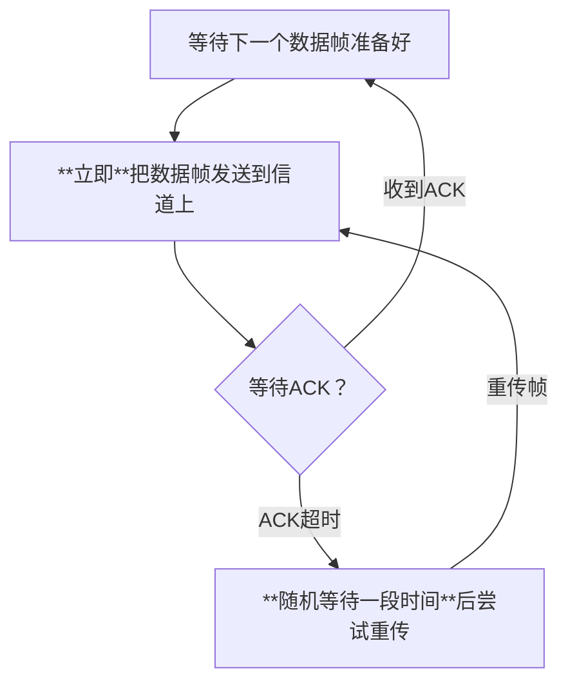
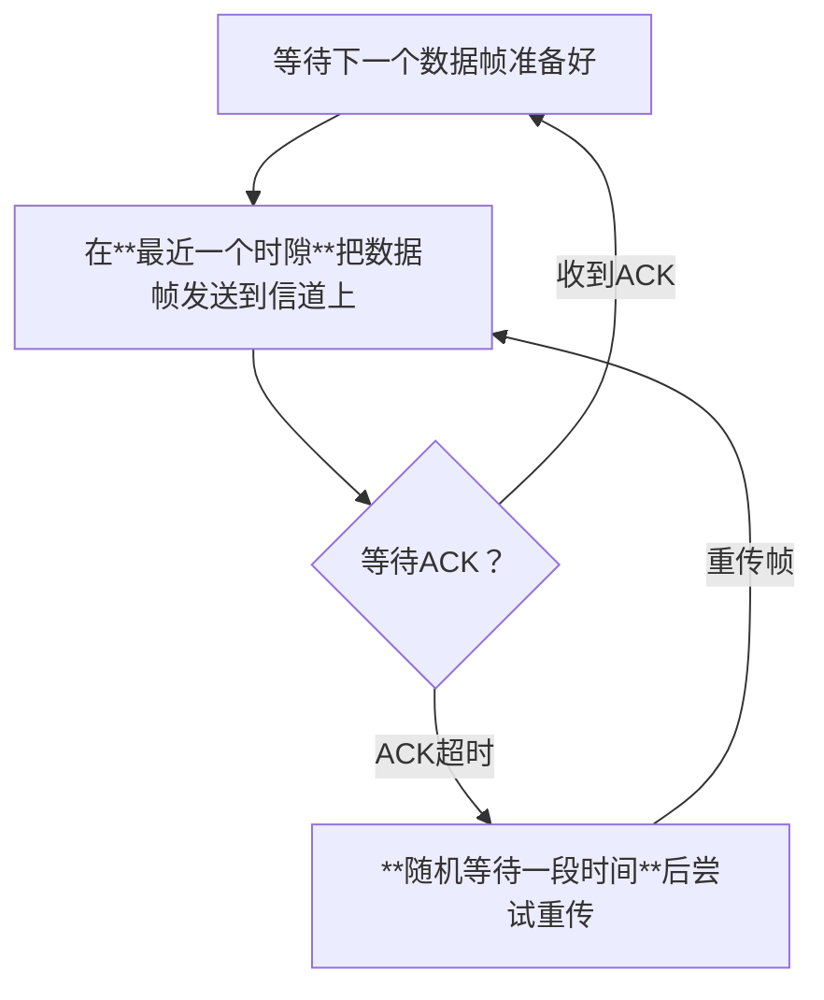
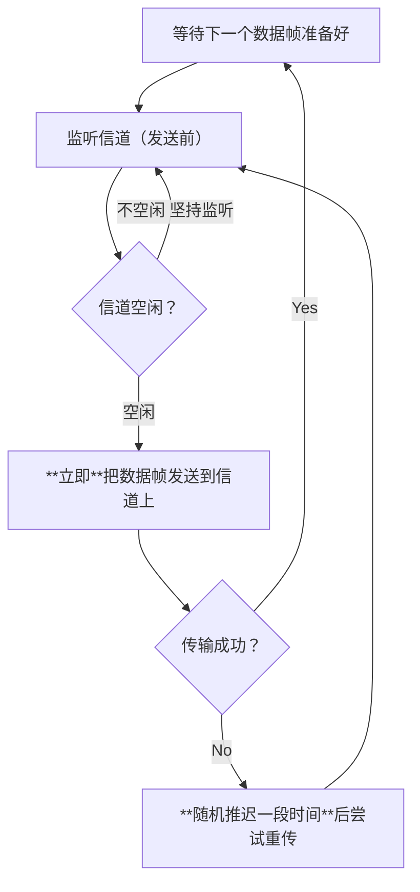
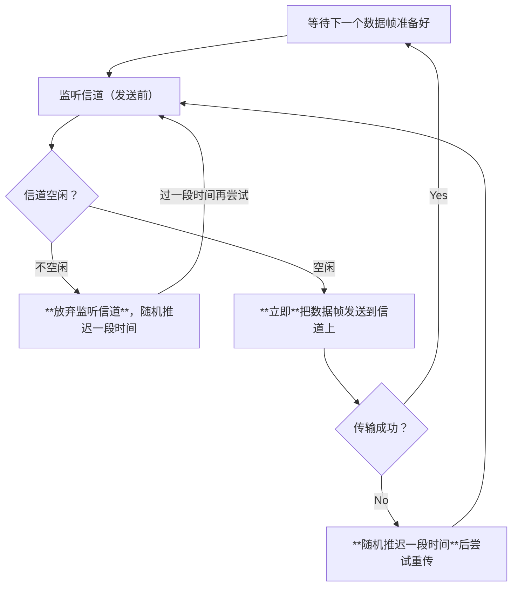
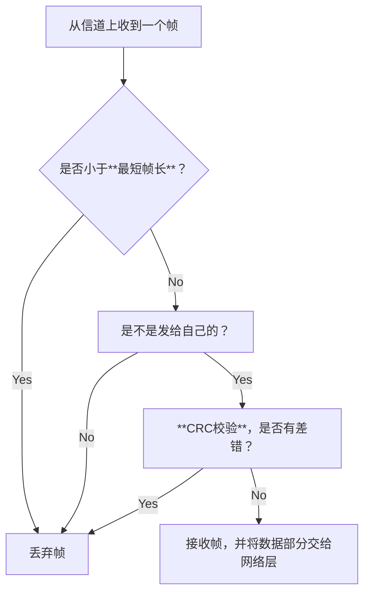

# 数据链路层的功能

##### 5.26

数据链路层 使用 物理层 提供的**比特传输**服务

数据链路层 为 网络层 提供服务，将网络层的**IP数据报（分组）** 封装成==**帧**==，传输给下一个相邻结点

==**物理链路**==：传输介质（0层）+物理层（1层）实现了相邻结点之间的**物理链路**
==**逻辑链路**==：数据链路层需要基于物理链路，实现了相邻结点之间逻辑上无差错的**数据链路（逻辑链路）**

## 数据链路层的功能

**封装成帧(组帧)**
 - **帧定界**：如何让接收方确定帧的界限
 - **透明传输**：接收方的链路层要能从收到的帧内恢复原始SDU，让网络层感受不到将分组封装成帧的过程

**差错控制**
 - 接收方需要发现并解决一个帧内的**位错误**
    - **方法1**：发现后直接**丢弃帧**，让发送方**重传帧**（仅需采用*检错编码*）
    - **方法2**：==由接收方发现并纠正比特错误==（需要采用*纠错编码*）

**可靠传输**
 - 发现并解决**帧错**
    - 帧丢失：发送1234，收到124
    - 帧重复：发送1234，收到12334
    - 帧失序：发送1234，收到1324

**流量控制**
 - 控制发送方发送帧的速率，让接收方来得及接收

**介质访问控制**
 - **广播信道**需要实现此功能。
     - 广播信道在逻辑上是总线型拓扑，**多个结点需争抢传输介质的使用权**
 - **点对点信道**通常不需要实现此功能。
	 - 点对点信道通常意味着**两个结点之间有专属的传输介质，不用争抢**

# 组帧

**封装成帧(组帧)**
 - **帧定界**：如何让接收方确定帧的界限
 - **透明传输**：接收方的链路层要能从收到的帧内恢复原始SDU，让网络层感受不到将分组封装成帧的过程

## 组帧方法

### 字符计数法

**原理**：在每个帧的开头，用一个**定长计数字段**表示帧长
 - 帧长 = 计数字段长度 + 帧的数据部分长度

**最大缺点**：任何一个计数字段出错，都会导致后续所有帧无法定界

### 字节填充法

约定两个特殊的字符分别标记首尾
 - **控制字符SOH**（Start Of Header）01H
 - **控制字符EOT**（End Of Transmission）04H

**问题**：如果数据部分刚好包含**控制字符**，可能导致错误
 - **解决**：引入**转义字符**（Escape Character）

**新问题**：数据部分包含转义字符
 - **解决**：在转义字符前**再插入一个转义字符**

如果帧的数据部分包含**特殊字符**，则**发送方**需要**在这些特殊字符前填充转义字符ESC**（**接收方**要做**逆处理**）

### 零比特填充法

用特殊比特串表示帧开始/结束（一般是01111110）

**问题**：与之前类似
 - **解决**：
    - **发送方**需要对帧的数据部分进行处理，==**每当遇到连续5个1，就填充一个0**==
    - **接收方**需要对帧的数据部分进行逆处理，==**每当遇到连续的5个1，就删除后边的一个0**==
这样的话，数据部分就不会出现连续的6个1，这样当出现连续的6个1时，就表示遇到了开始/结束的特殊比特串

*数据链路层使用的HDLC和PPP协议使用的就是零比特填充法*

### 违规编码法

违规编码（基于曼彻斯特编码）

**曼彻斯特编码（IEEE）**：==上跳0下跳1看中间，中必变==
 - 所以如果中间**不跳变**，**则违规**

# 差错控制

**目标**：发现并解决一个帧内部的**位错误**
    - **方法1**：发现后直接**丢弃帧**，让发送方**重传帧**（仅需采用*检错编码*）
    - **方法2**：==由接收方发现并纠正比特错误==（需要采用*纠错编码*）

**误码率BER**（Bit Error Rate）：即一段时间内，传输错误的比特占所传输比特总数的比率

**码距**：指两个码字在对应位上取值不同的bit数量
 - 计算方法即为对两个位串进行**异或运算**，所得结果中**1的个数即为码距**
 - 在一个编码集中，**任意两个有效码字之间码距最小的值**叫做==该编码集的码距==

根据差错控制理论，编码方案的检错能力和纠错能力与==码距l==的关系如下：
 - l = d + c + 1，且$d \geq c$
 即码距越大，其==检错的**位数d就越大**==，==纠错的**位数c也就越大**==，**且纠错能力不超过检错能力**
为进一步看来**c=0或者d=c**的情况，得出：
 - **为检测d位错误**，编码的码距至少为==d+1==
    - 任何发生d位错误的有效码字不可能变成另外一个有效码字，以确保差错可能被发现。比如码距为1的编码无法检测任何错误
 - **为纠正c位错误**，编码的码距至少为==2c+1==
    - 即使一个有效码字发生c位错误，其仍然离原始码字最近，接收方可据此唯一确定原始码字，实现纠错

## 检错编码
### 奇偶校验

**奇校验码**：整个校验码中1的个数为**奇数**
**偶校验码**：整个校验码中1的个数为**偶数**

偶校验的硬件实现：各信息位进行异或（模2加）运算，得到的结果即为**偶校验**
 - 发送方对信息位进行异或运算，将所得结果置于偶校验位
 - 接收方对全部位进行偶校验，==若结果为1则说明出错==

**问题**：如果偶数个bit发生跳变，则无法检查出错误

	### 循环冗余校验CRC

**循环冗余校验CRC**（Cyclic Redundancy Check）：数据发送方、接收方约定一个**除数**，==K个信息位+R个校验位==作为**被除数**，添加校验位后需保证**除法**的余数为0
 - 接收方收到数据后，进行**除法检查余数是否为0**

***举例**：设生成多项式为$G(x) = x^3 + x^2 + 1$，信息码为101001，求对应的CRC码*
 1. 确定K、R以及生成多项式对应的二进制码
     - **K = 信息码长度** = 6，**R = 生成多项式最高次幂** = 3 -> **校验码位数N** = K+R = 9
     - 生成多项式$G(x) = 1·x^3 + 1·x^2 + 0·x^1 + 1·x^0$，对应二进制码**1101**
 2. 移位
     - 信息码左移R位，低位补0
 3. 相除
     - 对移位后的信息码，用生成多项式进行**模2除**法，产生余数（001）
     - 所以最后对应的CRC码：101001 001
 4. 检错和纠错
     - 发送101001001，记为$C_9C_8C_7C_6C_5C_4C_3C_2C_1$
     - 接收101001001 --使用1101进行模2除--> 余数000，代表没有出错
     - 接收101001011 --使用1101进行模2除--> 余数010，代表$C_2$位出错？（并非正确，可能$C_9$出错）
     - **原因在于信息位太长了**

**只要确定了生成多项式，出错位与余数是相对应的**
 - K个信息位，R个校验位，若生成多项式选择得当，且$2^R \geq K+R+1$，则CRC码**可纠正1位错**

理论上可以证明CRC码的检错能力有以下**特点**：
	1. 可检测出**所有奇数个**的错误
	2. 可检测出**所有双比特**的错误
	3. 可检测出**所有小于等于校验码长度R的连续**错误

## 纠错编码

### 海明校验码

理查德·汉明，1968年图灵奖

**奇校验码**：整个校验码中1的个数为**奇数**
**偶校验码**：整个校验码中1的个数为**偶数**
 - 能发现奇数位错误，但无法确定哪一位错误

==海明码==设计思路：将信息位**分组**进行偶校验 -> 多个校验位 -> 多个校验位标注出**出错位置**

假设**信息位有n个**，**校验位有k个**
 - 信息位+校验位 = n + k，且还得包含一种正确的状态
 - k个校验位对应$2^k$中状态
 **所以**$2^k \geq n+k+1$ 

| n   | 1   | 2-4 | 5-11 | 12-26 | 27-57 | 58-120 |
| --- | --- | --- | ---- | ----- | ----- | ------ |
| k   | 2   | 3   | 4    | 5     | 6     | 7      |

#### 求解步骤

**确定校验位数量 -> 确定校验位分布 -> 求校验位的值 -> 检错纠错**

假设信息位：1010
 1. 确定海明码的个数：$2^k \geq n+k+1$ 
     - n = 4 --> k = 3
     - 设信息位为$D_4D_3D_2D_1$（1010），共4位，校验位$P_3P_2P_1$共三位，对应的海明码为$H_7H_6H_5H_4H_3H_2H_1$
 2. 确定校验位分布
     - **规定**：校验位$P_i$放在海明位号为$2^{i-1}$的位置上
     - 即最终位为$D_4D_3D_2P_3D_1P_2P_1$
 3. 求校验位的值:$D_4D_3D_2D_1$（1010）
     - $H_3(D_1)$：3 -> 011
     - $H_5(D_2)$：5 -> 101
     - $H_6(D_3)$：6 -> 110
     - $H_7(D_4)$：7 -> 111
     - $P_1 = H_3\oplus H_5 \oplus H_7 = D_1\oplus D_2\oplus D_4 = 0\oplus1\oplus1 = 0$
     - $P_2 = H_3\oplus H_6 \oplus H_7 = D_1\oplus D_3\oplus D_4 = 0\oplus0\oplus1 = 1$
     - $P_3 = H_5\oplus H_6 \oplus H_7 = D_2\oplus D_3\oplus D_4 = 1\oplus0\oplus1 = 0$
 4. 检错纠错
     - **校验方程**
        - $S_1 = P_1\oplus D_1\oplus D_2\oplus D_4$
        - $S_2 = P_2\oplus D_1\oplus D_3\oplus D_4$
        - $S_3 = P_3\oplus D_2\oplus D_3\oplus D_4$
     - 若接收到：1010010（正确的情况）
        - $S_1 = P_1\oplus D_1\oplus D_2\oplus D_4 = 0\oplus0\oplus1\oplus1 =0$
        - $S_2 = P_2\oplus D_1\oplus D_3\oplus D_4=1\oplus0\oplus0\oplus1=0$
        - $S_3 = P_3\oplus D_2\oplus D_3\oplus D_4=0\oplus1\oplus0\oplus1=0$
    - 若接收到：1010000（第010位出错）
        - $S_1 = P_1\oplus D_1\oplus D_2\oplus D_4 = 0\oplus0\oplus1\oplus1 =0$
        - $S_2 = P_2\oplus D_1\oplus D_3\oplus D_4=0\oplus0\oplus0\oplus1=1$
        - $S_3 = P_3\oplus D_2\oplus D_3\oplus D_4=0\oplus1\oplus0\oplus1=0$

**海明码的检错、纠错能力**：
 - 具有==**1位==的纠错能力**
 - 具有==**2位==的检错能力**

海明码加上**全校验位**，对整体进行偶校验，这样的话：
 - $S_3S_2S_1 = 000$且全体偶校验成功 -> 无错误
 - $S_3S_2S_1 \neq 000$且全体偶校验失败 -> **有1位错误**，纠正即可
 -  $S_3S_2S_1 \neq 000$且全体偶校验成功 -> **有2位错误**，需要重传

# 流量控制与可靠传输机制

##### 5.27

流量控制、可靠传输 两种功能都可以**基于滑动窗口机制**实现

实现流量控制与可靠传输需要**多种机制配合**
 - **滑动窗口机制**
    - 发送窗口$W_T$ = 1，接收窗口$W_R$ = 1
    - 发送窗口$W_T$ > 1，接收窗口$W_R$ = 1
    - 发送窗口$W_T$ > 1，接收窗口$W_R$ > 1
 - **确认机制**
    - 确认帧：ACK_i
        - 若接收方收到i号帧，且没有检测出差错，需要给发送方返回确认帧ACK_i
    - 否认帧：NAK_i
        - 若接收方收到i号帧，但检测出i号帧有差错，需要丢弃，并给发送方返回否认帧NAK_i 
 - **重传机制**
    - 超时重传：发送方超时**未收到**ACK_i，则重传i号帧
    - 请求重传：若发送方**收到**NAK_i，则重传i号帧
 - **帧编号**
    - 为了支持以上机制正确运行，**至少**需要**n bit**给帧编号
    - 要求$W_T + W_R \leq 2^n$ 

ACK：Acknowledge
NAK：Negative-Acknowledge
## 滑动窗口机制

**发送窗口**$W_T$（Transmit）：发送方当前允许发送的帧
 - 假设此时发送A~L，$W_T$=4

**接收窗口$W_R$**（Receive）：接收方当前允许接收的帧
 - 假设此时$W_R$ = 2

那么当发送方发送A、B、C时，接收方收到C（窗口之外的帧）时，会直接**丢弃**
**接收方通过确认机制控制**滑动窗口向前滑动，从而实现**流量控制**

## 数据帧、确认帧、帧序号

首先 发送方 给 接收方 发送一个**数据帧**Data i

之后 接收方 给 发送方 返回一个**确认帧**ACK i
 - 确认帧中间的数据部分很短，甚至可以是空

帧的**首部、尾部**主要包含一些控制信息，比如：帧定界信息、校验码、**帧类型**、==帧序号==等

## 停止-等待协议S-W

**S-W协议**：
 - **滑动窗口机制**
    - 发送窗口$W_T$ = 1，接收窗口$W_R$ = 1
 - **确认机制**
    - 确认帧：ACK_i
        - 若接收方收到i号帧，且没有检测出差错，需要给发送方返回确认帧ACK_i
 - **重传机制**
    - 超时重传：发送方超时**未收到**ACK_i，则重传i号帧
 - **帧编号**
    - 仅需**1 bit**给帧编号
    - 要求$W_T + W_R \leq 2^n$ 

用1 bit给帧编号：010101循环编号

**异常情况示例**：
 - 若**数据帧丢失**，发送方一直接收不到ACK，计时器则会触发==超时重传==
 - 若**确认帧丢失**，发送方一直接收不到ACK，但此时接收方已经**向后滑动**，发送方的计时器触发超时重传，接收方收到两个重复帧
	 - 此时接收方会**丢弃重复帧**并**返回重复帧的ACK**
- 若**数据帧有差错**，接收方收到数据帧并发现差错，**将此帧丢弃**，且**不返回**ACK，这样发送方计时器超时时就会**重复**发送该帧

为什么一定要帧编号：
 - 如果没有帧编号，则当**确认帧丢失**时，当数据一样时，接收方无法判断是新帧还是重复帧
 - 由于接收窗口和发送窗口的距离不超过1，所以**使用1bit**编号足矣

## 后退N帧协议GBN

**GBN**（Go-Back-N）：
 - **滑动窗口机制**
    - 发送窗口$W_T$ > 1，接收窗口$W_R$ = 1
 - **确认机制**
    - 确认帧：ACK_i
        - 若接收方收到i号帧，且没有检测出差错，需要给发送方返回确认帧ACK_i
 - **重传机制**
    - 超时重传：发送方超时**未收到**ACK_i，则重传i号帧
 - **帧编号**
    - 为了支持以上机制正确运行，**至少**需要**n bit**给帧编号
    - 要求$W_T + W_R \leq 2^n$ 
 - **特殊规则**：
    - 关于**确认帧**：接收方可以**累计确认**。即连续收到多个数据帧时，**可以仅返回最后一个帧的ACK**
        - ACK_i表示接收方已经收到i号帧及其之前的所有帧
    - 关于**超时重传**：若发送方==超时未收到ACK_i==，则**重传i号帧，及其之后的所有帧**

若此时发送窗口$W_T$为3，则使用2bit给帧编号即0123-0123-0123……
**正常情况**：
 - 发送方发送Data0，Data1，Data2
 - 收到0号帧后，接收窗口向后滑动，收到1号帧后，继续滑动，
 - 当收到2号帧时，信道中没有其他数据，
 - 此时**接收方向发送方返回ACK2**，表示已经收到2号帧及其之前的所有帧
 - 接下来发送窗口就可以向后移动

**异常情况分析**：
 - 若**数据帧丢失**，假设发送方发送了Data3、Data0、Data1，但0号数据因为故障而丢失（或者因为差错丢弃）
    - 此时Data1还可以顺利传送到接收方，则直接被丢弃
    - 当接收方**收到接收窗口之外**的帧时，**返回目前已正确接收的最后一个帧的ACK**（即ACK3）
    - 发送方收到ACK3后，发送窗口后移，但0号帧的计时器触发**超时重传**，会将0号帧及其之后的所有帧进行**重传**
 - 若**确认帧丢失**，假设发送方发送的0、1、2号帧**均已被**接收方接收，接收方返回ACK2，假设ACK2丢失
    - 此时0号帧会第一个**超时**，发送方会将0、1、2全部重传
    - 接收方又会重复收到相同帧，当其收到这种**非法帧**时，会**返回目前已经接收的最后一个正确帧的ACK**，即ACK2

如果**不满足** $W_T + W_R \leq 2^n$ 条件，假设此时发送窗口是4，但用2bit编号，若此时发送方发送0、1、2、3号帧
 - 接收方接收到之后，返回ACK3，**但此时ACK3丢失**
 - 发送方0号帧会第一个超时，触发重传，但此时**接收窗口位于下一个0号帧的位置**，刚好落在接收窗口之内，会被错误的接收

后退N帧：原本已经发送了1号帧，现在却会后退会0号帧重新发送，这样就实现了流量控制

**缺点**：如果接收方接收帧的速度很慢，或在信道误码率很高的情况下，可能会导致发送方的发送进度经常需要后退，传输效率低下

## 选择重传协议SR

**SR**（Selective Repeat）：
 - **滑动窗口机制**
    - 发送窗口$W_T$ > 1，接收窗口$W_R$ > 1
 - **确认机制**
    - 确认帧：ACK_i
        - 若接收方收到i号帧，且没有检测出差错，需要给发送方返回确认帧ACK_i
 - **重传机制**
    - 超时重传：发送方超时**未收到**ACK_i，则重传i号帧
 - **帧编号**
    - 为了支持以上机制正确运行，**至少**需要**n bit**给帧编号
    - 要求$W_T + W_R \leq 2^n$ 
 - **特殊机制**：
    - **否认帧**：NAK_i
        - 若接收方收到i号帧，但检测出i号帧有差错，需要丢弃，并给发送方返回否认帧NAK_i   
    - **请求重传**：若发送方**收到**NAK_i，则重传i号帧
    - 要求$W_R \leq W_T$，即接收窗口不能大于发送窗口

*SR并不支持累计确认，必须一帧一帧确认*

**正常情况**：
假设使用==3bit==给帧编号，即0、1、2、3、4、5、6、7，则选择重传协议SR的**窗口大小需满足如下两个条件**：(实际应用中通常使得$W_T$ = $W_R$)
	1. 若使用n bit编号，$W_T + W_R \leq 2^n$ 
	2. $W_R \leq W_T$
假设==发送窗口$W_T$=4==，==接收窗口$W_r$=4==，发送方连续发送0、1、2、3，接收方陆续收到这几个帧，并返回ACK0、1、2、3

**异常情况分析**：
 - 若**数据帧丢失**：发送方发送4、5、6、7号帧，但此时==5号帧因为故障而丢失==
    - 此时接收方正常接收了4、6、7号帧，接收窗口后滑1位，并返回ACK4、6、7
    - 此时下一个0号帧又在发送窗口内，则0号帧又可以被发送
    - 而5号帧的计时器超时，发送方重传5号帧，接收方发送ACK5、0
    - 接收窗口后滑，收到确认信号后，发送窗口后滑
 - 若**数据帧因为差错而丢弃**：发送方发送4、5、6、7号帧，但此时==5号帧因为差错而丢弃==
    - 此时接收窗口后滑1格，并返回ACK4、6、7以及==NAK5==
    - 收到ACK4后，发送窗口后滑1格，由于收到NAK5，所以发送方可以**在计时器超时之前**，==主动把5号帧重传==，
    - 此时下一个0号帧也紧接着发出
    - 接收方顺利收到后，发出ACK5、0
 - 若**确认帧丢失**，若接收方返回ACK0、1、2、3，假设ACK1、3因为故障丢失
    - 此时发送方收到了ACK0、2，所以后滑一格
    - 发送方1、3号帧由于计时器超时而重传，并同时传送4号帧
    - 接收方收到4号帧，并返回ACK4
    - 接收方收到1、3并判断出**此为重复帧**，此时接收方返回ACK1、3

如果**不满足** $W_T + W_R \leq 2^n$ 条件，假设发送窗口=5，接收窗口=4，若此时发送0、1、2、3、4号帧
 - 接收方依次收到帧进行后滑并返回ACK，若此时所有ACK都因为故障丢失了
 - 发送方触发超时重传，重传0、1、2、3、4号帧，但此时接收方窗口为**5、6、7、0**
 - 此时0号帧的重传就会出现问题，接收方会认为0号帧是合法的

## 三种协议的信道利用率

### S-W协议的信道利用率

$W_T$ = $W_R$ = 1
假设：
 - 信道的传输速率  = 1kbps
 - 数据帧长度 = 4kb --- 即发送一个数据帧需要**4s**
 - 确认帧长度 = 1kb --- 即发送一个确认帧需要**1s**
 - 信道单向传播时延 = 7s
$$信道利用率 = \frac{4}{4+2*7+1} \approx  21\% $$
将**数据帧传输时延**记作$T_D$
将**2倍传播时延**记作RTT
将**确认帧传输时延**记作$T_A$
则==**理想情况下**==：(没有丢帧和差错)
$$信道利用率 = U = \frac{T_D}{T_D+RTT+T_A}$$

假设：**确认帧非常短**，此时
$$信道利用率 = U = \frac{T_D}{T_D+RTT}$$

### GBN、SR协议的信道利用率

理想情况下，GBN、SR协议的信道利用率只受发送窗口$W_T$的影响

假设：
发送窗口大小 N = 4
信道的数据传送速率 = 1kbps
数据帧长度 = 4kb
确认帧长度 = 1kb
信道单向传播时延 = 7s
$$信道利用率 = \frac{4×4}{4+2*7+1} \approx  84\% $$
将**数据帧传输时延**记作$T_D$
将**2倍传播时延**记作RTT
将**确认帧传输时延**记作$T_A$
则==**理想情况下**==：(没有丢帧和差错)
$$信道利用率 = U = \frac{NT_D}{T_D+RTT+T_A}$$
### 术语补充

**滑动窗口协议**：术语上指的是GBN、SR协议

**ARQ协议**（Automatic Repeat reQuest）：自动重传请求协议，==包含S-W、GBN、SR三种协议==

**连续ARQ协议**：指的是GBN、SR协议

# 介质访问控制
##### 5.29
## 信道划分 介质访问控制

**介质访问控制MAC**（Medium Access Control）：多个节点共享同一个**总线型**广播信道时，可能发生**信号冲突**
 - 早期网络使用同轴电缆连接多个节点
 - 用集线器连接多个节点
 - WIFI、5G等无线通信

### 时分复用TDM

**时分复用TDM**（Time Division Multiplexing）：即将时间分为**等长的TDM帧**，每个TDM帧又分为**等长的m个时隙**，将m个时隙分配给m对用户（节点）使用

**缺点**：
 - 每个节点**最多只能分配到信道总带宽的$\frac{1}{m}$**
 - 如果某节点暂不发送数据，会导致被分配的时隙闲置，**信道利用率低**

**解决**：可以**统计**每个节点对信道的使用需求，**动态按需分配时隙**

### 统计时分复用STDM

**统计时分复用STDM**（Statistic Time Division Multiplexing）：又叫做**异步时分复用**，在TDM的基础上，**动态按序分配时隙**

**优点**：
 - 如果有需要时，一个节点可以在一段时间内**获得所有信道资源**
 - 如果某节点暂不发送数据，可以不分配时隙，**信道利用率更高**

### 频分复用FDM

如果两个**信号频率区别很大**，就**很容易**分辨

**频分复用FDM**：（Frequency Division Multiplexing）：即**将信道的总频带划分为多个==子频带==**，每个子频带作为一个子信道，每对用户使用一个子信道进行通信
 - 隔离频带：防止子信道间相互干扰
 - 复用器：将各个节点发出的信号**复合后**传输到共享信道上
 - 分用器：将各个子频带信号分离出来

**优点**：各个节点可以同时发送信号，充分利用了信道带宽（Hz）

**缺点**：FDM技术**只能用于模拟信号**的传输

### 波分复用WDM

**波分复用WDM**（Wavelength Division Multiplexing）：即**光的频分复用**
  - 光的频率与波长负相关

*光信号的频带范围非常大，因此很适合采用波分复用技术，将一根光纤在逻辑上拆分为多个子信道*

### 码分复用CDM

**背景**：在2G、3G时代，节点与节点之间的通信常使用**CDMA**（Code Division Multiple Access）技术
 - CDMA的底层就是**码分复用**

==**码分复用CDM**==（Code Division Multiplexing）：
 - CDM技术允许信号相互干扰，相互**叠加**，接收方有办法将来自各节点的信号值**分离**出来

 **过程**：
  1. 给各个节点分配专属**码片序列**
      - **码片序列**包含m个码片（信号值），可看作**m维向量**（m维向量的**分量通常取1或-1**）
      - 要求：各节点的m维向量**必须相互正交**
      - *相互通信的各节点知道彼此的码片序列*
  2. 发送方如何发送数据
      - 节点发出m个信号值与**码片序列相同**，表示**比特1**
      - 节点发出m个信号值与**码片序列相反**，表示**比特0**
  3. 信号在传输过程中叠加
      - 当多个发送方同时发送数据时，**信号值会叠加**（本质是多个**m维向量的加法**）
  4. 接收方如何接收数据
      - 接收方收到的是叠加信号，需要从中分离出各发送方的数据
      - **叠加信号**与**发送方的码片序列**作==**规格化内积**==
         - 结果为1，表示比特1
         - 结果为-1，表示比特0

## 随机访问 介质访问控制

### ALOHA协议

**ALOHA协议**（Additive Links On-line Hawaii Area）：
 - 纯ALOHA：如果准备好数据帧，就**立即发送**
 - 时隙ALOHA：时隙大小固定 = 传输一个最长帧所需时间；只有在每个时隙开始时才能发送帧

纯ALOHA：

时隙ALOHA协议：

**时隙ALOHA**避免了用户发送数据的随意性，**降低了冲突概率**，提高了信道的利用率
 - 发生冲突时，发生冲突的各个节点随机推迟若干个时隙

### CSMA协议

**载波监听多路==访问==CSMA**（Carrier Sense Multiple Access）：基于ALOHA的基础上提出改进
 - ==在发生数据之前，先监听信道是否空闲，只有空闲时才尝试发送==

*节点的网络适配器安装**载波监听装置***

#### 1-坚持CSMA协议

1-坚持CSMA：在信道不空闲时，**坚持监听信道是否空闲**

**优点**：信道利用率高，信道一旦空闲，就可以被下一个节点使用

**缺点**：当多个节点都已经准备好数据时，一旦信道空闲，会有多个节点同时发送数据，冲突概率大

#### 非坚持CSMA

非坚持CSMA：当信道不空闲时，**放弃监听信道**，随机推迟一段时间后再次尝试

**优点**：当多个节点准备好数据时，如果信道不空闲，则各个节点会**随机推迟一段时间再尝试监听**，从而使**各节点错开发送数据**，降低冲突概率

**缺点**：信道刚恢复空闲的时候，可能不会被立即利用，导致信道利用率降低

#### p-坚持CSMA协议

与1-坚持CSMA类似，**当信道不空闲的时候坚持监听信道**

**区别**：当信道空闲的时候，有**p的概率**立即把数据帧发送到信道上，有(1-p)的概率**推迟一段时间再尝试发送**

**优点**：属于1-坚持CSMA、非坚持CSMA的折中方案，降低冲突概率的同时，提升信道利用率

### CSMA/CD协议

用于早期的有线以太网（总线型）
 - 同轴电缆连接多个节点组成的有线局域网
 - 用集线器连接多个节点组成的有线局域网

**CSMA载波监听多路==访问==**（Carrier Sense Multiple Access）
**CD冲突检测**（Collision Detection）

**协议要点**
 - 先听后发，边听边发，**冲突停发**，**随机重发**
 - 如何随机重发
    - **截断二进制指数退避算法**：
       - 随机等待一段时间 = r 倍**争用期**，其中 r 是随机数（**争用期**是一段固定大小的时间）
         1. 如果 k ≤ 10，在$[0,(2^k-1)]$区间随机取一个整数r
         2. 如果 k > 10，在$[0,(2^{10}-1)]$区间随机取一个整数r
 - **特别注意**
    - **第10次**冲突是随机重发的分水岭
    - **第16次**冲突，直接躺平，放弃传帧，报告上级（网络层）

#### CSMA/CD协议（发送方）

流程与1-坚持CSMA大致相同

**区别**：当信道空闲时，立即把帧发送到信道上，此时**边发送边监听**
 - 发送过程中无冲突 -> 发送成功
 - 发送过程中有冲突，**立即停发**
    - 若k == 16，传输**失败**，放弃传输此帧，并报告网络层
    - 若k < 15，随机等待一段时间，继续监听信道

#### 争用期

**争用期**：争用期 = **2× 最远单向传播时延**（考虑距离最远的两个节点）
 - *如果**争用期内**没有检测到冲突，本次帧发送就不再可能发生冲突*
 - CSMA/CD没有**ACK机制**，若发送过程中未检测到冲突，就认为帧发送成功

假设：
A、C、D、B依次相距2000m
**即A、B两个节点相距最远，为6000m**
信号的传播速度 = 2×$10^8$ m/s，即200m/$\mu$s -> **最大单向传播时延 = 30$\mu s$**
信道带宽 = 10Mbps，即 10b/$\mu s$

**问题**1：若A节点往信道上发送数据，最多需要30$\mu s$可以被其他所有节点监听到信号

**问题2**：显然，A节点往信道上发送的数据可能与其他节点发生冲突。那么在最极限的情况下，从A节点发出数据开始，**最多需要60$\mu s$**，A节点**一定可以检测到冲突**

#### 最短帧长

**最短帧长** = **2 × 最大单向传播时延 × 信道带宽**
 - 若收到的帧**小于最短帧长**，视为**无效帧**
 -  = **争用期 × 信道带宽**

假设：
A、C、D、B依次相距2000m
**即A、B两个节点相距最远，为6000m**
信号的传播速度 = 2×$10^8$ m/s，即200m/$\mu$s -> **最大单向传播时延 = 30$\mu s$**
信道带宽 = 10Mbps，即 10b/$\mu s$

**最短帧长** = 2 ×30$\mu s$ × 10Mbps = 60$\mu s$（**争用期**） × 10Mbps = 600 bit

**问题**：如果A节点发送的数据帧长小于600bit，可能会导致A节点**误以为发送过程中没有发生冲突，但实际上已经发生了冲突**
 - CSMA/CD协议的**冲突停发**规则会导致**小于最短帧长的非法帧**（所以可以设置，如果收到小于最短帧长的数据的时候可以直接丢弃）

如果实际要发送的**数据很少，可填充至合法长度后再发送**

#### CSMA/CD协议（接收方）

#### 最长帧长

最长帧长：规定最长帧长可以防止某些节点一直占用信道

**以太网规定**：==**最短帧长 = 64B；最长帧长 = 1518B**==

### CSMA/CA协议
##### 6.1

**载波监听多路访问/冲突避免CSMA/CA协议**（Carrier Sense Multiple Access/Collision Avoidance）：发送过程中不用检测冲突，发送前想办法尽量避免冲突（无法完全避免）
 - 适用于无线网络，比如WIFI

#### 无线局域网面临的问题

AP（Access Point） -- **接入点**，也就是你平时连接的无线WiFi热点

家用路由器 = 路由器 + 交换机 + AP

校园网 = 路由器 + n个交换机 + n×m个AP

假设一个局域网内有A~D个==移动站点==，所有移动站点都要和固定站点AP进行通信
**问题**：为什么不采用**CSMA/CD**？
 1. **硬件上很难实现==“边听边发，冲突检测”==**
    - 因为接收信号的强度往往远小于发送信号的强度，且在无线介质上信号强度的动态变化范围很大
 2. **存在==隐藏站==的问题**
     - 在无线通信中，并非所有站点都能听见对方。发送节点处没有冲突并不意味着在接收节点处没有冲突
     - 例如：A无法监听到B、C的信号，B、C对于A而言就是==隐蔽站==

#### 不考虑隐蔽站

**协议要点**：
 - 发送方：==先听后发，忙则退避==
    - 若信道空闲，**间隔DIFS**后，再发生帧（**一口气发完，过程中不检测冲突**）
    - 若信道不空闲，则进行**随机退避**
 - ==随机退避==原理
    1.用二进制指数退避算法确定一段随机退避时间（倒计时）
    2.**发送方**会保持监听信道，**只有信道空闲时才==扣除倒计时==**，倒计时结束后立即发送帧 
 - 接收方：==停止等待协议==
    - 每收到一个正确数据帧都返回ACK；若**发送方**超时未收到ACK，则进行**随机退避**

**帧间间隔IFS**（Inter Frame Gap）：
 - DIFS（分布式协调IFS）：最长的IFS
    - 每次帧事务开始之前需要等待的时间
 - SIFS（短IFS）：最短的IFS
    - 收到一个帧后需要预留的一段处理时间
 - PIFS：中等长度的IFS
    - 考研可不关注

#### 解决隐蔽站问题

引入信道预约机制

**信道预约机制**（可选功能）：
 1. **发送方**广播**RTS控制帧**（先听后发，忙则退避）
 2. AP广播**CTS控制帧**（需要在**RTS、CTS中**指明预约时长）
 3. 其他无关节点收到CTS后自觉*禁言*一段时间（即：虚拟载波监听机制）；**发送方收到CTS**后就可以发送数据帧
 4. AP收到数据帧后，进行CRC校验，若无差错就返回ACK帧

**==RTS==控制帧**（Request To Send，==请求发送==）：包括源地址、目的地址和这次通信所需的**持续时间**

**==CTS==控制帧**（Clear To Send，==允许发送==）：它也包括源地址、目的地址和这次通信所需的**持续时间**
- *若超时未收到CTS，说明预约失败，则随机退避后再次RTS预约*
- *先预约，再发送这种模式可以启用、也可以不启用*

## 轮询访问 -- 令牌传递协议

**令牌环网技术**：IBM于1984开发
 - **特点**：环形拓扑结构，各节点**轮询访问**信道，==不会发生信道冲突==
 - 令牌传递协议

获得令牌的节点会持有一个**令牌帧**，若要传送数据**就将令牌帧转化为数据帧**
 - 包含节点编号、源地址&目的地址、数据部分、是否接收

节点检查目的地址是否与自己相同，如果是，就复制数据部分，并将数据帧标记为**已接收**
- 如果数据帧检查有异常则重发

若无异常，就将**数据帧转化为令牌帧**，发给下一个用户
 - 若下一个用户暂时不发数据，则生成一个新的令牌帧，继续发给下一个用户

**无论是令牌帧还是数据帧，都只能沿单向传递**

#### 令牌帧、数据帧

**令牌帧**

| 帧定界（开始） | 令牌号    | 帧定界（结束） |
| ------- | ------ | ------- |
| 8 bits  | 8 bits | 8 bits  |

**数据帧**

| 帧定界（开始） | 令牌号    | FC     | 目的地址    | 源地址     | 数据部分           | CRC校验   | 帧定界    | 是否接收   |
| ------- | ------ | ------ | ------- | ------- | -------------- | ------- | ------ | ------ |
| 8 bits  | 8 bits | 8 bits | 48 bits | 48 bits | 最多 4500×8 bits | 32 bits | 8 bits | 8 bits |

#### MAU -- 令牌环网的集中控制站

**多站接入单元MAU**（Multisation Access Units）：用于集中控制令牌环网

MAU也可以串联起来

# 局域网

##### 6.2

 ## 局域网的基本概念及体系结构

**局域网特点**：
 - 覆盖较小的地理范围
 - 较低的时延和误码率
 - 局域网内的各节点之间以==帧==为单位进行传输
 - 支持**单播、广播、多播**

### 局域网分类

**三要素**：
 - 拓扑结构
 - 传输介质
 - 介质访问控制方式

#### 有线局域网LAN

##### 令牌环网
 - 环形
 - 同轴电缆/双绞线
 - 令牌传递协议

##### 以太网
物理层均采用**曼彻斯特编码**

**同轴电缆以太网**：10Base5
 - 总线型
 - 同轴电缆（可以使用中继器连接多个同轴电缆网段）
 - CSMA/CD协议

**双绞线以太网**：10BaseT
 - **用集线器连接**：半双工
    - 物理上**星型**，逻辑上**总线型**拓扑结构
    - 双绞线
    - CSMA/CD协议
 - **用交换机连接**
    - 物理上、逻辑上都是星型
    - 双绞线
    - CSMA/CD协议 或者 NULL
       - 半双工模式下，采用CSMA/CD
       - 全双工模式下，**不用争抢信道**，也就不需要使用CSMA/CD

**光纤以太网**：10BaseF
 - **点对点**（用于中继器/集线器/交换机之间的传输，也就是说通常不会直接连接终端节点）
 - 光纤
 - **NULL**（用两条光纤实现**全双工通信**）

#### 无线局域网WLAN

WiFi/802.11
 - IEEE 定义为星型
 - 无线Wireless
 - CSMA/CA 协议

### 硬件架构

以太网适配器
 - 属于I/O设备
 - 包含RAM（帧缓冲） + ROM（指明了全球唯一的**MAC地址**，48bit）

WiFi网络适配器
 - 包含RAM（帧缓冲） + ROM（指明了全球唯一的**MAC地址**）

网络适配器厂商：（朝IEEE申请）
 1. 申请MAC地址段
 2. 允许MAC地址段（高24bit为厂商号，低24bit由厂商分配）
 3. 生产

**网络适配器的功能**：
1. **负责把帧发送到局域网**
    - 将IP数据报封装成帧的功能，有些系统由主机完成，有些由网络适配器完成
2. **负责从局域网接收帧**
    - 如果收到正确帧，就用中断通知CPU，如果收到异常帧，就直接丢弃
3. 需要根据接入的局域网类型，按照标准**实现数据链路层+物理层功能**
4. 需要完成数据的串/并行转换
5. 需要支持帧缓冲

## VLAN的基本概念与基本原理

**大型局域网面临问题**：
 1. 局域网内任何一个节点发出的广播帧，都会被广播至所有节点，可能出现“广播风暴”
 2. 不安全，局域网内可能会有一些敏感节点
此时引入VLAN

### VLAN（虚拟局域网）

**解决**：
 - 可将大型局域网分割成若干个小的VLAN，==每个VLAN是一个广播域==
 - 每个VLAN对应一个VID

**VLAN的划分方式**：
 1. 基于接口
 2. 基于MAC地址
     - 交换机内置数据结构。记录VID和MAC地址的映射关系
 3. 基于IP地址
     -  交换机内置数据结构。记录VID和IP地址的映射关系
     - 这种方式**可以让VLAN范围跨越路由器，让多个局域网的主机组成一个VLAN**（需要网络层功能支持）

主机与交换机之间，传输==标准以太网帧==
 - 6 6 2 n 4：收、发、协、数、验

交换机与交换机之间，传输**802.1Q帧**
 - 如果帧的传输跨越交换机，需指明VID
 - 6 6 4 2 n 4：收、发、V、协、数、验

## IEEE802.11 无线局域网

有固定基础设施无线局域网 -- WIFI
无固定基础设施移动自组织网络 -- AirDrop

通过门户Portal，即可将802.3和802.11两类局域网相连，变成一个更大的局域网

### 802.11无线局域网的基本概念

==802.11无线局域网==是**星型拓扑**，中心称为**接入点AP**，也可称为**无线接入点WAP**

基本服务集BSS：1个基站AP + 多个移动站
 - 服务集标识符SSID：指无线局域网的名字，不超过32字节
 - 基本服务器BSA：指一个基本服务集能够覆盖的地理范围

门户Portal：可将802.11接入802.3

拓展服务集ESS：将多个AP连接到同一个分配系统，组成一个更大服务集

漫游：一个移动站从一个基本服务集切换到另外一个基本服务集，仍然可以保持通信

### 802.11帧的分类

**分类**：
 1. 数据帧
 2. 控制帧：ACK、RTS、CTS帧
 3. 管理帧：探测请求/探测响应帧

**数据帧**

| 帧   | 帧控制 | 持续期 | 地址1 | 地址2 | 地址3 | 序号控制 | 地址4 | 帧主体    | FCS |
| --- | --- | --- | --- | --- | --- | ---- | --- | ------ | --- |
| 字节  | 2   | 2   | 6   | 6   | 6   | 2    | 6   | 0~2312 | 4   |

| 帧控制 | 协议版本 | 类型  | 子类型 | 去往AP | 来自AP | 更多分片 | 重试  | 功率管理 | 更多数据 | WEP | 顺序  |
| --- | ---- | --- | --- | ---- | ---- | ---- | --- | ---- | ---- | --- | --- |
| 位   | 2    | 2   | 4   | 1    | 1    | 1    | 1   | 1    | 1    | 1   | 1   |
*在802.11无线局域网内，两个移动站之间不能直接通信，必须通过基站AP转发*

# 广域网

##### 6.4
## 基本概念

**广域网WAN**（Wide Area Network）：
 - **主要任务**：
    - 长距离运送主机所发送的数据
    - 将分布在各地方的局域网互联起来
 - **特点**：
    - 覆盖范围广，几十到几千公里
 - WAN各节点之间通常是==点对点高速链路== -- LAN中常用==总线型==线路
    - 点对点链路：链路层通常采用**PPP协议**
    - 总线型链路：链路层通常采用CSMA/CD协议

## PPP协议

**PPP协议**（Point-to-Point Protocol）：主要有两种应用场景
 - 用户接入互联网时与ISP之间的通信
 - 两台设备之间通过直连专线通信

### PPP协议的组成

由三个部分组成：==链路控制协议LCP==、==网络控制协议NCP==以及一种==将IP数据报封装到串行链路的方法==

**LCP**：用于建立、配置、测试数据链路连接，以及协商一些选项

**NCP**：PPP支持多种网络协议，每种网络协议需要通过NCP进行配置，以建立和管理其逻辑连接

**将IP数据报封装到串行链路的方法**：IP数据报作为PPP帧的信息部分被封装在PPP帧中传输，其长度受**最大传送单元MTU**限制

### PPP帧

| F   | A   | C   | 协议  | 信息部分（IP数据报） | FCS | F   |
| --- | --- | --- | --- | ----------- | --- | --- |
| 7E  | FF  | 03  | 2字节 | 不超过1500B    | 2字节 | 7E  |
**帧组成**：
 - **首F**、**尾F**：帧定界符，0x7E
 - A（地址域）、C（控制域）：固定数值无意义
 - 协议：指明信息部分携带的是什么协议的数据
 - 信息部分：具体携带的协议数据（比如IP数据报）
 - FCS：CRC循环冗余校验码（若帧校验出错，则直接丢弃）

### 透明传输

**字节填充**：
 - 用于**异步传输**（逐个字符传送）
 - 0x7E即（01111110）作为帧定界符，**0x7D作为转义字符**

**零比特填充**：
 - 用于**同步通信**
 - 除了首尾的帧定界符7E外，只要发现**有5个连续的1，则立即填入1个0**

### PPP协议的特点

**特点**：
 - PPP协议是**链路层**的协议，仅支持**点对点 全双工**链路
 - 链路层只保证无差错（CRC），但不可靠（无ACK）
 - 支持多种网络层协议
 - PPP帧是**面向字节**的，帧长度是字节的整数倍

### PPP协议的工作过程

**LCP**：==用于建立、配置LCP链路==

**NCP**：==为网络层协议建立和配置逻辑连接==

以用户拨号接入ISP的过程为例
 - 拨号后，首先建立一条从用户到ISP的物理层连接
 - 而后用户向ISP发送一系列LCP分组（PPP帧），协商链路参数并**建立LCP连接**
 - 接着通过NCP配置网络层，ISP为用户分配一个临时的IP地址
 - 通信结束后，依次释放网络层、数据链路层和网络层连接

**具体过程如下**：
	1. PPP链路的起始和终止均为==链路静止==的状态，此时用户与ISP之间无物理层连接
	2. 当检测到调制解调器的载波信号并成功建立物理层连接后，PPP进入**链路建立状态**
	3. 在==链路建立状态==下，LCP开始协商配置选项（比如最大帧长、鉴别协议等）。若协商成功，则LCP连接建立完成，PPP进入**鉴别状态**。若协商失败，则退回**链路静止状态**
	4. 在==鉴别状态下==，若通信双方无须鉴别或身份鉴别成功，则进入**网络层协议**状态。若鉴别失败，则直接进入**链路终止状态**
	5. 在==网络层协议==状态下，双方通过NCP配置网络层参数（如分配IP地址），配置完成后，PPP进入**链路打开**状态，双方即可开始数据通信
	6. 数据通信结束后，若一方发送终止请求并在收到确认后，或链路故障，PPP将进入**链路终止状态**，待调制解调器的载波信号停止后，最终返回**链路静止状态**

## 以太网交换机

**交换机**：多端口的网桥
 - 工作在数据链路层，可以根据目的MAC地址转发帧
 - 交换机是一种即插即用的设备，其内部的帧转发表通过**自学习算法**，基于网络中各主机间的实际通信**自动建立和更新**
 - 采用专用交换结构芯片，因此交换速率较高

### 自学习

**自学习功能**：
 - **交换表**：初始为空，记录【MAC地址，端口号】的对应关系
 - 每**收到一个帧**，就将**发送方**的【MAC地址，端口号】更新到交换表
    1. 如果**不知道接收方在哪里**，就把帧**广播到除入口外的其他端口**
    2. 如果**知道接收方在哪里**，就把帧**精准转发**至某个端口
 - 交换表中每个表项都有有效时间，**过期自动作废** -- 以防止节点拔线跑路

**两种交换方式**：
 - **直通交换**
    - **只检查帧的目的MAC地址**，以决定帧的转发端口
    - 优点：**转发时延低**
    - 缺点：不适用于需要速率匹配、协议转换或差错检测的线路
 - **存储转发交换**
    - **先把帧完整的接收到交换机内部的高速缓存中**，进行差错检测等必要处理，再根据交换表决定从哪个端口转发出去
    - 优点：适用于需要速率匹配、协议转换或差错检测的线路
    - 缺点：**转发时延高**